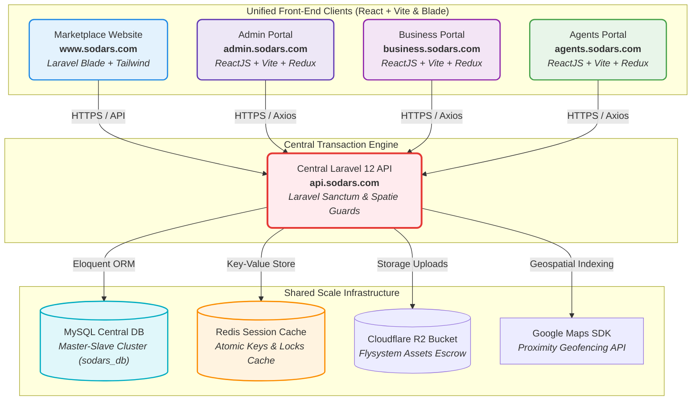

# SODARS: Streamline Outdoor Advertising Reach Solutions
## 🏛️ Enterprise ERP & B2B Marketplace Platform Architecture

Welcome to the central developer portal and system blueprints for the **SODARS** (Streamline Outdoor Advertising Reach Solutions) platform. This documentation defines the absolute technical foundations, data schemas, server infrastructures, and operational lifecycles powering the entire multi-portal ecosystem.

---

## 🗺️ Global Platform Flow & Decoupled Architecture

SODARS uses a modern, completely decoupled SaaS architecture where dedicated portal applications interact with a centralized, load-balanced Laravel REST API cluster reading from a shared MySQL schema.



---

## ⚡ Core Operational Architectural Rules

To ensure reliable, conflict-free platform operations, all internal modules and database transactions must strictly adhere to the following architecture rules:

> [!IMPORTANT]
> **Availability Engine = Core Operational Engine**: Occupancy calculations, dates blocking checks, and manual owner blackouts are strictly processed by the Availability Engine.

> [!IMPORTANT]
> **Booking Engine = Reservation & Allocation Engine**: Booking transactions are not simple CRUD operations. The Booking Engine coordinates locks, reservations, cart checkouts, and payouts calculations.

> [!WARNING]
> **`booking_calendar` = Database Source of Truth**: Availability queries must read directly from the `booking_calendar` composite index before reporting vacancies.

> [!NOTE]
> **Campaign = Parent Entity**: Multi-board schedules are grouped under a single parent `Campaign` profile for unified billing and tracking.

> [!NOTE]
> **Booking = Inventory-Level Reservation**: Each booking record represents a unique, physical hoarding reservation for specific dates.

> [!CAUTION]
> **Provider Approvals Required**: A pre-reservation hold is kept in a temporary status until the corresponding media owner confirms availability.

> [!CAUTION]
> **Verified Escrow Settlements**: Provider payouts and agent sales commissions are released only after day/night geotagged physical mounting photographs are uploaded and approved.

---

## 🛠️ Platform Domain & Tech Stack Matrix

| Module | Domain | Purpose | Core Stack |
| :--- | :--- | :--- | :--- |
| **Marketplace Website** | `www.sodars.com` | Public inventory discovery, map geofencing search, dynamic local routing, and campaign inquiries. | Laravel Blade, Tailwind CSS, Alpine.js |
| **Admin Portal** | `admin.sodars.com` | Internal platform command center, booking engine operations, branch configurations, GST invoices. | ReactJS, Vite, Redux Toolkit, Axios, `shadcn/ui` |
| **Business Portal** | `business.sodars.com` | Vendor dashboard enabling providers to CRUD boards, configure pricing calendars, and request payouts. | ReactJS, Vite, Redux Toolkit, Axios, `shadcn/ui` |
| **Agents Portal** | `agents.sodars.com` | Lead capture CRM, callback calendars, telecalling reminders, and agent commissions. | ReactJS, Vite, Redux Toolkit, Axios, `shadcn/ui` |
| **Central API System** | `api.sodars.com` | Decoupled RESTful API engine orchestrating authentication, queue workers, and databases. | Laravel 12 REST APIs, MySQL 8+, Redis |

---

## 📁 System Folder Structure Directory

The documentation workspace is organized into **21 specialized folders** containing **159 specification files**:

```txt
sodars/
 ├── README.md                      # Global Developer Entry point
 ├── CHANGELOG.md                   # Version tracking and release history
 ├── ROADMAP.md                     # Phased growth schedule
 ├── backlog.md                     # Complete product backlog & todo lists
 ├── CONTRIBUTING.md                # Development standards guide
 ├── ENVIRONMENT_SETUP.md           # Local installation guides
 │
 ├── portals/                       # Frontend application layouts & wires
 │     ├── front_website.md
 │     ├── admin_portal.md
 │     ├── business_portal.md
 │     └── agents_portal.md
 │
 ├── architecture/                  # Global system blueprints
 │     ├── project_architecture.md
 │     ├── system_architecture.md
 │     ├── server_architecture.md
 │     └── scaling_strategy.md
 │
 ├── backend/                       # Core system engines specifications
 │     ├── api_system.md
 │     ├── database_architecture.md
 │     ├── booking_engine.md
 │     └── availability_engine.md
 │
 ├── database/                      # DDL tables & indexes mappings
 │     ├── database_schema.md       # Complete 49 SQL Tables Schema Script
 │     ├── database_flowcharts.md   # Interactive 18 Relational flow charts
 │     ├── database_schema_diagram.md # Beautiful 21 ER diagrams & schemas
 │     ├── sodars_db_schema_diagram.html # Interactive HTML drag-and-drop diagram
 │     ├── relationships.md
 │     └── indexing_strategy.md
 │
 ├── uiux/                          # Color palettes & corporate design guidelines
 │     ├── design_system.md
 │     ├── color_system.md
 │     └── component_library.md
 │
 ├── api-docs/                      # Decoupled endpoints reference catalogs
 │     ├── auth_apis.md
 │     ├── inventory_apis.md
 │     └── bookings_apis.md
 │
 ├── devops/                        # Dockerfiles, Nginx configurations & Supervisor workers
 │     ├── docker_setup.md
 │     ├── nginx_configuration.md
 │     └── queue_setup.md
 │
 ├── integrations/                  # Webhook structures and drivers setups
 │     ├── google_maps.md
 │     ├── whatsapp_api.md
 │     └── cloud_storage.md
 │
 └── security/                      # Sanctum session policies and audit trials
       ├── authentication_security.md
       └── audit_logs.md
```

---

## 🚀 Phased Implementation Roadmap (Checklist)

```
                       [Phase 1: Foundations Setup]
                                    │
                                    ▼
                       [Phase 2: Provider Onboarding]
                                    │
                                    ▼
                      [Phase 3: Inventory Ingestion]
                                    │
                                    ▼
                       [Phase 4: Booking Core Lock]
                                    │
                                    ▼
                      [Phase 5: Financial Settlements]
                                    │
                                    ▼
                      [Phase 6: Marketplace Search]
                                    │
                                    ▼
                      [Phase 7: Analytics Dashboards]
```

### Phase 1: Foundations & Organizatonal Setup
- [x] Configure decoupled Laravel 12 API & React portals frameworks.
- [x] Implement dynamic Location Hierarchies dropdowns (`Country` -> `State` -> `District` -> `City` -> `Area` -> `Landmark` -> `Road`).
- [x] Configure Spatie user permissions and Sanctum token auth gates.

### Phase 2: Provider & Staff RBAC System
- [x] Build Provider KYC document verification workflows.
- [x] Configure restricted sub-accounts for vendor employees (`provider_staff` table).
- [x] Build admin provider verification controls.

### Phase 3: Inventory Specs Ingestion
- [x] Build billboard specs CRUD pipelines (facing, lighting, size, visibility score).
- [x] Integrate cloud uploads for drone footage, site mockups, and diagrams.
- [x] Integrate Google Places API coordinate geofencing pins.

### Phase 4: Booking & Concurrency Engine
- [x] Implement Redis atomic locks on dates holds during checkouts.
- [x] Program 30-minute auto-expiry cron listeners releasing unpaid holds.
- [x] Build double-booking date checkups inside the Availability Engine.

### Phase 5: Finance & Payout Settlements
- [x] Program CGST, SGST, and IGST tax calculation engines.
- [x] Integrate Stripe/Razorpay secure transaction pipelines.
- [x] Construct automated ledgers allocating provider payouts and agent commissions.

### Phase 6: Marketplace Curation
- [x] Integrate Meilisearch indexing for fuzzy term query search results.
- [x] Build search filters tracking availability, lighting class, and pricing brackets.
- [x]Curation featured hoardings and priority listings setup.

### Phase 7: Analytics Cockpit
- [x] Build cached data pipelines for MRR graphs, occupancy trends, and provider ratings.
- [x] Construct internal export pipelines compiling dynamic PDF files.
- [x] Complete CRM dashboard follow-up notifications.

---
*SODARS Enterprise ERP & B2B Marketplace - Platform Architecture Specification*
