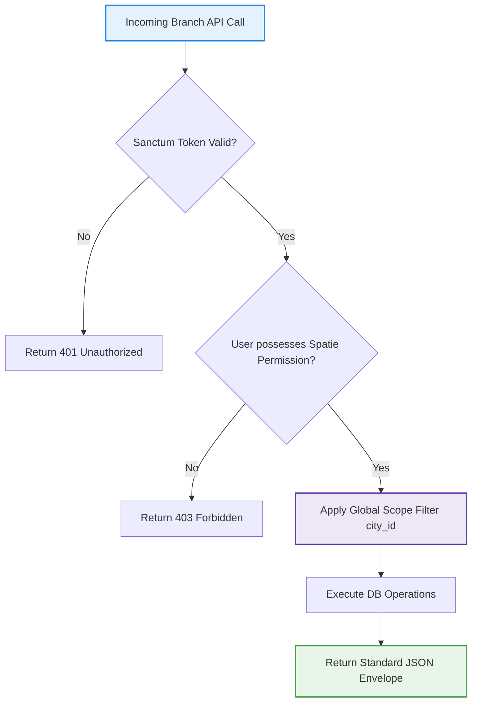

# SODARS API Specification: Branch Portal (District-wise) APIs
## Component: API Documents > Branch Portal APIs (api-docs/branch_apis.md)

---

# 1. OVERVIEW
This document defines the RESTful endpoints, parameters, authorization checks, and payload schemas for the **Branch Portal (District-wise)** API endpoints of the SODARS (Streamline Outdoor Advertising Reach Solutions) central backend. These endpoints enable regional verifications of providers, local hoarding safety audits, and geotagged mounting validations.

---

# 2. PURPOSE
To provide regional branch staff with secure APIs to audit document uploads, verify physical mounting photos, and log local commission payouts within their designated municipal territory.

---

# 3. BUSINESS LOGIC
* **Geographic Isolation**: Database queries inside branch APIs utilize global scoping, ensuring that request payloads can only read or write within the city/district boundaries of the authenticated branch user.
* **Geotag Verification**: Proof verifications calculate distances between the photo's EXIF parameters and the hoarding's baseline coordinates, rejecting values that exceed a 100-meter threshold.

---

# 4. WORKFLOW


---

# 5. DATABASE TABLES
This API layer reads and writes across:
* `branches`
* `providers`
* `provider_documents`
* `booking_proofs`
* `commissions`

---

# 6. APIs

Core endpoints exposed for Branch Portal verifications:

### 1. Fetch Branch Dashboard Statistics
* **Route**: `GET /api/branch/dashboard`
* **Secured**: Yes (Token Auth required)
* **Response Payload**:
  ```json
  {
    "success": true,
    "message": "Branch metrics loaded successfully",
    "data": {
      "total_local_hoardings": 204,
      "regional_occupancy_percentage": 78.4,
      "pending_kyc_approvals": 5,
      "pending_proof_inspections": 12,
      "district_monthly_revenue": 14200.00
    }
  }
  ```

### 2. Verify Regional Provider KYC Application
* **Route**: `POST /api/branch/verifications/providers/{id}/approve`
* **Secured**: Yes
* **Request Parameters**:
  * `verification_remarks`: `REQUIRED | TEXT`
* **Response Payload**:
  ```json
  {
    "success": true,
    "message": "Provider KYC status approved and marketplace enabled.",
    "data": {
      "provider_id": 104,
      "status": "Approved",
      "marketplace_enabled": true
    }
  }
  ```

### 3. Approve Geotagged Campaign Mounting Proof
* **Route**: `POST /api/branch/verifications/proofs/{id}/approve`
* **Secured**: Yes
* **Response Payload**:
  ```json
  {
    "success": true,
    "message": "Mounting proof approved successfully. Escrow funds released.",
    "data": {
      "booking_id": 2049,
      "proof_status": "Approved",
      "payout_status": "Released"
    }
  }
  ```

---

# 7. FRONTEND STRUCTURE
* **Layout Modules**: Dynamic API endpoints integrate with the React SPA `modules/branch/` dashboard, mapping statistics grids and verifications tables.
* **Component Usage**: Renders via clear database rows mapping lists and indices tracking profiles.

---

# 8. BACKEND LOGIC
All branch endpoints route to specific controllers running localized repository queries scoped dynamically by branch ID matching the authenticated user profile.

---

# 9. VALIDATION RULES
Verification requests must pass parameter constraints before controller access:
```php
public function rules()
{
    return [
        'verification_remarks' => 'required|string|max:500',
    ];
}
```

---

# 10. STATUSES
* KYC Status: `Pending`, `Approved`, `Rejected`.
* Geotagged Proof Audits: `Awaiting Audit`, `Approved`, `Disputed`.

---

# 11. PERMISSIONS
Access requires specific role gates:
* `approve-regional-providers` (Allowed for Branch Managers, Super Admins).
* `verify-regional-proofs` (Allowed for Branch Managers, Staff).

---

# 12. UI/UX NOTES
* Displays success states in Emerald Green (`#16A34A`) and disputes states in Saffron alerts (`#DC2626`).
* Visual charts styled in white border containers matching the corporate SaaS borders.

---

# 13. FUTURE SCOPE
* Machine learning yield prediction triggers calculating seasonal price modifiers automatically.
* WebSockets/MQTT pipelines synchronizing digital play logs with branch logs.

---
*SODARS platform branch portal API specification - Confidential Operational Guidelines*
