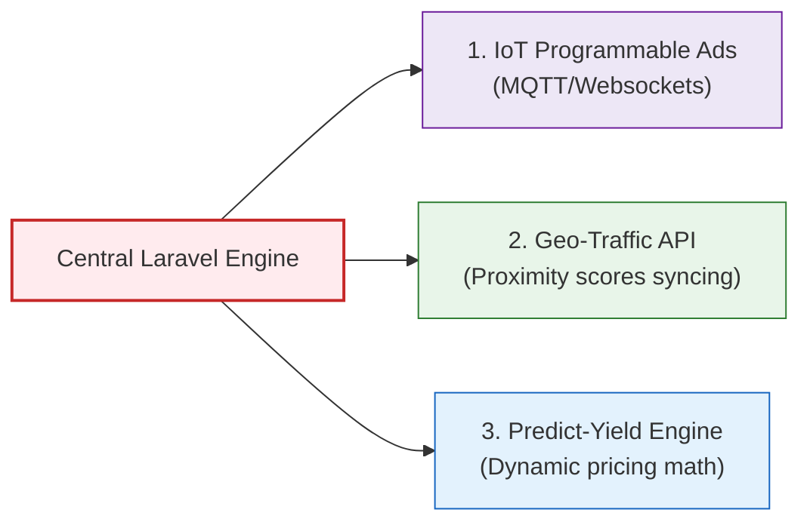

# SODARS Central API System Architecture & Endpoint Directory
## Backend Operating Engine (https://api.sodars.com/api)

The **SODARS Central API System** is a centralized, role-based, modular RESTful API built on **Laravel 12**. It serves as the single source of truth for the entire SODARS ecosystem, powering the public Marketplace Front-end, the internal Admin Command Center, the vendor-centric Business Portal, the Agents Portal, and future native iOS & Android applications.

---

## 🔒 Security & Sanctum Token Authentication Flow

All stateful and stateless requests to protected API endpoints are authenticated using **Laravel Sanctum** personal access tokens.

```mermaid
sequenceDiagram
    autonumber
    actor Client as Frontend Client (React/Blade)
    participant Sanctum as Laravel Sanctum Middleware
    participant Controller as Auth Controller
    database DB as MySQL Database
    
    Client->>Sanctum: POST /auth/login (email, password)
    Sanctum->>Controller: Route to login() action
    Controller->>DB: Query user records
    DB-->>Controller: Return user credentials
    Controller->>Controller: Verify Password (bcrypt)
    alt Invalid Credentials
        Controller-->>Client: 422 Validation Error / 401 Unauthorized
    else Valid Credentials
        Controller->>DB: Generate & Store personal access token
        DB-->>Controller: Token recorded
        Controller-->>Client: 200 OK (access_token, user profile, role list)
    end
    
    Note over Client, Sanctum: Subsequent authenticated request
    Client->>Sanctum: GET /inventory (Header: Authorization: Bearer token)
    Sanctum->>DB: Validate token tokenable match
    DB-->>Sanctum: Token Valid (User ID matching Role scopes)
    Sanctum->>Controller: Process index() query
    Controller-->>Client: 200 OK (Data array matched to JSON wrapper)
```

---

## ⚡ Concurrency & Booking Reservation Flow

To prevent double-bookings, the system utilizes atomic locking systems inside the Booking Engine prior to formal database writes.

```mermaid
sequenceDiagram
    autonumber
    actor Agent as Front/Agent Portal
    participant API as Bookings API (/bookings)
    participant Guard as Concurrency Engine (Atomic Lock)
    database DB as MySQL Database

    Agent->>API: POST /bookings (inventory_id, start_date, end_date)
    API->>Guard: Acquire lock on inventory_id for dates
    alt Overlap Detected
        Guard-->>API: Conflict active
        API-->>Agent: 422 Unprocessable (Date Conflict detected)
    else Slot Available
        Guard->>DB: Insert reservation (status: Reserved, 30-min expiration)
        DB-->>Guard: Success
        API-->>Agent: 201 Created (booking_id, status: Reserved)
    end
```

---

## 📋 Standardized API Envelope Formats

The platform strictly enforces uniform JSON responses to optimize AJAX parsing and ease frontend routing integrations.

### 🟢 HTTP 200/201 Success Payload
```json
{
  "success": true,
  "message": "Data fetched successfully",
  "data": {
    "items": []
  }
}
```

### 🔴 HTTP 422 Unprocessable / Validation Error Payload
```json
{
  "success": false,
  "message": "The given data was invalid.",
  "errors": {
    "email": [
      "The email field must be a valid email address."
    ]
  }
}
```

---

## 🛠️ API Response Code Registry

| Code | Status Title | System Mapping Context |
| :--- | :--- | :--- |
| **200** | Success (OK) | Successful read operations (GET, PUT, DELETE). |
| **201** | Created | Successful record additions (POST creations). |
| **400** | Bad Request | Bad computational payloads, malformed URL structures. |
| **401** | Unauthorized | Expired, corrupt, or missing Sanctum token. |
| **403** | Forbidden | Token authenticated but lacks Spatie permission gates. |
| **404** | Not Found | Database resource matching ID does not exist. |
| **422** | Validation Error | Form parameter validation rules failed. |
| **500** | Server Error | Uncaught database exception or computational crash. |

---

## 📂 Modular Component Architecture

Every business domain module inside `apis/Modules/` implements a clean decoupling framework, maintaining high cohesion and separation of concerns.

```txt
[DomainModule]/
 ├── Controllers/     # Processes requests, maps resources, handles HTTP responses
 ├── Services/        # Evaluates business computations (e.g. GST math, concurrency locks)
 ├── Repositories/    # Isolates Eloquent database actions from business components
 ├── Requests/        # Validates form attributes prior to controller access
 ├── Resources/       # Serializes Eloquent objects into standard JSON envelopes
 ├── Policies/        # Evaluates gate authorization rights (Spatie role matches)
 └── Routes/          # Configures specific domain routes (mapped to app route stacks)
```

---

## 🧭 Comprehensive Endpoint Catalog

---

### 1. Authentication APIs
* **Base Route**: `/auth`

| Action | Method | Endpoint | Secured? | Body Params Sample | Response Payload |
| :--- | :--- | :--- | :--- | :--- | :--- |
| **Login** | `POST` | `/auth/login` | No | `{"email": "...", "password": "..."}` | `{"success": true, "token": "...", "user": {}, "roles": []}` |
| **Logout** | `POST` | `/auth/logout` | **Yes** | None | `{"success": true, "message": "Logged out"}` |
| **Forgot Password** | `POST` | `/auth/forgot-password` | No | `{"email": "..."}` | `{"success": true, "message": "Email sent"}` |
| **Reset Password** | `POST` | `/auth/reset-password` | No | `{"email": "...", "token": "...", "password": "..."}` | `{"success": true, "message": "Password reset success"}` |
| **Get Profile** | `GET` | `/auth/profile` | **Yes** | None | `{"success": true, "data": {"user": {}}}` |
| **Change Password** | `POST` | `/auth/change-password` | **Yes** | `{"current": "...", "password": "..."}` | `{"success": true, "message": "Password changed"}` |

---

### 2. Users APIs
* **Base Route**: `/users`

| Action | Method | Endpoint | Secured? | Core Purpose |
| :--- | :--- | :--- | :--- | :--- |
| **List Users** | `GET` | `/users` | **Yes** | Fetches staff directories, customers lists, agency registers. |
| **Store User** | `POST` | `/users` | **Yes** | Creates new internal admin staff, branch admins, managers. |
| **Show User** | `GET` | `/users/{id}` | **Yes** | Returns individual detail profiles with historical logs. |
| **Update User** | `PUT` | `/users/{id}` | **Yes** | Modifies user data, branches mappings, and contact information. |
| **Delete User** | `DELETE` | `/users/{id}` | **Yes** | Soft-deletes user profile out of active registers. |

---

### 3. Roles & Permissions APIs
* **Base Route**: `/roles`

| Action | Method | Endpoint | Secured? | Core Purpose |
| :--- | :--- | :--- | :--- | :--- |
| **List Roles** | `GET` | `/roles` | **Yes** | Returns roles taxonomy (e.g. Branch Manager, Operations Staff). |
| **Store Role** | `POST` | `/roles` | **Yes** | Appends new operational role groups to Spatie framework. |
| **Update Role** | `PUT` | `/roles/{id}` | **Yes** | Adjusts name mappings and system descriptions. |
| **Delete Role** | `DELETE` | `/roles/{id}` | **Yes** | Deletes custom roles out of operational security registries. |
| **List Permissions**| `GET` | `/permissions` | **Yes** | Fetches full permissions registry. |
| **Store Permission**| `POST` | `/permissions` | **Yes** | Registers custom permission gates. |

---

### 4. Locations APIs
> [!IMPORTANT]
> **Foundation Layer**: Powers location listings, filtering directories, and geographic drop-down matrices.
* **Base Route**: `/locations`

| Target Level | List (GET) | Create (POST) | View Detail (GET) | Modify (PUT) | Erase (DELETE) |
| :--- | :--- | :--- | :--- | :--- | :--- |
| **Countries** | `/locations/countries` | `/locations/countries` | `/locations/countries/{id}` | `/locations/countries/{id}` | `/locations/countries/{id}` |
| **States** | `/locations/states` | `/locations/states` | `/locations/states/{id}` | `/locations/states/{id}` | `/locations/states/{id}` |
| **Districts** | `/locations/districts` | `/locations/districts` | `/locations/districts/{id}` | `/locations/districts/{id}` | `/locations/districts/{id}` |
| **Cities** | `/locations/cities` | `/locations/cities` | `/locations/cities/{id}` | `/locations/cities/{id}` | `/locations/cities/{id}` |
| **Areas** | `/locations/areas` | `/locations/areas` | `/locations/areas/{id}` | `/locations/areas/{id}` | `/locations/areas/{id}` |
| **Landmarks** | `/locations/landmarks` | `/locations/landmarks` | `/locations/landmarks/{id}` | `/locations/landmarks/{id}` | `/locations/landmarks/{id}` |
| **Roads** | `/locations/roads` | `/locations/roads` | `/locations/roads/{id}` | `/locations/roads/{id}` | `/locations/roads/{id}` |

#### 🔄 Dynamic Proximity Dropdowns:
* **States in Country**: `GET /locations/states-by-country/{id}`
* **Districts in State**: `GET /locations/districts-by-state/{id}`
* **Cities in District**: `GET /locations/cities-by-district/{id}`
* **Areas in City**: `GET /locations/areas-by-city/{id}`

---

### 5. Providers APIs
* **Base Route**: `/providers`

| Action | Method | Endpoint | Secured? | Core Purpose |
| :--- | :--- | :--- | :--- | :--- |
| **List Providers** | `GET` | `/providers` | **Yes** | Aggregates all registered outdoor media vendors. |
| **Store Provider** | `POST` | `/providers` | No/Yes | Register new provider profiles. |
| **Show Provider** | `GET` | `/providers/{id}` | **Yes** | Details KYC parameters, coverage cities, and ratings. |
| **Update Provider** | `PUT` | `/providers/{id}` | **Yes** | Adjust company parameters and direct bank accounts. |
| **Delete Provider** | `DELETE` | `/providers/{id}` | **Yes** | Suspends provider profiles. |
| **List Inventory** | `GET` | `/providers/{id}/inventory` | **Yes** | Gets registered media boards owned by specific provider. |
| **View Analytics** | `GET` | `/providers/{id}/analytics` | **Yes** | Analyzes vendor revenue, occupancy splits. |
| **Approve Vendor** | `POST` | `/providers/{id}/approve` | **Yes** | Super Admin KYC signoff (Activates vendor account). |
| **Reject Vendor** | `POST` | `/providers/{id}/reject` | **Yes** | Super Admin rejects validation submission. |

---

### 6. Inventory APIs
* **Base Route**: `/inventory`

| Action | Method | Endpoint | Secured? | Core Purpose |
| :--- | :--- | :--- | :--- | :--- |
| **List Inventory** | `GET` | `/inventory` | No | Fetches entire active hoardings directory. |
| **Store Inventory** | `POST` | `/inventory` | **Yes** | Adds new hoarding parameters, coordinates and price cards. |
| **Show Inventory** | `GET` | `/inventory/{id}` | No | Returns detailed specs, visual gallery, and calendar blocks. |
| **Update Inventory**| `PUT` | `/inventory/{id}` | **Yes** | Adjust pricing structures and lighting profiles. |
| **Delete Inventory**| `DELETE` | `/inventory/{id}` | **Yes** | Deletes the hoarding item. |
| **Search Catalog** | `GET` | `/inventory/search` | No | Multi-filter marketplace database search. |
| **View Featured** | `GET` | `/inventory/featured` | No | Gets inventory items with premium featured status. |
| **Nearby Geofence**| `GET` | `/inventory/nearby` | No | Proximity searches (Lat/Long ranges check). |
| **Upload Photo** | `POST` | `/inventory/{id}/gallery` | **Yes** | Uploads mockup photos and drone footage. |
| **Delete Photo** | `DELETE` | `/inventory/gallery/{id}` | **Yes** | Removes media file out of cloud bucket logs. |

---

### 7. Campaign APIs
* **Base Route**: `/campaigns`

| Action | Method | Endpoint | Secured? | Core Purpose |
| :--- | :--- | :--- | :--- | :--- |
| **List Campaigns** | `GET` | `/campaigns` | **Yes** | Gets client active and historical campaigns. |
| **Store Campaign** | `POST` | `/campaigns` | **Yes** | Structures multi-city campaigns (groups bookings). |
| **Show Campaign** | `GET` | `/campaigns/{id}` | **Yes** | Outlines target budget, timelines, and hoarding lists. |
| **Update Campaign**| `PUT` | `/campaigns/{id}` | **Yes** | Modifies outlines and parameters. |
| **Delete Campaign**| `DELETE` | `/campaigns/{id}` | **Yes** | Cancels campaigns. |
| **View Performance**| `GET` | `/campaigns/{id}/analytics` | **Yes** | Tracks target campaign execution rates. |
| **View Bookings** | `GET` | `/campaigns/{id}/bookings` | **Yes** | Details actual bookings registered in campaign container. |

---

### 8. Bookings APIs
> [!IMPORTANT]
> **Transactional Processing Layer**: Handles reservations, calendar dates, validation engines, and vendor confirmations.
* **Base Route**: `/bookings`

| Action | Method | Endpoint | Secured? | Core Purpose |
| :--- | :--- | :--- | :--- | :--- |
| **List Bookings** | `GET` | `/bookings` | **Yes** | Gets bookings database matching role filters. |
| **Create Booking** | `POST` | `/bookings` | **Yes** | Triggers concurrency locks and places temporary holds. |
| **Show Booking** | `GET` | `/bookings/{id}` | **Yes** | Outlines invoice milestones, dates, and artworks. |
| **Update Booking** | `PUT` | `/bookings/{id}` | **Yes** | Adjusts dates or details. |
| **Cancel Booking** | `DELETE`/`POST` | `/bookings/{id}/cancel` | **Yes** | Direct cancellations, triggers hold release and notifications. |
| **Approve Booking** | `POST` | `/bookings/{id}/approve` | **Yes** | Media Owner/Vendor confirms availability hold. |
| **Reject Booking** | `POST` | `/bookings/{id}/reject` | **Yes** | Media Owner/Vendor rejects booking hold request. |
| **Check Conflict** | `GET` | `/bookings/check-availability` | **Yes** | Availability engine query verifying date schedules. |
| **Get Calendar** | `GET` | `/bookings/calendar` | **Yes** | Feeds the calendar with occupancy blocks. |
| **List Conflicts** | `GET` | `/bookings/conflicts` | **Yes** | Dashboard diagnostic identifying booking conflicts. |

---

### 9. Marketplace APIs
* **Base Route**: `/marketplace`

| Action | Method | Endpoint | Secured? | Core Purpose |
| :--- | :--- | :--- | :--- | :--- |
| **Fetch Catalog** | `GET` | `/marketplace/inventory` | No | Ingests active listings into public directories. |
| **Get Featured** | `GET` | `/marketplace/featured` | No | Aggregates high-bidding inventory spots. |
| **Top City Nodes** | `GET` | `/marketplace/cities` | No | Top cities for quick search homepage links. |
| **Provider Log** | `GET` | `/marketplace/providers` | No | Public catalog of verified media partners. |
| **Search Engine** | `GET` | `/marketplace/search` | No | Autocomplete keyword matching searches. |
| **Filter Query** | `GET` | `/marketplace/filter` | No | Dynamic matching for map overlays. |

---

### 10. Finance APIs
* **Base Route**: `/finance`

| Action | Method | Endpoint | Secured? | Core Purpose |
| :--- | :--- | :--- | :--- | :--- |
| **List Invoices** | `GET` | `/finance/invoices` | **Yes** | Ingests ledger invoices and payment statuses. |
| **Create Invoice** | `POST` | `/finance/invoices` | **Yes** | Automated draft invoice generation on campaign wins. |
| **Get Invoice** | `GET` | `/finance/invoices/{id}` | **Yes** | Returns individual detail and tax details. |
| **List Payments** | `GET` | `/finance/payments` | **Yes** | Logs transaction gateway records. |
| **Process Payment**| `POST` | `/finance/payments` | **Yes** | Syncs payment gateway webhooks. |
| **List Payouts** | `GET` | `/finance/payouts` | **Yes** | Vendor payout requests ledger. |
| **Process Payout** | `POST` | `/finance/payouts` | **Yes** | Withdraws earned commission/yield to bank account. |
| **GST Taxes** | `GET` | `/finance/gst-reports` | **Yes** | Computes CGST, SGST, IGST calculations. |

---

### 11. Reports APIs
* **Base Route**: `/reports`

| Action | Method | Endpoint | Secured? | Core Purpose |
| :--- | :--- | :--- | :--- | :--- |
| **Revenue Report** | `GET` | `/reports/revenue` | **Yes** | Ingests sales ledger data. |
| **Bookings Report**| `GET` | `/reports/bookings` | **Yes** | Outlines booking conversion volumes. |
| **Vendor Report** | `GET` | `/reports/providers` | **Yes** | Performance metrics on provider payout completions. |
| **Occupancy Index**| `GET` | `/reports/occupancy` | **Yes** | Ratios of booked vs vacancy metrics. |
| **Campaign Logs** | `GET` | `/reports/campaigns` | **Yes** | Aggregated reports for corporate advertisers. |
| **PDF Compilation**| `GET` | `/reports/export-pdf` | **Yes** | Triggers dynamic PDF generation pipeline. |
| **Excel Export** | `GET` | `/reports/export-excel` | **Yes** | Generates formatted Excel/CSV summaries. |

---

### 12. Notifications APIs
* **Base Route**: `/notifications`

| Action | Method | Endpoint | Secured? | Core Purpose |
| :--- | :--- | :--- | :--- | :--- |
| **Fetch Alerts** | `GET` | `/notifications` | **Yes** | Ingests notification items matching user session ID. |
| **Mark Read** | `POST` | `/notifications/read` | **Yes** | Updates notification statuses. |
| **Dispatch Alert** | `POST` | `/notifications/send` | **Yes** | Manual announcement/push notification setup. |

---

### 13. Settings APIs
* **Base Route**: `/settings`

| Action | Method | Endpoint | Secured? | Core Purpose |
| :--- | :--- | :--- | :--- | :--- |
| **Get Config** | `GET` | `/settings/general` | **Yes** | Reads dynamic configurations, currency, titles. |
| **Save Config** | `POST` | `/settings/general` | **Yes** | Modifies platform settings variables. |
| **Get Tax Profile**| `GET` | `/settings/tax` | **Yes** | Configures tax brackets configurations. |
| **Save Tax Profile**| `POST` | `/settings/tax` | **Yes** | Adjusts GST/VAT brackets. |
| **Get Assets** | `GET` | `/settings/branding` | **Yes** | Reads custom branding configurations, email templates. |
| **Save Assets** | `POST` | `/settings/branding` | **Yes** | Updates logos and themes settings. |

---

### 14. File Upload APIs
> [!TIP]
> **Optimized Asset Delivery**: Ingestion pipelines compress uploads into WebP templates before committing to AWS S3/Cloudflare R2 nodes.
* **Base Route**: `/uploads`

| Action | Method | Endpoint | Secured? | Core Purpose |
| :--- | :--- | :--- | :--- | :--- |
| **Inventory Media**| `POST` | `/uploads/inventory` | **Yes** | Uploads physical hoardings mockups and drone shots. |
| **Artwork File** | `POST` | `/uploads/artwork` | **Yes** | Uploads advertisement templates submitted by buyers. |
| **Campaign Proof** | `POST` | `/uploads/proofs` | **Yes** | Geotagged confirmation photographs proving placement. |
| **Verification Doc**| `POST` | `/uploads/documents`| **Yes** | Vendor KYC certificate files (PAN, GSTIN, Deeds). |

---

## 🚀 Forward Compatibility & Emerging API Services



1. **IoT Display Protocols**: WebSockets and MQTT integrations for real-time play logs on digital LED displays.
2. **Dynamic Yield Predictive Modeling**: Machine learning algorithms calculating dynamic pricing adjustments in response to local demand.
3. **Route Proximity Metrics**: Geo-proximity calculations estimating road-traffic volume indexes matching spatial paths.
