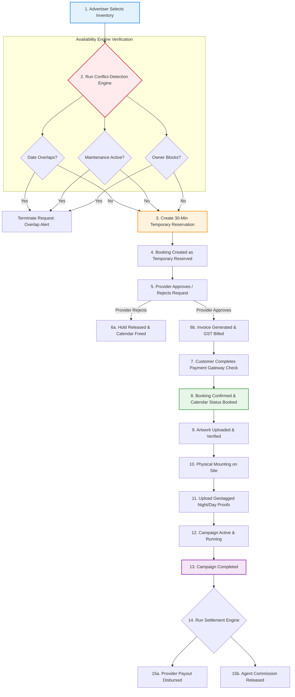

# SODARS Core Booking Engine Architecture & Specification
## Primary Transactional Allocation Engine (backend/booking_engine.md)

---

# 1. OVERVIEW
The **Booking Engine** is the core transactional system of the SODARS (Streamline Outdoor Advertising Reach Solutions) platform. Unlike simple CRUD modules, it coordinates real-time date reservations, manages concurrent cart holds, implements strict conflict prevention, triggers financial invoicing, and structures multi-provider payout splits. It functions as the database source of truth, balancing buyer demand against finite billboard occupancy timelines.

```
Campaign Container
       │
       ▼
Multiple Bookings (Each row = 1 Hoarding Reservation)
       │
       ├─ Booking #1 ──► Provider A ──► Hoarding Board #104
       ├─ Booking #2 ──► Provider B ──► Digital Screen #205
       └─ Booking #3 ──► Provider C ──► Bus Shelter #302
```

---

# 2. PURPOSE
* **Eliminate Double-Bookings**: Prevent overlapping dates for both static billboards and digital display loops.
* **Streamline Approvals**: Handle vendor checks, dynamic pre-reservations, and credit limits.
* **Coordinate Workflows**: Coordinate design, artwork, printing, mounting, photo proofing, and settlements.

---

# 3. BUSINESS LOGIC

### 🔑 Essential Rules of Execution:
1. **Rule 1 (Exclusive Date Hold)**: An inventory board cannot have overlapping active bookings or holds.
2. **Rule 2 (Time-Limited Locks)**: Pre-reservations expire and release locked dates after exactly **30 Minutes**.
3. **Rule 3 (Mandatory Approval Gate)**: Media owners must verify and approve booking requests before payment links are sent.
4. **Rule 4 (Proof-Verified Settlements)**: Provider payouts and agent commissions are held in escrow, releasing only after geotagged mounting photos are verified.
5. **Rule 5 (Calendar Source of Truth)**: The `booking_calendar` is the authoritative record for all availability checks.

### 🛡️ Conflict Detection Engine
Every reservation request triggers a database check across four conflict types:
* **Date Overlap**: Confirms the hoarding is vacant for all selected dates.
* **Maintenance Block**: Checks for structural repairs or safety blackouts.
* **Duplicate Reservation**: Prevents overlapping temporary holds.
* **Provider Block**: Validates manual calendar blocks configured by media owners.

---

# 4. WORKFLOW

The booking lifecycle progresses through the following sequential workflows:



---

# 5. DATABASE TABLES

The Booking Engine reads and writes across these schema tables:

### 1. `bookings`
*Master transactional record tracking values and payment statuses.*
* `id` (`BIGINT UNSIGNED`, PK)
* `booking_code` (`VARCHAR(100)`, Unique)
* `campaign_id` (`BIGINT UNSIGNED`, FK -> `campaigns.id`)
* `provider_id` (`BIGINT UNSIGNED`, FK -> `providers.id`)
* `inventory_id` (`BIGINT UNSIGNED`, FK -> `inventory.id`)
* `booking_start_date` / `booking_end_date` (`DATE`)
* `total_days` (`INT`)
* `price` (`DECIMAL(12,2)`)
* `gst_percentage` / `gst_amount` (`DECIMAL(4,2)` / `DECIMAL(12,2)`)
* `total_amount` (`DECIMAL(12,2)`)
* `provider_amount` (`DECIMAL(12,2)`)
* `commission_amount` (`DECIMAL(12,2)`)
* `booking_status` (`ENUM`)
* `payment_status` (`ENUM`)

### 2. `booking_calendar`
*The source of truth for date availability.*
* `id` (`BIGINT UNSIGNED`, PK)
* `inventory_id` (`BIGINT UNSIGNED`, FK)
* `booking_id` (`BIGINT UNSIGNED`, FK)
* `date` (`DATE`, Composite Index with `inventory_id`)
* `status` (`ENUM`: 'Available', 'Temporary Reserved', 'Reserved', 'Booked', 'Maintenance', 'Blocked')

### 3. `booking_artworks`
*Tracks mockups and creative dimensions.*
* `id`, `booking_id`, `artwork_file` (VARCHAR), `artwork_status` ('Pending', 'Approved', 'Rejected'), `uploaded_by`.

### 4. `booking_proofs`
*Proof-of-play images verifying campaign delivery.*
* `id`, `booking_id`, `proof_type` ('Mounting Photo', 'Night Illumination', 'Drone View'), `proof_file`, `remarks`, `uploaded_by`.

### 5. `booking_logs`
*Audits transitions and actions.*
* `id`, `booking_id`, `status` (VARCHAR), `remarks` (TEXT), `created_by` (FK).

---

# 6. APIs

Core endpoints exposed by the Booking Engine:

| HTTP Method | Endpoint | Secured? | Purpose |
| :--- | :--- | :--- | :--- |
| `POST` | `/api/bookings` | **Yes** | Initiates pre-reservations and locks dates for 30 minutes. |
| `GET` | `/api/bookings/check-availability` | No | Validates availability for inventory items across date ranges. |
| `POST` | `/api/bookings/{id}/approve` | **Yes** | Used by media owners to approve date holds. |
| `POST` | `/api/bookings/{id}/reject` | **Yes** | Used by media owners to reject holds, releasing locked dates. |
| `POST` | `/api/bookings/{id}/cancel` | **Yes** | Cancels active or pending holds. |
| `GET` | `/api/bookings/calendar` | **Yes** | Fetches availability timelines. |

---

# 7. FRONTEND STRUCTURE
* **Layout Modules**: Embedded inside the React SPA `modules/bookings/` folders across Admin, Business, and Agents portals.
* **Core Views**:
  * **Interactive Booking Calendar**: Visual timeline grid displaying occupancy blocks, color-coded by status (Green: Available, Yellow: Held, Blue: Booked, Red: Maintenance).
  * **Approvals Hub**: Dashboard listing incoming requests, actions, and verification documents.
  * **Artworks/Proofs Uploader**: Drag-and-drop form verifying creative dimensions before uploading.

---

# 8. BACKEND LOGIC
* **Framework Layer**: Powered by domain-driven services (`apis/Modules/Bookings/Services/BookingEngineService.php`).
* **Concurrency Lock**: Employs Redis atomic locks (`Redis::lock()`) during booking requests to prevent race conditions.
* **Auto-Expiration Scheduler**: A cron job runs every 5 minutes to release holds that have exceeded the 30-minute checkout window.
  ```php
  // Release hold query example
  Booking::where('booking_status', 'Temporary Reserved')
         ->where('created_at', '<', now()->subMinutes(30))
         ->update(['booking_status' => 'Expired']);
  ```

---

# 9. VALIDATION RULES

Requests submitted to the Booking Engine must pass the following validation constraints:

```php
public function rules()
{
    return [
        'inventory_id'       => 'required|exists:inventory,id',
        'booking_start_date' => 'required|date|after_or_equal:today',
        'booking_end_date'   => 'required|date|after:booking_start_date',
        'campaign_id'        => 'nullable|exists:campaigns,id',
    ];
}
```

---

# 10. STATUSES

The Booking Engine orchestrates status transitions across the platform.

```
                  +---------+
                  |  Draft  |
                  +----+----+
                       |
                       ▼
            +---------------------+
            | Temporary Reserved  | ===(Expired)===> [Release Hold]
            +----------+----------+
                       |
                       ▼
            +---------------------+
            |  Approval Pending   | ===(Rejected)==> [Release Hold]
            +----------+----------+
                       |
                       ▼
            +---------------------+
            |      Reserved       | (Invoice Generated)
            +----------+----------+
                       |
                       ▼
            +---------------------+
            |      Confirmed      | (Payment Settled)
            +----------+----------+
                       |
                       ▼
            +---------------------+
            |       Active        | (Campaign Mounted)
            +----------+----------+
                       |
                       ▼
            +---------------------+
            |      Completed      | (Geotag Proof Approved)
            +---------------------+
```

---

# 11. PERMISSIONS
Access to booking actions is protected by Sanctum and Spatie gates:
* `create-bookings` (Allowed for Website Customers, Sales Agents).
* `approve-bookings` (Allowed for Media Owners/Providers, Super Admins).
* `cancel-bookings` (Allowed for buyers, managers, or internal staff).
* `settle-bookings` (Allowed strictly for internal Finance Teams).

---

# 12. UI/UX NOTES
* **Design Standards**: Outlined in the global **color_system.md**.
* **Visual States**:
  * **Temporary Reserved**: Dotted yellow border overlays.
  * **Confirmed/Booked**: Solid Dark Emerald Green (`#014D40`) highlights.
  * **Maintenance Blocks**: Muted dark patterns displaying a disabled status.
* **Responsive Drawer**: Displays details inline via overlay sliders on mobile devices.

---

# 13. FUTURE SCOPE
* **AI Smart Booking Scheduler**: Predicts and suggests optimal campaign dates based on historic occupancy trends.
* **Multi-City Route Planner**: Recommends a bundle of high-visibility boards along specific transit routes.
* **IoT Dynamic Display Sync**: Tracks digital play logs via WebSockets to enable micro-moment purchases.

---
*SODARS platform reservation engine specification - Confidential Operational Guidelines*
