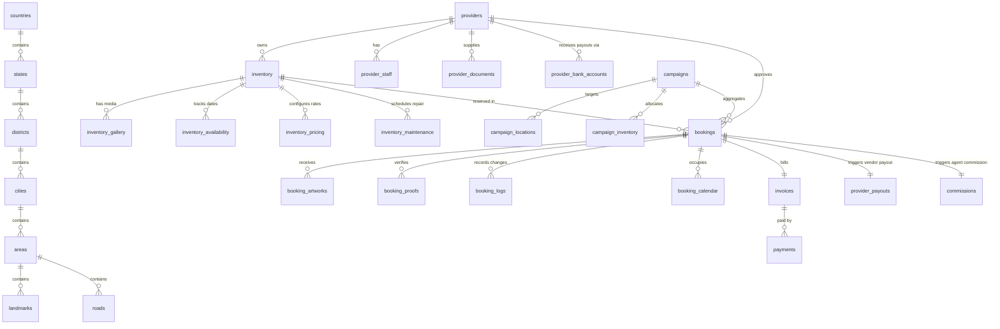
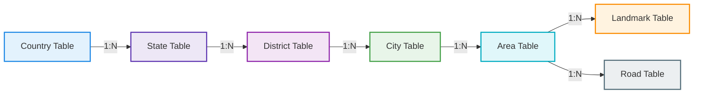
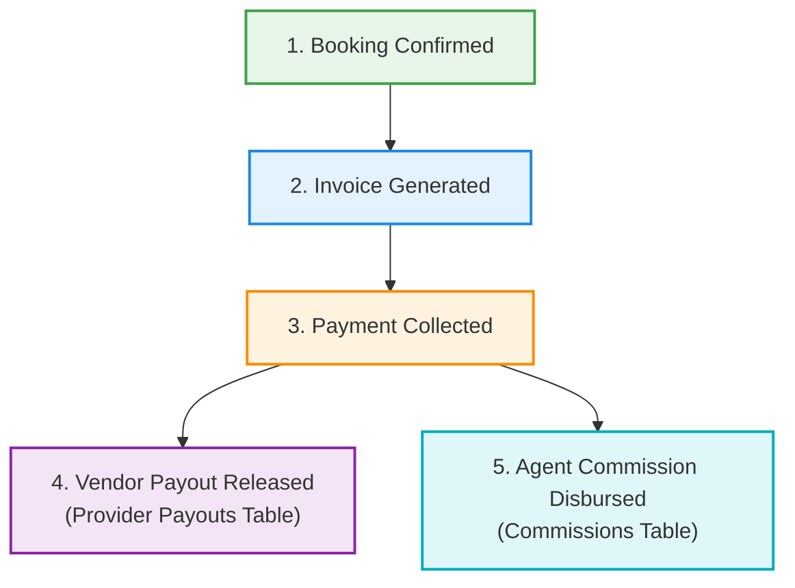

# SODARS Central Database Architecture & Schema Specification
## Database Engine (MySQL 8.0+) | Centralized Relational Schema (sodars_db)

This document establishes the official database model, entity relationships, dynamic indexing configurations, and table structures for the **SODARS** (Streamline Outdoor Advertising Reach Solutions) platform. 

The centralized architecture ensures that the Front Website, Admin Portal, Business Portal, and Agents Portal sync synchronously through a single database instance (`sodars_db`).

---

## 🗺️ Entity-Relationship Diagram (ERD)

The following relational mapping defines the database dependencies, foreign keys, and card-level dependencies across core tables:



---

## 📍 Dynamic Operational Workflows

### 1. Geospatial Location Taxonomy Flow


---

### 2. Transaction & Settlement Ledger Flow


---

## 🗄️ Detailed Schema Specifications

---

### 1. Authentication & Security Schema

#### `users`
*Tracks all core users (internal admins, portal accounts, agency profiles).*
* **Columns**:
  * `id`: `BIGINT UNSIGNED` (Primary Key, Auto Increment)
  * `name`: `VARCHAR(255)` (Full name)
  * `email`: `VARCHAR(255)` (Unique constraint, auth identifier)
  * `mobile`: `VARCHAR(20)` (Primary phone number)
  * `password`: `VARCHAR(255)` (Bcrypt password payload)
  * `role_id`: `INT UNSIGNED` (Foreign Key -> `roles.id`)
  * `status`: `ENUM('Active', 'Suspended', 'Pending')` (Default: 'Pending')
  * `profile_photo`: `VARCHAR(255)` (NULL, path to R2/S3 bucket)
  * `email_verified_at`: `TIMESTAMP` (NULLable)
  * `remember_token`: `VARCHAR(100)` (NULLable)
  * `created_at` / `updated_at`: `TIMESTAMP`

#### `roles`
*Spatie-compatible user roles definitions.*
* **Columns**: `id` (PK), `name` (VARCHAR), `slug` (VARCHAR, Unique), `description` (VARCHAR), `created_at`, `updated_at`.

#### `permissions`
*Granular gate definitions.*
* **Columns**: `id` (PK), `name` (VARCHAR), `slug` (VARCHAR, Unique), `module` (VARCHAR), `created_at`, `updated_at`.

#### `role_permissions`
*Mapping table routing permissions to roles.*
* **Columns**: `id` (PK), `role_id` (FK), `permission_id` (FK).

#### `user_sessions`
*Monitors concurrent active device login logs.*
* **Columns**: `id` (PK), `user_id` (FK -> `users.id`), `ip_address` (VARCHAR), `device` (VARCHAR), `browser` (VARCHAR), `login_at` (TIMESTAMP), `logout_at` (TIMESTAMP, NULLable).

---

### 2. Location Intelligence Schema (Foundation Tables)

```txt
[countries] 
   └── [states] 
          └── [districts] 
                 └── [cities] 
                        └── [areas] 
                               ├── [landmarks]
                               └── [roads]
```

* **`countries`**: `id` (PK), `name` (VARCHAR), `code` (VARCHAR), `iso_code` (VARCHAR, Unique), `currency` (VARCHAR), `timezone` (VARCHAR), `status` (ENUM), `created_at`, `updated_at`.
* **`states`**: `id` (PK), `country_id` (FK -> `countries.id`), `name` (VARCHAR), `code` (VARCHAR), `capital` (VARCHAR), `status` (ENUM), `created_at`, `updated_at`.
* **`districts`**: `id` (PK), `state_id` (FK -> `states.id`), `name` (VARCHAR), `status` (ENUM), `created_at`, `updated_at`.
* **`cities`**: `id` (PK), `district_id` (FK -> `districts.id`), `name` (VARCHAR), `latitude` (DECIMAL(10,8)), `longitude` (DECIMAL(11,8)), `status` (ENUM), `created_at`, `updated_at`.
* **`areas`**: `id` (PK), `city_id` (FK -> `cities.id`), `name` (VARCHAR), `pincode` (VARCHAR), `latitude` (DECIMAL(10,8)), `longitude` (DECIMAL(11,8)), `status` (ENUM), `created_at`, `updated_at`.
* **`landmarks`**: `id` (PK), `area_id` (FK -> `areas.id`), `name` (VARCHAR), `type` (VARCHAR, e.g. "Metro Station", "Shopping Mall"), `latitude` (DECIMAL(10,8)), `longitude` (DECIMAL(11,8)), `status` (ENUM), `created_at`, `updated_at`.
* **`roads`**: `id` (PK), `city_id` (FK), `area_id` (FK -> `areas.id`), `name` (VARCHAR), `road_type` (ENUM, e.g. "National Highway", "Internal City Road"), `traffic_score` (INT), `status` (ENUM), `created_at`, `updated_at`.

---

### 3. Provider Schema (Vendor Master Registry)

#### `providers`
*Tracks media vendor companies and corporate profiles.*
* **Columns**:
  * `id` (PK)
  * `company_name`: `VARCHAR(255)`
  * `owner_name`: `VARCHAR(255)`
  * `email` / `mobile`: `VARCHAR(255)` (Unique constraint)
  * `gst_number` / `pan_number`: `VARCHAR(50)` (Verification checks)
  * `address`: `TEXT`
  * `country_id` / `state_id` / `district_id` / `city_id`: `INT UNSIGNED` (FK Location mapping constraints)
  * `logo`: `VARCHAR(255)` (Cloud file path)
  * `status`: `ENUM('Approved', 'Pending', 'Rejected')` (Default: 'Pending')
  * `marketplace_enabled`: `TINYINT(1)` (Default: 0)
  * `created_at` / `updated_at`: `TIMESTAMP`

#### `provider_staff`
*Sub-accounts mapping vendor staff employees.*
* **Columns**: `id` (PK), `provider_id` (FK -> `providers.id`), `name` (VARCHAR), `email` (Unique), `mobile` (Unique), `role` (ENUM: 'Manager', 'Finance', 'Designer', 'Ops'), `password` (VARCHAR), `status` (ENUM), `created_at`, `updated_at`.

#### `provider_documents`
*KYC documents upload sheets.*
* **Columns**: `id` (PK), `provider_id` (FK), `document_type` (ENUM: 'GST', 'PAN', 'Deed', 'Safety'), `document_file` (VARCHAR), `status` (ENUM), `uploaded_at`.

#### `provider_bank_accounts`
*Payment target payout accounts ledger.*
* **Columns**: `id` (PK), `provider_id` (FK), `bank_name` (VARCHAR), `account_number` (VARCHAR), `ifsc_code` (VARCHAR), `upi_id` (VARCHAR), `status` (ENUM), `created_at`, `updated_at`.

---

### 4. Inventory Schema (Core Media Assets)

#### `inventory`
> [!IMPORTANT]
> **Core Asset Repository**: Combines physical dimension tags, geo-location mapping registers, baseline rates, and visibility indexes.

* **Columns**:
  * `id` (PK)
  * `provider_id`: `BIGINT UNSIGNED` (FK -> `providers.id`)
  * `inventory_code`: `VARCHAR(100)` (Unique SKU mapping)
  * `title` / `description`: `VARCHAR(255)` / `TEXT`
  * `media_type`: `ENUM('Hoarding', 'LED Screen', 'Pillar', 'Bus Shelter', 'Mall Media')`
  * `category`: `ENUM('Front-Lit', 'Back-Lit', 'Non-Lit', 'Digital')`
  * `country_id` / `state_id` / `district_id` / `city_id` / `area_id` / `landmark_id` / `road_id`: `INT UNSIGNED` (Hierarchical FK Location boundaries)
  * `latitude` / `longitude`: `DECIMAL(10,8)` / `DECIMAL(11,8)` (Pin mapping)
  * `width` / `height`: `DECIMAL(8,2)` (Sizing tags)
  * `facing_direction`: `ENUM('North', 'South', 'East', 'West')`
  * `lighting_type`: `ENUM('Front-lit', 'Back-lit', 'Digital', 'Non-lit')`
  * `traffic_type`: `ENUM('High', 'Medium', 'Low')`
  * `visibility_score`: `DECIMAL(4,2)` (Value performance rating)
  * `monthly_price` / `weekly_price` / `daily_price`: `DECIMAL(12,2)`
  * `marketplace_enabled` / `featured`: `TINYINT(1)` (Default: 0)
  * `status`: `ENUM('Active', 'Inactive', 'Maintenance')`
  * `created_at` / `updated_at`: `TIMESTAMP`

* **`inventory_gallery`**: `id` (PK), `inventory_id` (FK -> `inventory.id`), `file_type` (ENUM: 'Photo', 'Video', 'Drone'), `file_path` (VARCHAR), `is_primary` (TINYINT(1)), `created_at`.
* **`inventory_pricing`**: `id` (PK), `inventory_id` (FK), `price_type` (ENUM: 'Seasonal', 'Festival', 'Discount'), `amount` (DECIMAL), `start_date` (DATE), `end_date` (DATE), `created_at`, `updated_at`.
* **`inventory_maintenance`**: `id` (PK), `inventory_id` (FK), `start_date` (DATE), `end_date` (DATE), `reason` (TEXT), `status` (ENUM: 'Scheduled', 'In Progress', 'Completed'), `created_at`, `updated_at`.

---

### 5. Campaign Schema

#### `campaigns`
*Outlines marketing campaigns generated by Advertisers or CRM Agents.*
* **Columns**:
  * `id` (PK)
  * `campaign_code`: `VARCHAR(100)` (Unique)
  * `title` / `notes`: `VARCHAR(255)` / `TEXT`
  * `advertiser_name` / `agency_name` / `customer_name`: `VARCHAR(255)`
  * `customer_mobile` / `customer_email`: `VARCHAR(255)`
  * `budget`: `DECIMAL(12,2)`
  * `start_date` / `end_date`: `DATE`
  * `campaign_status`: `ENUM('Draft', 'Awaiting Action', 'Active', 'Completed', 'Cancelled')`
  * `created_by`: `BIGINT UNSIGNED` (FK -> `users.id`)
  * `created_at` / `updated_at`: `TIMESTAMP`

* **`campaign_locations`**: `id` (PK), `campaign_id` (FK -> `campaigns.id`), `country_id` (FK), `state_id` (FK), `district_id` (FK), `city_id` (FK), `area_id` (FK), `created_at`.
* **`campaign_inventory`**: `id` (PK), `campaign_id` (FK), `inventory_id` (FK -> `inventory.id`), `booking_id` (FK -> `bookings.id`, NULLable), `status` (ENUM: 'Allocated', 'Confirmed', 'Removed'), `created_at`, `updated_at`.

---

### 6. Booking Schema (Most Critical Tables)

#### `bookings`
> [!IMPORTANT]
> **Operational Booking Log**: Calculates transaction details, tracks milestones, and maps provider-to-marketplace percentage splits.

* **Columns**:
  * `id` (PK)
  * `booking_code`: `VARCHAR(100)` (Unique)
  * `campaign_id`: `BIGINT UNSIGNED` (FK -> `campaigns.id`, NULLable)
  * `provider_id`: `BIGINT UNSIGNED` (FK -> `providers.id`)
  * `inventory_id`: `BIGINT UNSIGNED` (FK -> `inventory.id`)
  * `booking_start_date` / `booking_end_date`: `DATE`
  * `total_days`: `INT`
  * `price`: `DECIMAL(12,2)` (Subtotal base rate)
  * `gst_percentage` / `gst_amount`: `DECIMAL(4,2)` / `DECIMAL(12,2)`
  * `total_amount`: `DECIMAL(12,2)` (Gross price billed to buyer)
  * `provider_amount`: `DECIMAL(12,2)` (Net payout due to media owner)
  * `commission_amount`: `DECIMAL(12,2)` (Net agent/platform commission split)
  * `booking_status`: `ENUM('Pending', 'Reserved', 'Approved', 'Rejected', 'Confirmed', 'Active', 'Completed', 'Cancelled', 'Expired')`
  * `payment_status`: `ENUM('Unpaid', 'Partially Paid', 'Paid', 'Refunded')`
  * `approved_by_provider`: `TINYINT(1)` (Default: 0)
  * `approved_at` / `created_by` (FK -> `users.id`): `TIMESTAMP` NULLable
  * `created_at` / `updated_at`: `TIMESTAMP`

* **`booking_artworks`**: `id` (PK), `booking_id` (FK -> `bookings.id`), `artwork_file` (VARCHAR), `artwork_status` (ENUM: 'Pending Review', 'Approved', 'Rejected'), `uploaded_by` (FK -> `users.id`), `created_at` (TIMESTAMP).
* **`booking_proofs`**: `id` (PK), `booking_id` (FK), `proof_type` (ENUM: 'Mounting Photo', 'Night Illumination', 'Drone View'), `proof_file` (VARCHAR), `remarks` (TEXT), `uploaded_by` (FK), `created_at`.
* **`booking_logs`**: `id` (PK), `booking_id` (FK), `status` (VARCHAR), `remarks` (TEXT), `created_by` (FK), `created_at`.
* **`booking_calendar`**: `id` (PK), `inventory_id` (FK -> `inventory.id`), `booking_id` (FK -> `bookings.id`), `date` (DATE), `status` (ENUM: 'Reserved', 'Booked', 'Blocked'), `created_at`.

---

### 7. Marketplace Curation Schema
* **`marketplace_featured`**: `id` (PK), `inventory_id` (FK -> `inventory.id`), `start_date` (DATE), `end_date` (DATE), `priority` (INT), `status` (ENUM), `created_at`.
* **`marketplace_inquiries`**: `id` (PK), `name` (VARCHAR), `mobile` (VARCHAR), `email` (VARCHAR), `company_name` (VARCHAR), `message` (TEXT), `inventory_id` (FK, NULLable), `campaign_id` (FK, NULLable), `status` (ENUM: 'New', 'Contacted', 'Closed'), `created_at`.
* **`marketplace_search_logs`**: `id` (PK), `search_keyword` (VARCHAR), `city_id` (FK, NULLable), `media_type` (VARCHAR), `searched_at` (TIMESTAMP).

---

### 8. CRM Leads Schema
* **`leads`**: `id` (PK), `agent_id` (FK -> `users.id`), `name` (VARCHAR), `company_name` (VARCHAR), `mobile` (VARCHAR), `email` (VARCHAR), `city_id` (FK), `lead_source` (VARCHAR), `status` (ENUM: 'New', 'Contacted', 'Interested', 'Negotiation', 'Converted', 'Lost'), `remarks` (TEXT), `created_at`, `updated_at`.
* **`lead_followups`**: `id` (PK), `lead_id` (FK -> `leads.id`), `followup_date` (DATETIME), `remarks` (TEXT), `status` (ENUM: 'Pending', 'Completed', 'Rescheduled'), `created_by` (FK), `created_at`.
* **`customers`**: `id` (PK), `name` (VARCHAR), `company_name` (VARCHAR), `mobile` (VARCHAR), `email` (VARCHAR), `address` (TEXT), `city_id` (FK), `gst_number` (VARCHAR), `created_at`, `updated_at`.

---

### 9. Finance & Commission Schema

#### `invoices`
*Outputs customer dynamic bills ledger.*
* **Columns**: `id` (PK), `invoice_number` (VARCHAR, Unique), `booking_id` (FK -> `bookings.id`), `customer_id` (FK -> `customers.id`), `invoice_date` (DATE), `subtotal` (DECIMAL), `gst_amount` (DECIMAL), `total_amount` (DECIMAL), `payment_status` (ENUM), `created_at`, `updated_at`.

#### `payments`
*Gateways transactional records.*
* **Columns**: `id` (PK), `invoice_id` (FK -> `invoices.id`), `payment_mode` (ENUM: 'Card', 'NetBanking', 'UPI', 'NEFT'), `transaction_id` (VARCHAR, Unique), `amount` (DECIMAL), `payment_date` (DATETIME), `payment_status` (ENUM), `created_at`.

#### `provider_payouts`
*Vendor payout ledger mapping custom TDS and tax logic.*
* **Columns**: `id` (PK), `provider_id` (FK -> `providers.id`), `booking_id` (FK -> `bookings.id`), `amount` (DECIMAL), `gst_deduction` (DECIMAL), `tds_amount` (DECIMAL), `final_amount` (DECIMAL), `payment_date` (DATE, NULLable), `payment_status` (ENUM: 'Held', 'Pending', 'Released'), `created_at`.

#### `commissions`
*Agent commissions payouts logs.*
* **Columns**: `id` (PK), `agent_id` (FK -> `users.id`), `booking_id` (FK -> `bookings.id`), `commission_percentage` (DECIMAL(5,2)), `commission_amount` (DECIMAL(12,2)), `status` (ENUM: 'Pending', 'Approved', 'Paid'), `created_at`.

#### `expenses`
*General platform expense registry.*
* **Columns**: `id` (PK), `expense_type` (VARCHAR), `amount` (DECIMAL), `remarks` (TEXT), `expense_date` (DATE), `created_by` (FK), `created_at`.

---

### 10. Reports & Cached Metrics
* **`report_exports`**: `id` (PK), `user_id` (FK -> `users.id`), `report_type` (VARCHAR), `file_path` (VARCHAR, R2/S3 PDF link), `exported_at` (TIMESTAMP).
* **`analytics_cache`**: `id` (PK), `analytics_type` (VARCHAR, Unique slug), `cache_data` (LONGTEXT / JSON mapping), `generated_at` (TIMESTAMP).

---

### 11. Event-Driven Notifications Schema
* **`notifications`**: `id` (PK), `user_id` (FK -> `users.id`), `title` (VARCHAR), `message` (TEXT), `type` (VARCHAR, e.g. "BookingRequest"), `is_read` (TINYINT(1), Default: 0), `created_at`.
* **`notification_logs`**: `id` (PK), `notification_type` (ENUM: 'Email', 'SMS', 'WhatsApp', 'Push'), `recipient` (VARCHAR), `message` (TEXT), `status` (ENUM: 'Pending', 'Sent', 'Failed'), `sent_at` (TIMESTAMP).

---

### 12. Dynamic System Settings Schema
* **`settings`**: `id` (PK), `setting_key` (VARCHAR, Unique Index), `setting_value` (TEXT), `created_at`, `updated_at`.
* **`branding_settings`**: `id` (PK), `logo` (VARCHAR), `favicon` (VARCHAR), `primary_color` (VARCHAR), `secondary_color` (VARCHAR), `updated_at`.
* **`tax_settings`**: `id` (PK), `gst_percentage` (DECIMAL(4,2)), `tds_percentage` (DECIMAL(4,2)), `updated_at`.

---

### 13. Audit Trails & Queue Logs

#### `activity_logs`
*Internal system operation audits.*
* **Columns**: `id` (PK), `user_id` (FK, NULLable for guests), `module` (VARCHAR), `activity` (TEXT), `ip_address` (VARCHAR), `created_at`.

#### `audit_logs`
*Comprehensive field-by-field database change history logs.*
* **Columns**:
  * `id` (PK)
  * `table_name`: `VARCHAR(100)`
  * `record_id`: `BIGINT UNSIGNED`
  * `action`: `ENUM('INSERT', 'UPDATE', 'DELETE')`
  * `old_data`: `JSON` (NULLable)
  * `new_data`: `JSON` (NULLable)
  * `created_by`: `BIGINT UNSIGNED` (FK -> `users.id`, NULLable)
  * `created_at`: `TIMESTAMP`

#### `failed_jobs`
*Laravel standard queue failures registry.*
* **Columns**: `id` (PK), `uuid` (VARCHAR), `connection` (TEXT), `queue` (TEXT), `payload` (LONGTEXT), `exception` (LONGTEXT), `failed_at` (TIMESTAMP).

---

## ⚡ Indexing & Performance Tuning Blueprint

To support low-latency geospatial searches and dynamic calendar concurrency checks, composite and single indexes are enforced on the following target directories:

```sql
-- Core Relational Foreign Key Indexing
CREATE INDEX idx_inventory_provider ON inventory(provider_id);
CREATE INDEX idx_bookings_inventory ON bookings(inventory_id);
CREATE INDEX idx_bookings_campaign ON bookings(campaign_id);

-- Geospatial Location Search Optimization
CREATE INDEX idx_inventory_geography ON inventory(city_id, area_id, road_id);
CREATE INDEX idx_inventory_coords ON inventory(latitude, longitude);

-- Booking Availability Calendar Indexing
CREATE INDEX idx_booking_calendar_lookup ON booking_calendar(inventory_id, date, status);

-- Dynamic Pipelines Filters Indexing
CREATE INDEX idx_leads_agent_status ON leads(agent_id, status);
CREATE INDEX idx_bookings_status_dates ON bookings(booking_status, booking_start_date, booking_end_date);
```
