# SODARS Enterprise Specification: Database Architecture Flow Charts
## Segment Component: Database > Relational & Operational Data Flow Charts

---

# 1. OVERVIEW
This document provides an exhaustive, interactive visualization of the **SODARS (Streamline Outdoor Advertising Reach Solutions)** database architecture, operational data pipelines, and portal-wise schemas. 

Every flow has been meticulously structured using high-fidelity **Mermaid.js** flowcharts, utilizing a premium, unified styling schema to demarcate system nodes:
*   **Branches & Approvals (Emerald Green)**: Representing district-wise branch nodes, verification levels, and regional logic gates.
*   **Engines & Conflicts (Dark Saffron)**: Highlighting real-time computation hubs, lock managers, and dynamic allocations.
*   **Core Systems (Ocean Blue)**: Signifying standard tables, directories, and transactional master ledgers.
*   **Auxiliary Systems (Sleek Charcoal)**: Representing analytical caches, notifications, and historic trace logs.

All legacy "Franchise" terminology has been completely migrated to **Branch / Branch Portal (District-wise)** to reflect the enterprise district-decentralized operational architecture.

---

# 2. COMPLETE MASTER DATABASE FLOW
This high-level blueprint depicts the end-to-end relational progression across the SODARS platform, showing how users map through district branches down to campaign bookings, payments, and analytics.

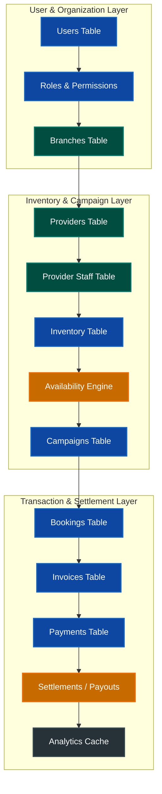

---

# 3. WEBSITE PORTAL DATABASE FLOW
The **www.sodars.com** public portal acts as the marketplace browsing and campaign inquiry gateway. It drives lead generation by mapping locations to active provider inventories.

## A. Functional Operational Flow
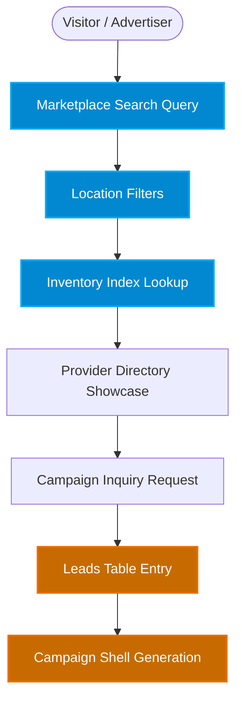

## B. Database Table Relational Flow
This flow details how geographic table lookups filter inventory units, feeding marketplace logs and inquiries.
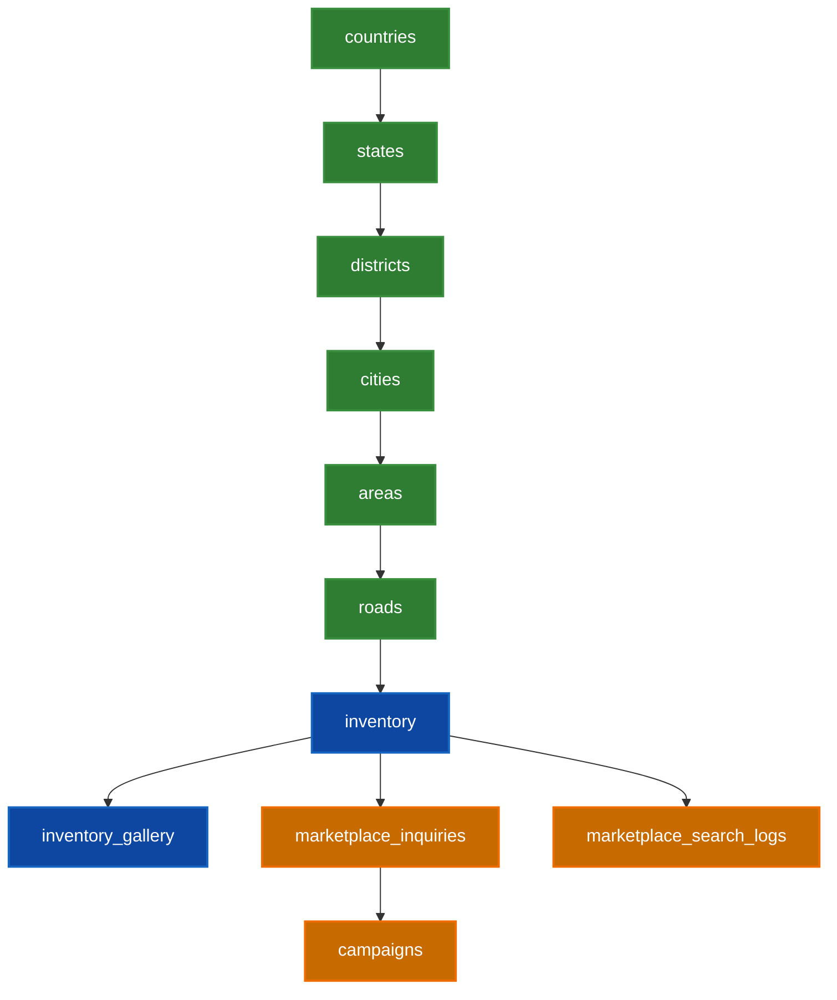

## C. Website Core Modules & Relations


---

# 4. ADMIN PORTAL DATABASE FLOW
The central ERP (**admin.sodars.com**) acts as the global control center, orchestrating regional branches, provider listings, bookings, and release audits.

## A. Admin Master Operations
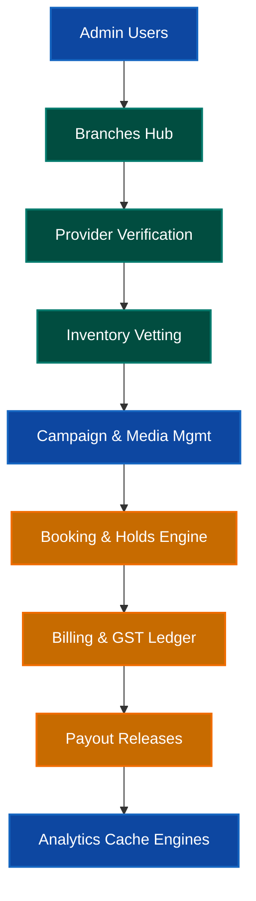

## B. Admin Database Tables & Schema Flows
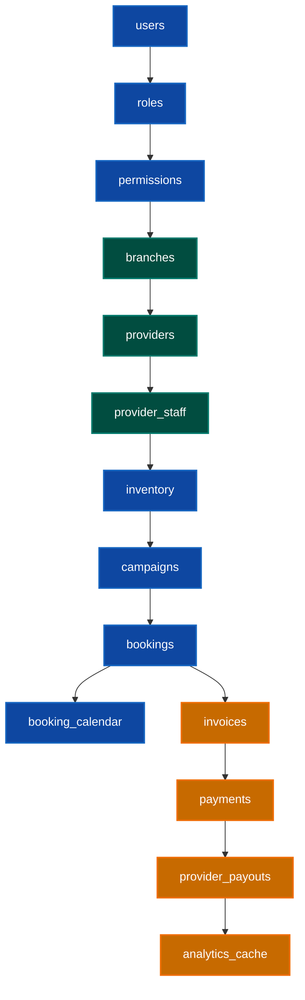

## C. Admin Operational Lifecycle Pipelines
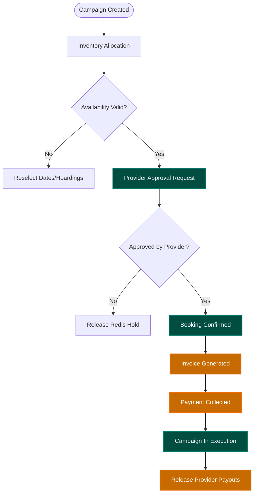

---

# 5. BUSINESS PORTAL DATABASE FLOW
The provider panel (**business.sodars.com**) coordinates localized billboard management, active inventories, live schedules, artwork setups, and geotagged verification uploads.

## A. Provider Portal Workflows
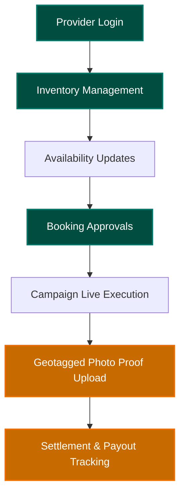

## B. Business Database Tables Relation Mapping
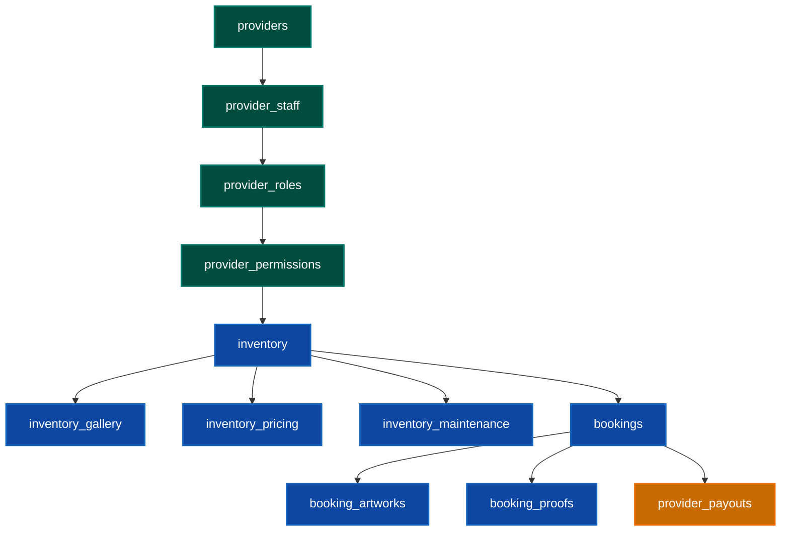

## C. Provider Inventory Lifecycle Flow


## D. Provider Booking Operational Flow
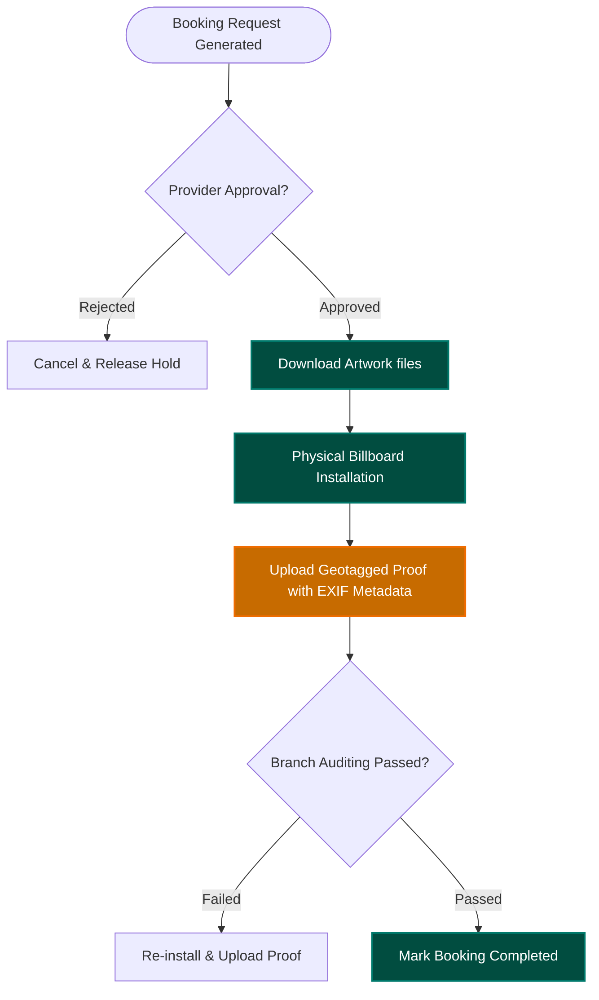

---

# 6. AGENTS PORTAL DATABASE FLOW
The CRM platform (**agents.sodars.com**) empowers field agents, managing local advertiser tracking, pipeline leads, custom media campaign formulations, and commission payouts.

## A. Agent Core Operational Flows
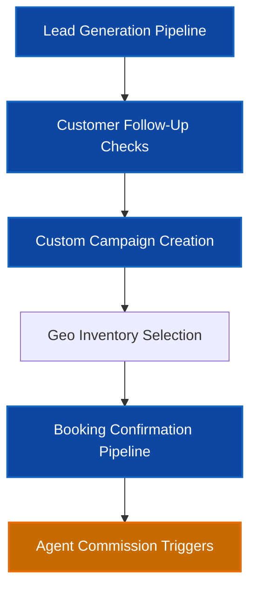

## B. Agent Database Tables Relations
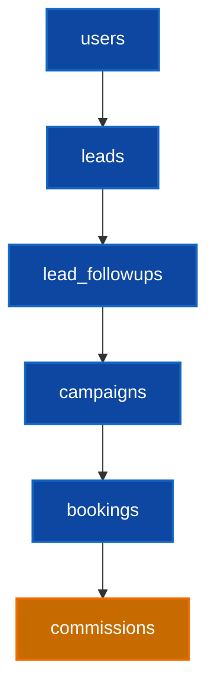

## C. Agent CRM Pipeline Progression


---

# 7. BRANCH PORTAL (DISTRICT-WISE) DATABASE FLOW
Replacing legacy Franchise systems, the **Branch Portal (District-wise)** drives regional audits, local provider reviews, and verification of campaign photos within a structured geographic region.

## A. Branch Core Workflows
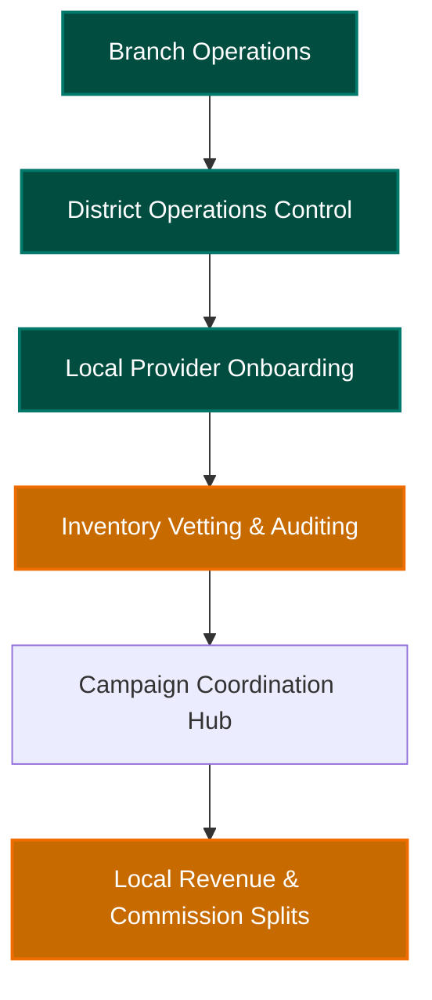

## B. Branch Relational Schema Connections
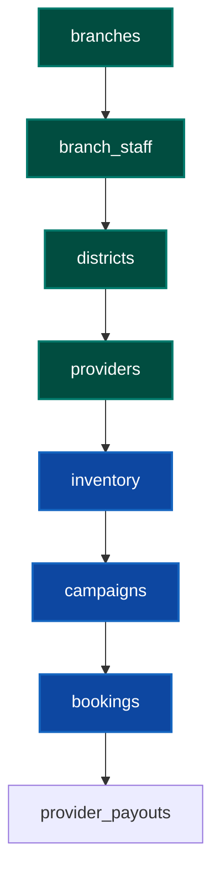

## C. Regional Operations Mapping Flow


---

# 8. LOCATION DATABASE FLOW
The foundation of geo-intelligence, organizing structural units dynamically from countries down to coordinate roads.

## A. Master Location Hierarchy
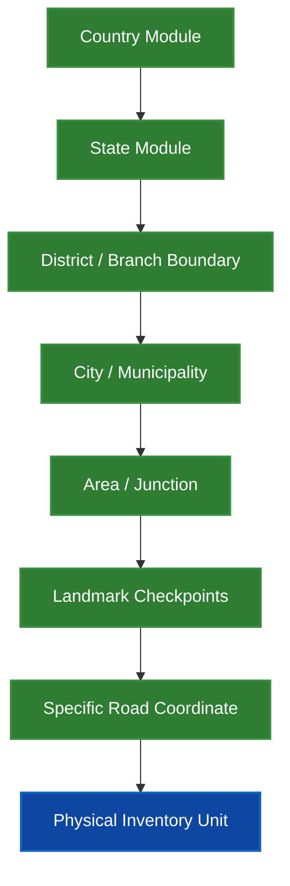

## B. Geographic Database Schema Flow


## C. Location-to-Inventory Lifecycle Flow


---

# 9. INVENTORY DATABASE FLOW
Tracks high-value media items (digital screens, billboards, and transit boards) from baseline parameters through status transitions.

## A. Inventory Operational Flow
```mermaid
graph LR
    classDef core fill:#0D47A1,stroke:#1565C0,stroke-width:2px,color:#fff;
    classDef state fill:#014D40,stroke:#00796B,stroke-width:2px,color:#fff;

    Provider[Provider Profiles]:::state --> Inventory[Inventory Records]:::core
    Inventory --> Gallery[Gallery Asset Collections]
    Gallery --> Pricing[Pricing Schedules]
    Pricing --> Availability[Calendar Engine Sync]:::core
    Availability --> Bookings[Active Relational Bookings]:::state
```

## B. Inventory Database Relations
```mermaid
graph TD
    classDef table fill:#0D47A1,stroke:#1565C0,stroke-width:2px,color:#fff;
    classDef branch fill:#014D40,stroke:#00796B,stroke-width:2px,color:#fff;

    providers[providers]:::branch --> inventory[inventory]:::table
    inventory --> inventory_gallery[inventory_gallery]:::table
    inventory --> inventory_pricing[inventory_pricing]:::table
    inventory --> inventory_maintenance[inventory_maintenance]:::table
    inventory --> booking_calendar[booking_calendar]:::table
```

## C. State Machine Progression Flow
```mermaid
graph TD
    classDef state fill:#0D47A1,stroke:#1565C0,stroke-width:2px,color:#fff;
    classDef lock fill:#C76B00,stroke:#EF6C00,stroke-width:2px,color:#fff;
    classDef green fill:#014D40,stroke:#00796B,stroke-width:2px,color:#fff;

    Available([Available - Storefront Display]):::green --> TempReserved[Temporary Reserved - 30 Min Hold]:::lock
    TempReserved --> |Hold Expires / Cancelled| Available
    TempReserved --> |Confirmed by Admin| Reserved[Reserved Status]:::lock
    Reserved --> Booked[Booked - Invoice Cleared]:::lock
    Booked --> Active[Active - Campaign Running Live]:::state
    Active --> Completed([Completed - Cycle Concluded]):::green
```

---

# 10. CAMPAIGN DATABASE FLOW
Campaigns structure multi-booking media items. A single campaign coordinates multiple billboards and distinct providers.

## A. Campaign Master Architecture
```mermaid
graph TD
    classDef client fill:#0D47A1,stroke:#1565C0,stroke-width:2px,color:#fff;
    classDef campaign fill:#014D40,stroke:#00796B,stroke-width:2px,color:#fff;

    Customer[Customer / Agency]:::client --> Campaign[Master Campaign Record]:::campaign
    Campaign --> Bookings[Multiple Bookings Rows]:::campaign
    Bookings --> Providers[Multiple Media Providers]
    Bookings --> Inventory[Multiple Hoarding Inventory SKUs]:::client
```

## B. Campaign Database Relational Schema
```mermaid
graph TD
    classDef core fill:#0D47A1,stroke:#1565C0,stroke-width:2px,color:#fff;
    classDef proof fill:#014D40,stroke:#00796B,stroke-width:2px,color:#fff;

    campaigns[campaigns]:::core --> campaign_locations[campaign_locations]:::core
    campaign_locations --> bookings[bookings]:::core
    bookings --> booking_artworks[booking_artworks]:::proof
    bookings --> booking_proofs[booking_proofs]:::proof
```

## C. Campaign Status Lifecycle
```mermaid
graph LR
    classDef draft fill:#263238,stroke:#37474F,stroke-width:2px,color:#fff;
    classDef active fill:#014D40,stroke:#00796B,stroke-width:2px,color:#fff;
    classDef process fill:#C76B00,stroke:#EF6C00,stroke-width:2px,color:#fff;

    Draft[Draft]:::draft --> Pending[Pending Verification]:::process
    Pending --> ApprovalPending[Approval Pending from Providers]:::process
    ApprovalPending --> Confirmed[Confirmed / Paid]:::active
    Confirmed --> Active[Active Live]:::active
    Active --> Completed([Completed]):::active
```

---

# 11. BOOKING ENGINE DATABASE FLOW
The core transactional pipeline of the SODARS application. It orchestrates real-time checks, locks, approvals, and physical installations.

## A. Master Transaction & Hold Workflow
```mermaid
graph TD
    classDef engine fill:#C76B00,stroke:#EF6C00,stroke-width:2px,color:#fff;
    classDef branch fill:#014D40,stroke:#00796B,stroke-width:2px,color:#fff;
    classDef core fill:#0D47A1,stroke:#1565C0,stroke-width:2px,color:#fff;

    Campaign([Campaign Initialization]) --> Selection[Inventory Selection]
    Selection --> AvailCheck{Availability Check passed?}:::engine
    AvailCheck -->|No| Conflict[Resolve Calendar Conflicts]
    AvailCheck -->|Yes| RedisLock[30-Minute Temporary Reservation]:::engine
    RedisLock --> ProviderCheck[Provider Approval Routing]:::branch
    ProviderCheck --> Approve{Provider Approves?}
    Approve -->|No| ReleaseLock[Release Lock & Notify Agent]
    Approve -->|Yes| Confirmed[Reserved & Lock Extended]:::engine
    Confirmed --> Invoice[Generate GST Invoice]:::core
    Invoice --> Payment{Payment Cleared?}
    Payment -->|No| Cancel[Release Calendar Slot]
    Payment -->|Yes| Live[Activate Booking & Block Calendar]:::core
    Live --> Installation[Physical Hoarding Setup]
    Installation --> PhotoProof[Upload GPS/EXIF Geotagged Proof]:::branch
    PhotoProof --> ReleaseSettlement[Trigger Payout Releases]:::engine
```

## B. Booking Relational Tables
```mermaid
graph TD
    classDef table fill:#0D47A1,stroke:#1565C0,stroke-width:2px,color:#fff;
    classDef hold fill:#C76B00,stroke:#EF6C00,stroke-width:2px,color:#fff;

    campaigns[campaigns]:::table --> bookings[bookings]:::table
    bookings --> booking_calendar[booking_calendar]:::table
    bookings --> booking_logs[booking_logs]:::table
    bookings --> booking_artworks[booking_artworks]:::table
    bookings --> booking_proofs[booking_proofs]:::table
    booking_calendar --> booking_conflicts[booking_conflicts]:::hold
```

## C. Dynamic Booking State Machine
```mermaid
graph TD
    classDef state fill:#0D47A1,stroke:#1565C0,stroke-width:2px,color:#fff;
    classDef hold fill:#C76B00,stroke:#EF6C00,stroke-width:2px,color:#fff;
    classDef green fill:#014D40,stroke:#00796B,stroke-width:2px,color:#fff;

    Draft[Draft]:::state --> Pending[Pending Selection]:::state
    Pending --> TempReserved[Temporary Reserved - Redis Lock]:::hold
    TempReserved --> ApprovalPending[Approval Pending by Provider]:::hold
    ApprovalPending --> Reserved[Reserved - Pending Payout Verification]:::hold
    Reserved --> Confirmed[Confirmed - Calendar Blocked]:::green
    Confirmed --> Active[Active - Campaign Live]:::green
    Active --> Completed([Completed]):::green
```

## D. Booking Calendar Logic Routing
```mermaid
graph TD
    classDef calendar fill:#C76B00,stroke:#EF6C00,stroke-width:2px,color:#fff;
    classDef core fill:#0D47A1,stroke:#1565C0,stroke-width:2px,color:#fff;

    Inventory[Inventory ID]:::core --> CalendarEngine[Calendar Validation Engine]:::calendar
    CalendarEngine --> Occupancy[Occupancy Checks & Ranges]
    Occupancy --> Reservation{Reservation Conflict?}
    Reservation -->|Conflict Detected| LogConflict[Log Conflict Table Entry]:::calendar
    Reservation -->|Available| ConfirmHold[Generate Calendar Block Entry]:::core
```

---

# 12. AVAILABILITY ENGINE DATABASE FLOW
Guarantees conflict-free bookings across digital, transit, and billboard inventory.

## A. Master Availability Evaluation
```mermaid
graph TD
    classDef engine fill:#C76B00,stroke:#EF6C00,stroke-width:2px,color:#fff;
    classDef core fill:#0D47A1,stroke:#1565C0,stroke-width:2px,color:#fff;

    Inventory[Target Inventory SKU]:::core --> BookedChecks[Evaluate Active Booked Ranges]:::core
    BookedChecks --> TempCheck[Evaluate Temporary Redis Holds]
    TempCheck --> Maintenance[Evaluate Maintenance/Outage Blocks]
    Maintenance --> ConflictEngine[Conflict Detection Algorithms]:::engine
    ConflictEngine --> OutResult([Confirm Availability Result]):::engine
```

## B. Engine Relational Schema Map
```mermaid
graph TD
    classDef table fill:#0D47A1,stroke:#1565C0,stroke-width:2px,color:#fff;
    classDef engine fill:#C76B00,stroke:#EF6C00,stroke-width:2px,color:#fff;

    inventory[inventory]:::table --> booking_calendar[booking_calendar]:::table
    booking_calendar --> inventory_maintenance[inventory_maintenance]:::table
    inventory_maintenance --> bookings[bookings]:::table
    bookings --> booking_conflicts[booking_conflicts]:::engine
```

## C. Occupancy & Dynamic Yield Operations
```mermaid
graph LR
    classDef flow fill:#C76B00,stroke:#EF6C00,stroke-width:2px,color:#fff;

    Booked[Booked Days Range]:::flow --> Occupancy[Occupancy % Metrics Calculation]:::flow
    Occupancy --> Analytics[Platform Yield Analytics]
    Analytics --> YieldPricing[Dynamic Pricing Intelligence]:::flow
```

---

# 13. FINANCE DATABASE FLOW
Secures financial pathways across invoices, GST mappings, payments, agent commissions, and provider payouts.

## A. Financial Settlement Pipelines
```mermaid
graph TD
    classDef engine fill:#C76B00,stroke:#EF6C00,stroke-width:2px,color:#fff;
    classDef table fill:#0D47A1,stroke:#1565C0,stroke-width:2px,color:#fff;

    Booking([Booking Confirmation]) --> Invoice[Generate GST Invoice]:::table
    Invoice --> Tax[Apply GST Ledgers]
    Tax --> Payment{Payment Processed?}:::engine
    Payment -->|No| Cancel[Notify Agent / Flag Invoice]
    Payment -->|Yes| LogPayment[Log Payment Transaction]:::table
    LogPayment --> ReleasePayout[Calculate Provider Payouts]:::engine
    LogPayment --> ReleaseComm[Calculate Agent Commissions]:::engine
```

## B. Finance Database Tables
```mermaid
graph TD
    classDef finance fill:#C76B00,stroke:#EF6C00,stroke-width:2px,color:#fff;
    classDef table fill:#0D47A1,stroke:#1565C0,stroke-width:2px,color:#fff;

    bookings[bookings]:::table --> invoices[invoices]:::table
    invoices --> payments[payments]:::finance
    payments --> provider_payouts[provider_payouts]:::finance
    payments --> commissions[commissions]:::finance
    payments --> refunds[refunds]:::finance
```

## C. Billing Ledger Status Machine
```mermaid
graph LR
    classDef state fill:#C76B00,stroke:#EF6C00,stroke-width:2px,color:#fff;
    classDef green fill:#014D40,stroke:#00796B,stroke-width:2px,color:#fff;

    Pending[Pending]:::state --> Generated[Invoice Generated]:::state
    Generated --> Partial[Partially Paid]:::state
    Partial --> Paid[Paid - Invoice Cleared]:::green
    Paid --> Settlement[Settlement & Payout Released]:::green
```

---

# 14. CRM DATABASE FLOW
Logs leads, agent follow-up calendars, customer conversions, and downstream campaigns.

## A. Lead-to-Conversion Pipeline
```mermaid
graph TD
    classDef crm fill:#0D47A1,stroke:#1565C0,stroke-width:2px,color:#fff;
    classDef converted fill:#014D40,stroke:#00796B,stroke-width:2px,color:#fff;

    Lead[Lead Entry Created]:::crm --> FollowUp[Agent Follow-Up Track]:::crm
    FollowUp --> Customer[Convert to Customer/Agency]:::converted
    Customer --> Campaign[Active Campaign Build]:::crm
    Campaign --> Booking[Confirmed Booking Matrix]:::converted
```

## B. CRM Database Schema
```mermaid
graph LR
    classDef tbl fill:#0D47A1,stroke:#1565C0,stroke-width:2px,color:#fff;

    leads:::tbl --> lead_followups:::tbl
    lead_followups --> campaigns:::tbl
    campaigns --> bookings:::tbl
```

---

# 15. NOTIFICATION DATABASE FLOW
Manages real-time alerts across email, SMS, and WhatsApp integrations.

## A. Dispatch & Queuing Operational Flow
```mermaid
graph TD
    classDef core fill:#0D47A1,stroke:#1565C0,stroke-width:2px,color:#fff;
    classDef notify fill:#263238,stroke:#37474F,stroke-width:2px,color:#fff;

    Event([System Event Trigger]) --> NotificationQueue[Notification Dispatch Queue]:::core
    NotificationQueue --> Channels{Select Channels}
    Channels -->|Email| SMTP[Email Dispatch]:::notify
    Channels -->|SMS| SMSGate[SMS Gateway Dispatch]:::notify
    Channels -->|WhatsApp| WAAPI[WhatsApp Business API]:::notify
    SMTP & SMSGate & WAAPI --> NotificationLogs[Logs Table Database Entry]:::core
```

## B. Notifications Relational Schema
```mermaid
graph LR
    classDef tbl fill:#263238,stroke:#37474F,stroke-width:2px,color:#fff;

    notifications:::tbl --> notification_logs:::tbl
```

---

# 16. ANALYTICS DATABASE FLOW
Consolidates platform data into read-optimized analytical caches for rapid dashboard loading.

## A. Analytics Aggregation Pipeline
```mermaid
graph TD
    classDef core fill:#0D47A1,stroke:#1565C0,stroke-width:2px,color:#fff;
    classDef cache fill:#263238,stroke:#37474F,stroke-width:2px,color:#fff;

    Bookings[Bookings Ledger]:::core --> Revenue[Revenue & Billing Aggregator]:::core
    Revenue --> Occupancy[Occupancy Rates Compilers]:::core
    Occupancy --> CampaignPerf[Campaign ROI Metrics]
    CampaignPerf --> ProviderKPIs[Provider Analytics Compiled]
    ProviderKPIs --> CacheEngine([Write to analytics_cache Table]):::cache
```

## B. Analytics Source Tables Map
```mermaid
graph LR
    classDef src fill:#0D47A1,stroke:#1565C0,stroke-width:2px,color:#fff;
    classDef cache fill:#263238,stroke:#37474F,stroke-width:2px,color:#fff;

    bookings:::src --> payments:::src
    payments --> provider_payouts:::src
    provider_payouts --> analytics_cache:::cache
```

---

# 17. MASTER SYSTEM FLOW
The high-level macro view of a transaction's lifecycle across the SODARS system architecture.

```mermaid
graph TD
    classDef branch fill:#014D40,stroke:#00796B,stroke-width:2px,color:#fff;
    classDef engine fill:#C76B00,stroke:#EF6C00,stroke-width:2px,color:#fff;
    classDef core fill:#0D47A1,stroke:#1565C0,stroke-width:2px,color:#fff;

    Branch[Branch Nodes]:::branch --> Providers[Providers]:::branch
    Providers --> Inventory[Inventory]:::core
    Inventory --> AvailEngine[Availability Engine]:::engine
    AvailEngine --> Campaigns[Campaigns]:::core
    Campaigns --> Bookings[Bookings Engine]:::engine
    Bookings --> Invoices[Invoices]:::core
    Invoices --> Payments[Payments]:::core
    Payments --> Settlements[Settlements Engine]:::engine
    Settlements --> Analytics[Analytics Cache Engines]:::core
```

---

# 18. MOST IMPORTANT TABLES
These database tables form the operational core of the SODARS ERP and booking engine.

```mermaid
graph TD
    classDef core fill:#0D47A1,stroke:#1565C0,stroke-width:2px,color:#fff;
    classDef engine fill:#C76B00,stroke:#EF6C00,stroke-width:2px,color:#fff;

    inventory[inventory - Media catalog]:::core
    bookings[bookings - Reservation transactions]:::core
    booking_calendar[booking_calendar - Allocation schedules]:::core
    campaigns[campaigns - Multi-booking parent shells]:::core
    invoices[invoices - Billable transactions]:::engine
    payments[payments - Gateway receipt records]:::engine
    provider_payouts[provider_payouts - Settlement transfers]:::engine

    campaigns --> bookings
    bookings --> booking_calendar
    inventory --> booking_calendar
    bookings --> invoices
    invoices --> payments
    payments --> provider_payouts
```

---

# 19. MOST IMPORTANT ENGINES
The five functional computation engines orchestrating business rules across all SODARS portals.

```mermaid
graph TD
    classDef engine fill:#C76B00,stroke:#EF6C00,stroke-width:2px,color:#fff;

    Avail[Availability Engine]:::engine
    Book[Booking Engine]:::engine
    Fin[Finance Engine]:::engine
    Approve[Provider Approval Engine]:::engine
    Settle[Settlement Engine]:::engine

    Avail --> |Feeds| Book
    Book --> |Triggers| Approve
    Approve --> |Converts to| Fin
    Fin --> |Initiates| Settle
```

---
*SODARS platform specification - Enterprise Relational Database Flow Charts*
