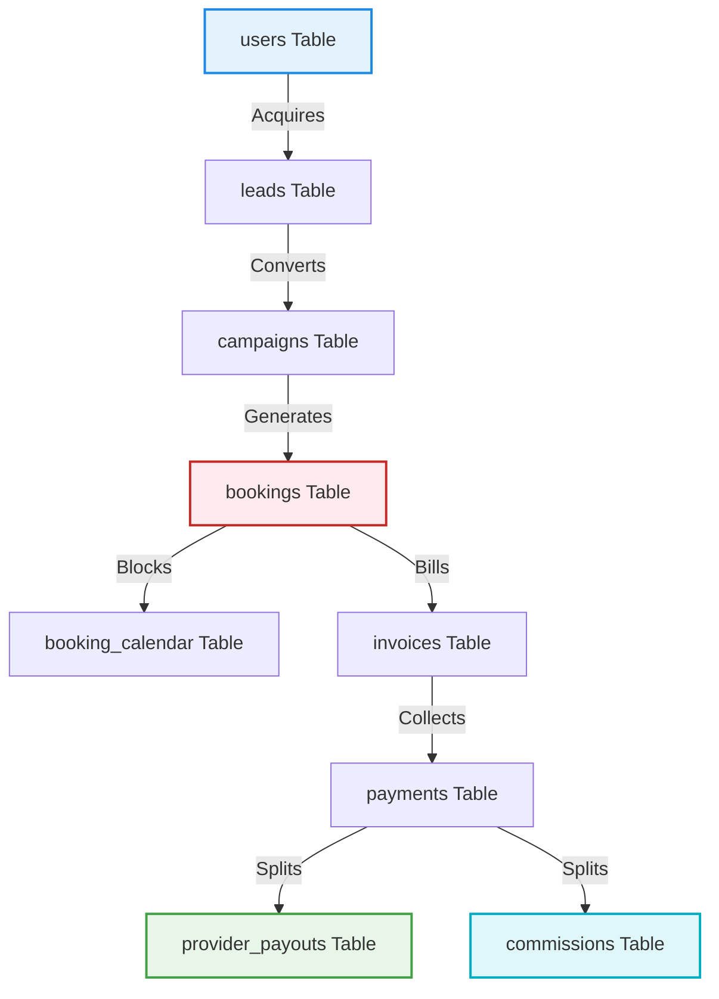

# SODARS Enterprise Database Schema Specification
## Unified Production Schema Blueprint (database/database_schema.md)

---

# 1. OVERVIEW
The **SODARS Enterprise Database Schema** (`sodars_db`) is a centralized, high-performance relational database engine structured on **MySQL 8.0+**. It is the single source of truth for the entire decoupled multi-portal ecosystem, guaranteeing complete transactional ACID compliance across cartHolds, reservations, campaigns, dynamic tax accounting, and payouts.

---

# 2. PURPOSE
The database is engineered to:
* Support concurrent date reservations with atomic safety.
* Maintain structural geographical taxonomies.
* Coordinate KYC documents, provider accounts, and ledgers.
* Power dynamic analytics dashboards and CRM lead pipelines.

---

# 3. BUSINESS LOGIC
* **Exclusive Integrity Logic**: Restricts overlapping dates for hoardings inside `booking_calendar` using a composite index `(inventory_id, date)`.
* **KYC Approvals Gate**: Providers cannot enable marketplace operations unless their state is approved by an administrator (`status = 'Approved'`).
* **Milestone Payout Calculations**: Automatically computes platform commission splits and TDS deductions before recording final vendor disbursement balances.

---

# 4. WORKFLOW
The transaction and ledger allocations flow sequentially through the following relational tables:



---

# 5. DATABASE TABLES

Below is the complete production SQL schema script for the **49 Centralized Tables**:

```sql
-- =========================================================================
-- 1. AUTHENTICATION & SECURITY TABLES
-- =========================================================================

CREATE TABLE users (
    id BIGINT UNSIGNED AUTO_INCREMENT PRIMARY KEY,
    uuid VARCHAR(100) NOT NULL UNIQUE,
    role_id BIGINT UNSIGNED NOT NULL,
    branch_id BIGINT UNSIGNED NULL,
    name VARCHAR(255) NOT NULL,
    email VARCHAR(255) NOT NULL UNIQUE,
    mobile VARCHAR(20) NOT NULL UNIQUE,
    password VARCHAR(255) NOT NULL,
    profile_photo VARCHAR(500) NULL,
    status ENUM('Active', 'Inactive', 'Suspended', 'Blocked') DEFAULT 'Active',
    last_login_at DATETIME NULL,
    email_verified_at DATETIME NULL,
    mobile_verified_at DATETIME NULL,
    remember_token VARCHAR(255) NULL,
    created_at TIMESTAMP DEFAULT CURRENT_TIMESTAMP,
    updated_at TIMESTAMP DEFAULT CURRENT_TIMESTAMP ON UPDATE CURRENT_TIMESTAMP,
    deleted_at TIMESTAMP NULL
);

CREATE TABLE roles (
    id BIGINT UNSIGNED AUTO_INCREMENT PRIMARY KEY,
    name VARCHAR(100) NOT NULL,
    slug VARCHAR(100) NOT NULL UNIQUE,
    description TEXT NULL,
    status ENUM('Active', 'Inactive') DEFAULT 'Active',
    created_at TIMESTAMP DEFAULT CURRENT_TIMESTAMP,
    updated_at TIMESTAMP DEFAULT CURRENT_TIMESTAMP ON UPDATE CURRENT_TIMESTAMP
);

CREATE TABLE permissions (
    id BIGINT UNSIGNED AUTO_INCREMENT PRIMARY KEY,
    module VARCHAR(100) NOT NULL,
    name VARCHAR(100) NOT NULL,
    slug VARCHAR(100) NOT NULL UNIQUE,
    created_at TIMESTAMP DEFAULT CURRENT_TIMESTAMP,
    updated_at TIMESTAMP DEFAULT CURRENT_TIMESTAMP ON UPDATE CURRENT_TIMESTAMP
);

CREATE TABLE role_permissions (
    id BIGINT UNSIGNED AUTO_INCREMENT PRIMARY KEY,
    role_id BIGINT UNSIGNED NOT NULL,
    permission_id BIGINT UNSIGNED NOT NULL,
    FOREIGN KEY (role_id) REFERENCES roles(id) ON DELETE CASCADE,
    FOREIGN KEY (permission_id) REFERENCES permissions(id) ON DELETE CASCADE
);

CREATE TABLE user_sessions (
    id BIGINT UNSIGNED AUTO_INCREMENT PRIMARY KEY,
    user_id BIGINT UNSIGNED NOT NULL,
    ip_address VARCHAR(100) NOT NULL,
    device TEXT NULL,
    browser TEXT NULL,
    platform TEXT NULL,
    login_at DATETIME NOT NULL,
    logout_at DATETIME NULL,
    FOREIGN KEY (user_id) REFERENCES users(id) ON DELETE CASCADE
);

CREATE TABLE activity_logs (
    id BIGINT UNSIGNED AUTO_INCREMENT PRIMARY KEY,
    user_id BIGINT UNSIGNED NULL,
    module VARCHAR(100) NOT NULL,
    activity TEXT NOT NULL,
    old_data JSON NULL,
    new_data JSON NULL,
    ip_address VARCHAR(100) NOT NULL,
    created_at TIMESTAMP DEFAULT CURRENT_TIMESTAMP
);

-- =========================================================================
-- 2. BRANCHES & ORGANIZATION
-- =========================================================================

CREATE TABLE branches (
    id BIGINT UNSIGNED AUTO_INCREMENT PRIMARY KEY,
    name VARCHAR(255) NOT NULL,
    code VARCHAR(100) NOT NULL UNIQUE,
    country_id BIGINT UNSIGNED NOT NULL,
    state_id BIGINT UNSIGNED NOT NULL,
    district_id BIGINT UNSIGNED NOT NULL,
    city_id BIGINT UNSIGNED NOT NULL,
    address TEXT NOT NULL,
    manager_id BIGINT UNSIGNED NULL,
    status ENUM('Active', 'Inactive') DEFAULT 'Active',
    created_at TIMESTAMP DEFAULT CURRENT_TIMESTAMP,
    updated_at TIMESTAMP DEFAULT CURRENT_TIMESTAMP ON UPDATE CURRENT_TIMESTAMP
);

-- =========================================================================
-- 3. LOCATION TABLES
-- =========================================================================

CREATE TABLE countries (
    id BIGINT UNSIGNED AUTO_INCREMENT PRIMARY KEY,
    name VARCHAR(255) NOT NULL,
    code VARCHAR(10) NOT NULL,
    iso_code VARCHAR(10) NOT NULL UNIQUE,
    currency VARCHAR(20) NOT NULL,
    timezone VARCHAR(100) NOT NULL,
    status ENUM('Active', 'Inactive') DEFAULT 'Active',
    created_at TIMESTAMP DEFAULT CURRENT_TIMESTAMP,
    updated_at TIMESTAMP DEFAULT CURRENT_TIMESTAMP ON UPDATE CURRENT_TIMESTAMP
);

CREATE TABLE states (
    id BIGINT UNSIGNED AUTO_INCREMENT PRIMARY KEY,
    country_id BIGINT UNSIGNED NOT NULL,
    name VARCHAR(255) NOT NULL,
    code VARCHAR(20) NOT NULL,
    status ENUM('Active', 'Inactive') DEFAULT 'Active',
    created_at TIMESTAMP DEFAULT CURRENT_TIMESTAMP,
    updated_at TIMESTAMP DEFAULT CURRENT_TIMESTAMP ON UPDATE CURRENT_TIMESTAMP,
    FOREIGN KEY (country_id) REFERENCES countries(id) ON DELETE CASCADE
);

CREATE TABLE districts (
    id BIGINT UNSIGNED AUTO_INCREMENT PRIMARY KEY,
    state_id BIGINT UNSIGNED NOT NULL,
    name VARCHAR(255) NOT NULL,
    status ENUM('Active', 'Inactive') DEFAULT 'Active',
    created_at TIMESTAMP DEFAULT CURRENT_TIMESTAMP,
    updated_at TIMESTAMP DEFAULT CURRENT_TIMESTAMP ON UPDATE CURRENT_TIMESTAMP,
    FOREIGN KEY (state_id) REFERENCES states(id) ON DELETE CASCADE
);

CREATE TABLE cities (
    id BIGINT UNSIGNED AUTO_INCREMENT PRIMARY KEY,
    district_id BIGINT UNSIGNED NOT NULL,
    name VARCHAR(255) NOT NULL,
    latitude DECIMAL(10,8) NOT NULL,
    longitude DECIMAL(11,8) NOT NULL,
    status ENUM('Active', 'Inactive') DEFAULT 'Active',
    created_at TIMESTAMP DEFAULT CURRENT_TIMESTAMP,
    updated_at TIMESTAMP DEFAULT CURRENT_TIMESTAMP ON UPDATE CURRENT_TIMESTAMP,
    FOREIGN KEY (district_id) REFERENCES districts(id) ON DELETE CASCADE
);

CREATE TABLE areas (
    id BIGINT UNSIGNED AUTO_INCREMENT PRIMARY KEY,
    city_id BIGINT UNSIGNED NOT NULL,
    name VARCHAR(255) NOT NULL,
    pincode VARCHAR(20) NOT NULL,
    latitude DECIMAL(10,8) NOT NULL,
    longitude DECIMAL(11,8) NOT NULL,
    status ENUM('Active', 'Inactive') DEFAULT 'Active',
    created_at TIMESTAMP DEFAULT CURRENT_TIMESTAMP,
    updated_at TIMESTAMP DEFAULT CURRENT_TIMESTAMP ON UPDATE CURRENT_TIMESTAMP,
    FOREIGN KEY (city_id) REFERENCES cities(id) ON DELETE CASCADE
);

CREATE TABLE landmarks (
    id BIGINT UNSIGNED AUTO_INCREMENT PRIMARY KEY,
    area_id BIGINT UNSIGNED NOT NULL,
    name VARCHAR(255) NOT NULL,
    type VARCHAR(100) NOT NULL,
    latitude DECIMAL(10,8) NOT NULL,
    longitude DECIMAL(11,8) NOT NULL,
    status ENUM('Active', 'Inactive') DEFAULT 'Active',
    created_at TIMESTAMP DEFAULT CURRENT_TIMESTAMP,
    updated_at TIMESTAMP DEFAULT CURRENT_TIMESTAMP ON UPDATE CURRENT_TIMESTAMP,
    FOREIGN KEY (area_id) REFERENCES areas(id) ON DELETE CASCADE
);

CREATE TABLE roads (
    id BIGINT UNSIGNED AUTO_INCREMENT PRIMARY KEY,
    city_id BIGINT UNSIGNED NOT NULL,
    area_id BIGINT UNSIGNED NOT NULL,
    name VARCHAR(255) NOT NULL,
    road_type VARCHAR(100) NOT NULL,
    traffic_score DECIMAL(10,2) DEFAULT 0,
    status ENUM('Active', 'Inactive') DEFAULT 'Active',
    created_at TIMESTAMP DEFAULT CURRENT_TIMESTAMP,
    updated_at TIMESTAMP DEFAULT CURRENT_TIMESTAMP ON UPDATE CURRENT_TIMESTAMP,
    FOREIGN KEY (city_id) REFERENCES cities(id) ON DELETE CASCADE,
    FOREIGN KEY (area_id) REFERENCES areas(id) ON DELETE CASCADE
);

-- =========================================================================
-- 4. PROVIDERS TABLES
-- =========================================================================

CREATE TABLE providers (
    id BIGINT UNSIGNED AUTO_INCREMENT PRIMARY KEY,
    provider_code VARCHAR(100) NOT NULL UNIQUE,
    company_name VARCHAR(255) NOT NULL,
    owner_name VARCHAR(255) NOT NULL,
    email VARCHAR(255) NOT NULL,
    mobile VARCHAR(20) NOT NULL,
    gst_number VARCHAR(100) NOT NULL,
    pan_number VARCHAR(100) NOT NULL,
    country_id BIGINT UNSIGNED NOT NULL,
    state_id BIGINT UNSIGNED NOT NULL,
    district_id BIGINT UNSIGNED NOT NULL,
    city_id BIGINT UNSIGNED NOT NULL,
    address TEXT NOT NULL,
    logo VARCHAR(500) NULL,
    marketplace_enabled BOOLEAN DEFAULT 0,
    status ENUM('Pending', 'Approved', 'Rejected', 'Suspended', 'Inactive') DEFAULT 'Pending',
    approved_by BIGINT UNSIGNED NULL,
    approved_at DATETIME NULL,
    created_at TIMESTAMP DEFAULT CURRENT_TIMESTAMP,
    updated_at TIMESTAMP DEFAULT CURRENT_TIMESTAMP ON UPDATE CURRENT_TIMESTAMP,
    deleted_at TIMESTAMP NULL
);

CREATE TABLE provider_staff (
    id BIGINT UNSIGNED AUTO_INCREMENT PRIMARY KEY,
    provider_id BIGINT UNSIGNED NOT NULL,
    name VARCHAR(255) NOT NULL,
    email VARCHAR(255) NOT NULL,
    mobile VARCHAR(20) NOT NULL,
    role VARCHAR(100) NOT NULL,
    password VARCHAR(255) NOT NULL,
    status ENUM('Active', 'Inactive') DEFAULT 'Active',
    created_at TIMESTAMP DEFAULT CURRENT_TIMESTAMP,
    updated_at TIMESTAMP DEFAULT CURRENT_TIMESTAMP ON UPDATE CURRENT_TIMESTAMP,
    FOREIGN KEY (provider_id) REFERENCES providers(id) ON DELETE CASCADE
);

CREATE TABLE provider_documents (
    id BIGINT UNSIGNED AUTO_INCREMENT PRIMARY KEY,
    provider_id BIGINT UNSIGNED NOT NULL,
    document_type VARCHAR(100) NOT NULL,
    document_file VARCHAR(500) NOT NULL,
    verification_status ENUM('Pending', 'Approved', 'Rejected') DEFAULT 'Pending',
    verified_by BIGINT UNSIGNED NULL,
    verified_at DATETIME NULL,
    created_at TIMESTAMP DEFAULT CURRENT_TIMESTAMP,
    FOREIGN KEY (provider_id) REFERENCES providers(id) ON DELETE CASCADE
);

CREATE TABLE provider_bank_accounts (
    id BIGINT UNSIGNED AUTO_INCREMENT PRIMARY KEY,
    provider_id BIGINT UNSIGNED NOT NULL,
    bank_name VARCHAR(255) NOT NULL,
    account_holder_name VARCHAR(255) NOT NULL,
    account_number VARCHAR(100) NOT NULL,
    ifsc_code VARCHAR(50) NOT NULL,
    upi_id VARCHAR(100) NULL,
    is_primary BOOLEAN DEFAULT 0,
    created_at TIMESTAMP DEFAULT CURRENT_TIMESTAMP,
    updated_at TIMESTAMP DEFAULT CURRENT_TIMESTAMP ON UPDATE CURRENT_TIMESTAMP,
    FOREIGN KEY (provider_id) REFERENCES providers(id) ON DELETE CASCADE
);

-- =========================================================================
-- 5. INVENTORY TABLES
-- =========================================================================

CREATE TABLE inventory (
    id BIGINT UNSIGNED AUTO_INCREMENT PRIMARY KEY,
    provider_id BIGINT UNSIGNED NOT NULL,
    inventory_code VARCHAR(100) NOT NULL UNIQUE,
    title VARCHAR(255) NOT NULL,
    media_type ENUM('Hoarding', 'Digital Screen', 'Transit Media', 'Bus Shelter', 'Mall Media', 'Airport Media') NOT NULL,
    category VARCHAR(100) NOT NULL,
    description LONGTEXT NULL,
    country_id BIGINT UNSIGNED NOT NULL,
    state_id BIGINT UNSIGNED NOT NULL,
    district_id BIGINT UNSIGNED NOT NULL,
    city_id BIGINT UNSIGNED NOT NULL,
    area_id BIGINT UNSIGNED NOT NULL,
    landmark_id BIGINT UNSIGNED NULL,
    road_id BIGINT UNSIGNED NULL,
    latitude DECIMAL(10,8) NOT NULL,
    longitude DECIMAL(11,8) NOT NULL,
    width DECIMAL(10,2) NOT NULL,
    height DECIMAL(10,2) NOT NULL,
    facing_direction VARCHAR(100) NOT NULL,
    lighting_type VARCHAR(100) NOT NULL,
    traffic_type VARCHAR(100) NOT NULL,
    visibility_score DECIMAL(10,2) DEFAULT 0,
    traffic_score DECIMAL(10,2) DEFAULT 0,
    monthly_price DECIMAL(12,2) NOT NULL,
    weekly_price DECIMAL(12,2) NOT NULL,
    daily_price DECIMAL(12,2) NOT NULL,
    marketplace_enabled BOOLEAN DEFAULT 0,
    featured BOOLEAN DEFAULT 0,
    status ENUM('Available', 'Reserved', 'Booked', 'Maintenance', 'Inactive', 'Blocked') DEFAULT 'Available',
    created_at TIMESTAMP DEFAULT CURRENT_TIMESTAMP,
    updated_at TIMESTAMP DEFAULT CURRENT_TIMESTAMP ON UPDATE CURRENT_TIMESTAMP,
    deleted_at TIMESTAMP NULL,
    FOREIGN KEY (provider_id) REFERENCES providers(id) ON DELETE CASCADE
);

CREATE TABLE inventory_gallery (
    id BIGINT UNSIGNED AUTO_INCREMENT PRIMARY KEY,
    inventory_id BIGINT UNSIGNED NOT NULL,
    file_type ENUM('Image', 'Video', 'Drone') NOT NULL,
    file_path VARCHAR(500) NOT NULL,
    is_primary BOOLEAN DEFAULT 0,
    created_at TIMESTAMP DEFAULT CURRENT_TIMESTAMP,
    FOREIGN KEY (inventory_id) REFERENCES inventory(id) ON DELETE CASCADE
);

CREATE TABLE inventory_pricing (
    id BIGINT UNSIGNED AUTO_INCREMENT PRIMARY KEY,
    inventory_id BIGINT UNSIGNED NOT NULL,
    price_type ENUM('Daily', 'Weekly', 'Monthly', 'Festival', 'Special') NOT NULL,
    amount DECIMAL(12,2) NOT NULL,
    start_date DATE NOT NULL,
    end_date DATE NOT NULL,
    created_at TIMESTAMP DEFAULT CURRENT_TIMESTAMP,
    updated_at TIMESTAMP DEFAULT CURRENT_TIMESTAMP ON UPDATE CURRENT_TIMESTAMP,
    FOREIGN KEY (inventory_id) REFERENCES inventory(id) ON DELETE CASCADE
);

CREATE TABLE inventory_maintenance (
    id BIGINT UNSIGNED AUTO_INCREMENT PRIMARY KEY,
    inventory_id BIGINT UNSIGNED NOT NULL,
    start_date DATE NOT NULL,
    end_date DATE NOT NULL,
    reason TEXT NULL,
    status ENUM('Active', 'Completed') DEFAULT 'Active',
    created_at TIMESTAMP DEFAULT CURRENT_TIMESTAMP,
    updated_at TIMESTAMP DEFAULT CURRENT_TIMESTAMP ON UPDATE CURRENT_TIMESTAMP,
    FOREIGN KEY (inventory_id) REFERENCES inventory(id) ON DELETE CASCADE
);

-- =========================================================================
-- 6. CAMPAIGNS TABLES
-- =========================================================================

CREATE TABLE campaigns (
    id BIGINT UNSIGNED AUTO_INCREMENT PRIMARY KEY,
    campaign_code VARCHAR(100) NOT NULL UNIQUE,
    title VARCHAR(255) NOT NULL,
    advertiser_name VARCHAR(255) NOT NULL,
    agency_name VARCHAR(255) NULL,
    customer_name VARCHAR(255) NOT NULL,
    customer_mobile VARCHAR(20) NOT NULL,
    customer_email VARCHAR(255) NOT NULL,
    budget DECIMAL(12,2) NOT NULL,
    campaign_total_amount DECIMAL(12,2) DEFAULT 0,
    campaign_gst_amount DECIMAL(12,2) DEFAULT 0,
    campaign_provider_amount DECIMAL(12,2) DEFAULT 0,
    campaign_commission_amount DECIMAL(12,2) DEFAULT 0,
    start_date DATE NOT NULL,
    end_date DATE NOT NULL,
    status ENUM('Draft', 'Pending', 'Processing', 'Approval Pending', 'Confirmed', 'Active', 'Completed', 'Cancelled', 'Expired') DEFAULT 'Draft',
    notes LONGTEXT NULL,
    created_by BIGINT UNSIGNED NOT NULL,
    created_at TIMESTAMP DEFAULT CURRENT_TIMESTAMP,
    updated_at TIMESTAMP DEFAULT CURRENT_TIMESTAMP ON UPDATE CURRENT_TIMESTAMP,
    deleted_at TIMESTAMP NULL,
    FOREIGN KEY (created_by) REFERENCES users(id) ON DELETE CASCADE
);

CREATE TABLE campaign_locations (
    id BIGINT UNSIGNED AUTO_INCREMENT PRIMARY KEY,
    campaign_id BIGINT UNSIGNED NOT NULL,
    country_id BIGINT UNSIGNED NOT NULL,
    state_id BIGINT UNSIGNED NOT NULL,
    district_id BIGINT UNSIGNED NOT NULL,
    city_id BIGINT UNSIGNED NOT NULL,
    area_id BIGINT UNSIGNED NULL,
    created_at TIMESTAMP DEFAULT CURRENT_TIMESTAMP,
    FOREIGN KEY (campaign_id) REFERENCES campaigns(id) ON DELETE CASCADE
);

-- =========================================================================
-- 7. BOOKING ENGINE TABLES
-- =========================================================================

CREATE TABLE bookings (
    id BIGINT UNSIGNED AUTO_INCREMENT PRIMARY KEY,
    booking_code VARCHAR(100) NOT NULL UNIQUE,
    campaign_id BIGINT UNSIGNED NOT NULL,
    provider_id BIGINT UNSIGNED NOT NULL,
    inventory_id BIGINT UNSIGNED NOT NULL,
    booking_type ENUM('Static', 'Digital', 'Transit', 'Loop') NOT NULL,
    booking_source ENUM('Website', 'Admin', 'Agent', 'Business Portal', 'API') NOT NULL,
    priority_level ENUM('Low', 'Medium', 'High', 'Critical') DEFAULT 'Medium',
    booking_start_date DATE NOT NULL,
    booking_end_date DATE NOT NULL,
    total_days INT NOT NULL,
    reservation_expires_at DATETIME NULL,
    slot_start_time TIME NULL,
    slot_end_time TIME NULL,
    loop_duration INT NULL,
    play_frequency INT NULL,
    price DECIMAL(12,2) NOT NULL,
    gst_percentage DECIMAL(5,2) NOT NULL,
    gst_amount DECIMAL(12,2) NOT NULL,
    total_amount DECIMAL(12,2) NOT NULL,
    provider_amount DECIMAL(12,2) NOT NULL,
    commission_amount DECIMAL(12,2) NOT NULL,
    booking_inventory_snapshot JSON NULL,
    booking_pricing_snapshot JSON NULL,
    booking_status ENUM('Draft', 'Pending', 'Temporary Reserved', 'Approval Pending', 'Reserved', 'Confirmed', 'Active', 'Completed', 'Cancelled', 'Rejected', 'Expired') DEFAULT 'Draft',
    payment_status ENUM('Pending', 'Partial', 'Paid', 'Failed', 'Refunded') DEFAULT 'Pending',
    approved_by_provider BOOLEAN DEFAULT 0,
    approved_at DATETIME NULL,
    created_by BIGINT UNSIGNED NOT NULL,
    created_at TIMESTAMP DEFAULT CURRENT_TIMESTAMP,
    updated_at TIMESTAMP DEFAULT CURRENT_TIMESTAMP ON UPDATE CURRENT_TIMESTAMP,
    deleted_at TIMESTAMP NULL,
    FOREIGN KEY (campaign_id) REFERENCES campaigns(id) ON DELETE CASCADE,
    FOREIGN KEY (provider_id) REFERENCES providers(id) ON DELETE CASCADE,
    FOREIGN KEY (inventory_id) REFERENCES inventory(id) ON DELETE CASCADE,
    FOREIGN KEY (created_by) REFERENCES users(id) ON DELETE CASCADE
);

CREATE TABLE booking_calendar (
    id BIGINT UNSIGNED AUTO_INCREMENT PRIMARY KEY,
    inventory_id BIGINT UNSIGNED NOT NULL,
    booking_id BIGINT UNSIGNED NOT NULL,
    date DATE NOT NULL,
    status ENUM('Available', 'Temporary Reserved', 'Reserved', 'Booked', 'Maintenance', 'Blocked') NOT NULL,
    created_at TIMESTAMP DEFAULT CURRENT_TIMESTAMP,
    FOREIGN KEY (inventory_id) REFERENCES inventory(id) ON DELETE CASCADE,
    FOREIGN KEY (booking_id) REFERENCES bookings(id) ON DELETE CASCADE
);

CREATE TABLE booking_conflicts (
    id BIGINT UNSIGNED AUTO_INCREMENT PRIMARY KEY,
    booking_id BIGINT UNSIGNED NOT NULL,
    conflict_type ENUM('Date Overlap', 'Maintenance', 'Provider Block', 'Duplicate Reservation') NOT NULL,
    remarks TEXT NULL,
    resolved BOOLEAN DEFAULT 0,
    created_at TIMESTAMP DEFAULT CURRENT_TIMESTAMP,
    FOREIGN KEY (booking_id) REFERENCES bookings(id) ON DELETE CASCADE
);

CREATE TABLE booking_artworks (
    id BIGINT UNSIGNED AUTO_INCREMENT PRIMARY KEY,
    booking_id BIGINT UNSIGNED NOT NULL,
    artwork_file VARCHAR(500) NOT NULL,
    artwork_status ENUM('Pending', 'Approved', 'Rejected') DEFAULT 'Pending',
    uploaded_by BIGINT UNSIGNED NOT NULL,
    created_at TIMESTAMP DEFAULT CURRENT_TIMESTAMP,
    FOREIGN KEY (booking_id) REFERENCES bookings(id) ON DELETE CASCADE,
    FOREIGN KEY (uploaded_by) REFERENCES users(id) ON DELETE CASCADE
);

CREATE TABLE booking_proofs (
    id BIGINT UNSIGNED AUTO_INCREMENT PRIMARY KEY,
    booking_id BIGINT UNSIGNED NOT NULL,
    proof_type ENUM('Mounting Photo', 'Night Illumination', 'Drone View', 'Completion Proof') NOT NULL,
    proof_file VARCHAR(500) NOT NULL,
    remarks TEXT NULL,
    uploaded_by BIGINT UNSIGNED NOT NULL,
    created_at TIMESTAMP DEFAULT CURRENT_TIMESTAMP,
    FOREIGN KEY (booking_id) REFERENCES bookings(id) ON DELETE CASCADE,
    FOREIGN KEY (uploaded_by) REFERENCES users(id) ON DELETE CASCADE
);

CREATE TABLE booking_logs (
    id BIGINT UNSIGNED AUTO_INCREMENT PRIMARY KEY,
    booking_id BIGINT UNSIGNED NOT NULL,
    old_status VARCHAR(100) NOT NULL,
    new_status VARCHAR(100) NOT NULL,
    remarks TEXT NULL,
    portal_source VARCHAR(100) NOT NULL,
    ip_address VARCHAR(100) NOT NULL,
    created_by BIGINT UNSIGNED NOT NULL,
    created_at TIMESTAMP DEFAULT CURRENT_TIMESTAMP,
    FOREIGN KEY (booking_id) REFERENCES bookings(id) ON DELETE CASCADE,
    FOREIGN KEY (created_by) REFERENCES users(id) ON DELETE CASCADE
);

-- =========================================================================
-- 8. FINANCE TABLES
-- =========================================================================

CREATE TABLE invoices (
    id BIGINT UNSIGNED AUTO_INCREMENT PRIMARY KEY,
    invoice_number VARCHAR(100) NOT NULL UNIQUE,
    booking_id BIGINT UNSIGNED NOT NULL,
    campaign_id BIGINT UNSIGNED NOT NULL,
    invoice_date DATE NOT NULL,
    subtotal DECIMAL(12,2) NOT NULL,
    gst_amount DECIMAL(12,2) NOT NULL,
    total_amount DECIMAL(12,2) NOT NULL,
    payment_status ENUM('Pending', 'Partial', 'Paid', 'Overdue', 'Cancelled') DEFAULT 'Pending',
    created_at TIMESTAMP DEFAULT CURRENT_TIMESTAMP,
    updated_at TIMESTAMP DEFAULT CURRENT_TIMESTAMP ON UPDATE CURRENT_TIMESTAMP,
    FOREIGN KEY (booking_id) REFERENCES bookings(id) ON DELETE CASCADE,
    FOREIGN KEY (campaign_id) REFERENCES campaigns(id) ON DELETE CASCADE
);

CREATE TABLE payments (
    id BIGINT UNSIGNED AUTO_INCREMENT PRIMARY KEY,
    invoice_id BIGINT UNSIGNED NOT NULL,
    payment_mode ENUM('UPI', 'Bank Transfer', 'Cheque', 'NEFT', 'RTGS', 'Gateway') NOT NULL,
    transaction_id VARCHAR(255) NOT NULL UNIQUE,
    amount DECIMAL(12,2) NOT NULL,
    payment_date DATETIME NOT NULL,
    payment_status ENUM('Pending', 'Paid', 'Failed', 'Refunded') DEFAULT 'Pending',
    created_at TIMESTAMP DEFAULT CURRENT_TIMESTAMP,
    FOREIGN KEY (invoice_id) REFERENCES invoices(id) ON DELETE CASCADE
);

CREATE TABLE provider_payouts (
    id BIGINT UNSIGNED AUTO_INCREMENT PRIMARY KEY,
    provider_id BIGINT UNSIGNED NOT NULL,
    booking_id BIGINT UNSIGNED NOT NULL,
    amount DECIMAL(12,2) NOT NULL,
    gst_deduction DECIMAL(12,2) NOT NULL,
    tds_amount DECIMAL(12,2) NOT NULL,
    final_amount DECIMAL(12,2) NOT NULL,
    payment_status ENUM('Pending', 'Processing', 'Paid') DEFAULT 'Pending',
    payment_date DATETIME NULL,
    created_at TIMESTAMP DEFAULT CURRENT_TIMESTAMP,
    updated_at TIMESTAMP DEFAULT CURRENT_TIMESTAMP ON UPDATE CURRENT_TIMESTAMP,
    FOREIGN KEY (provider_id) REFERENCES providers(id) ON DELETE CASCADE,
    FOREIGN KEY (booking_id) REFERENCES bookings(id) ON DELETE CASCADE
);

CREATE TABLE commissions (
    id BIGINT UNSIGNED AUTO_INCREMENT PRIMARY KEY,
    agent_id BIGINT UNSIGNED NOT NULL,
    booking_id BIGINT UNSIGNED NOT NULL,
    commission_percentage DECIMAL(5,2) NOT NULL,
    commission_amount DECIMAL(12,2) NOT NULL,
    status ENUM('Pending', 'Approved', 'Paid') DEFAULT 'Pending',
    created_at TIMESTAMP DEFAULT CURRENT_TIMESTAMP,
    updated_at TIMESTAMP DEFAULT CURRENT_TIMESTAMP ON UPDATE CURRENT_TIMESTAMP,
    FOREIGN KEY (agent_id) REFERENCES users(id) ON DELETE CASCADE,
    FOREIGN KEY (booking_id) REFERENCES bookings(id) ON DELETE CASCADE
);

CREATE TABLE expenses (
    id BIGINT UNSIGNED AUTO_INCREMENT PRIMARY KEY,
    expense_type VARCHAR(100) NOT NULL,
    amount DECIMAL(12,2) NOT NULL,
    remarks TEXT NULL,
    expense_date DATE NOT NULL,
    created_by BIGINT UNSIGNED NOT NULL,
    created_at TIMESTAMP DEFAULT CURRENT_TIMESTAMP,
    FOREIGN KEY (created_by) REFERENCES users(id) ON DELETE CASCADE
);

CREATE TABLE refunds (
    id BIGINT UNSIGNED AUTO_INCREMENT PRIMARY KEY,
    booking_id BIGINT UNSIGNED NOT NULL,
    refund_amount DECIMAL(12,2) NOT NULL,
    refund_reason TEXT NULL,
    refund_status ENUM('Pending', 'Approved', 'Paid') DEFAULT 'Pending',
    created_at TIMESTAMP DEFAULT CURRENT_TIMESTAMP,
    updated_at TIMESTAMP DEFAULT CURRENT_TIMESTAMP ON UPDATE CURRENT_TIMESTAMP,
    FOREIGN KEY (booking_id) REFERENCES bookings(id) ON DELETE CASCADE
);

-- =========================================================================
-- 9. CRM TABLES
-- =========================================================================

CREATE TABLE leads (
    id BIGINT UNSIGNED AUTO_INCREMENT PRIMARY KEY,
    agent_id BIGINT UNSIGNED NULL,
    name VARCHAR(255) NOT NULL,
    company_name VARCHAR(255) NULL,
    mobile VARCHAR(20) NOT NULL,
    email VARCHAR(255) NOT NULL,
    city_id BIGINT UNSIGNED NULL,
    lead_source VARCHAR(100) NOT NULL,
    status ENUM('New', 'Contacted', 'Interested', 'Negotiation', 'Converted', 'Lost') DEFAULT 'New',
    remarks TEXT NULL,
    created_at TIMESTAMP DEFAULT CURRENT_TIMESTAMP,
    updated_at TIMESTAMP DEFAULT CURRENT_TIMESTAMP ON UPDATE CURRENT_TIMESTAMP,
    FOREIGN KEY (agent_id) REFERENCES users(id) ON DELETE SET NULL,
    FOREIGN KEY (city_id) REFERENCES cities(id) ON DELETE SET NULL
);

CREATE TABLE lead_followups (
    id BIGINT UNSIGNED AUTO_INCREMENT PRIMARY KEY,
    lead_id BIGINT UNSIGNED NOT NULL,
    followup_date DATETIME NOT NULL,
    remarks TEXT NULL,
    status ENUM('Pending', 'Completed', 'Rescheduled') DEFAULT 'Pending',
    created_by BIGINT UNSIGNED NOT NULL,
    created_at TIMESTAMP DEFAULT CURRENT_TIMESTAMP,
    FOREIGN KEY (lead_id) REFERENCES leads(id) ON DELETE CASCADE,
    FOREIGN KEY (created_by) REFERENCES users(id) ON DELETE CASCADE
);

-- =========================================================================
-- 10. MARKETPLACE TABLES
-- =========================================================================

CREATE TABLE marketplace_inquiries (
    id BIGINT UNSIGNED AUTO_INCREMENT PRIMARY KEY,
    inventory_id BIGINT UNSIGNED NULL,
    campaign_id BIGINT UNSIGNED NULL,
    name VARCHAR(255) NOT NULL,
    company_name VARCHAR(255) NOT NULL,
    mobile VARCHAR(20) NOT NULL,
    email VARCHAR(255) NOT NULL,
    message LONGTEXT NULL,
    status ENUM('Pending', 'Contacted', 'Converted', 'Closed') DEFAULT 'Pending',
    created_at TIMESTAMP DEFAULT CURRENT_TIMESTAMP,
    updated_at TIMESTAMP DEFAULT CURRENT_TIMESTAMP ON UPDATE CURRENT_TIMESTAMP,
    FOREIGN KEY (inventory_id) REFERENCES inventory(id) ON DELETE SET NULL,
    FOREIGN KEY (campaign_id) REFERENCES campaigns(id) ON DELETE SET NULL
);

CREATE TABLE marketplace_search_logs (
    id BIGINT UNSIGNED AUTO_INCREMENT PRIMARY KEY,
    search_keyword VARCHAR(255) NOT NULL,
    city_id BIGINT UNSIGNED NULL,
    media_type VARCHAR(100) NULL,
    searched_at DATETIME NOT NULL,
    FOREIGN KEY (city_id) REFERENCES cities(id) ON DELETE SET NULL
);

-- =========================================================================
-- 11. NOTIFICATIONS TABLES
-- =========================================================================

CREATE TABLE notifications (
    id BIGINT UNSIGNED AUTO_INCREMENT PRIMARY KEY,
    user_id BIGINT UNSIGNED NOT NULL,
    title VARCHAR(255) NOT NULL,
    message LONGTEXT NOT NULL,
    type ENUM('Email', 'SMS', 'WhatsApp', 'Push') NOT NULL,
    is_read BOOLEAN DEFAULT 0,
    created_at TIMESTAMP DEFAULT CURRENT_TIMESTAMP,
    FOREIGN KEY (user_id) REFERENCES users(id) ON DELETE CASCADE
);

CREATE TABLE notification_logs (
    id BIGINT UNSIGNED AUTO_INCREMENT PRIMARY KEY,
    notification_type VARCHAR(100) NOT NULL,
    recipient VARCHAR(255) NOT NULL,
    message LONGTEXT NOT NULL,
    status ENUM('Sent', 'Failed') DEFAULT 'Sent',
    sent_at DATETIME NOT NULL
);

-- =========================================================================
-- 12. SETTINGS TABLES
-- =========================================================================

CREATE TABLE settings (
    id BIGINT UNSIGNED AUTO_INCREMENT PRIMARY KEY,
    setting_key VARCHAR(255) NOT NULL UNIQUE,
    setting_value LONGTEXT NOT NULL,
    created_at TIMESTAMP DEFAULT CURRENT_TIMESTAMP,
    updated_at TIMESTAMP DEFAULT CURRENT_TIMESTAMP ON UPDATE CURRENT_TIMESTAMP
);

CREATE TABLE tax_settings (
    id BIGINT UNSIGNED AUTO_INCREMENT PRIMARY KEY,
    gst_percentage DECIMAL(5,2) NOT NULL,
    cgst_percentage DECIMAL(5,2) NOT NULL,
    sgst_percentage DECIMAL(5,2) NOT NULL,
    igst_percentage DECIMAL(5,2) NOT NULL,
    tds_percentage DECIMAL(5,2) NOT NULL,
    updated_at TIMESTAMP DEFAULT CURRENT_TIMESTAMP ON UPDATE CURRENT_TIMESTAMP
);

-- =========================================================================
-- 13. ANALYTICS TABLES
-- =========================================================================

CREATE TABLE analytics_cache (
    id BIGINT UNSIGNED AUTO_INCREMENT PRIMARY KEY,
    analytics_type VARCHAR(100) NOT NULL UNIQUE,
    cache_data LONGTEXT NOT NULL,
    generated_at DATETIME NOT NULL
);
```

---

# 6. APIs
These structural tables are synchronized via specialized backend database ORM layers (Eloquent models mapping schemas directly to controller operations) and expose standardized database migrations outputs.

---

# 7. FRONTEND STRUCTURE
* **Layout Caching View**: The React SPAs display database migrations status inside the Admin Portal `Settings > Database` panel.
* **Component Usage**: Renders via clear database rows mapping lists and indices tracking profiles.

---

# 8. BACKEND LOGIC
* **Atomic Transaction Wrapping**: Database writes across multiple tables (e.g. `bookings`, `booking_calendar`, `invoices`) are wrapped inside Laravel atomic transactions (`DB::transaction()`) to guarantee data integrity:
  ```php
  DB::transaction(function () use ($bookingData) {
      $booking = Booking::create($bookingData);
      BookingCalendar::createDates($booking);
      Invoice::generate($booking);
  });
  ```

---

# 9. VALIDATION RULES
Parameter checks are strictly enforced by the backend repository layers matching each MySQL type constraint:
* BIGINT IDs: `REQUIRED | INT UNSIGNED`
* DECIMAL Coordinates: `REQUIRED | NUMERIC | BETWEEN:-180,180`
* Prices / Amount: `REQUIRED | NUMERIC | MIN:0`

---

# 10. STATUSES
Relational statuses enforce data transition gates:
* Active / Suspended / Blocked (`users` table)
* Available / Booked / Maintenance (`inventory` & `booking_calendar` tables)
* Draft / Confirmed / Active / Completed (`bookings` & `campaigns` tables)

---

# 11. PERMISSIONS
Access to database migrations or raw analytics caches is restricted to Super Admins via structural permission gates:
* `execute-migrations` (Internal DB updates)
* `clear-analytics-cache` (Purges old cached longtext strings)

---

# 12. UI/UX NOTES
* **Design Standards**: Tabular data displays are styled in clean white containers matching the corporate SaaS borders.
* **Visual States**: Database migration success states are color-coded in Emerald Green (`#16A34A`), and validation bottlenecks are mapped to Saffron alerts (`#DC2626`).

---

# 13. FUTURE SCOPE
* Sharding the `booking_calendar` and `activity_logs` tables across different physical servers by year keys.
* Real-time read-write decoupling mapping write transactions to Master and read logs to Slave replica instances.
* Continuous daily snapshots backup engines sync directly to cloud R2 volumes.

---
*SODARS platform centralized database specification - Enterprise Operational Guidelines*
