# SODARS Enterprise Database Schema Diagram
## Segment Component: Database > Complete DB Relationship Architecture

---

# 1. OVERVIEW
This specification provides an exhaustive structural and relational overview of the **SODARS (Streamline Outdoor Advertising Reach Solutions)** database schema. 

Every schema division is mapped using high-fidelity **Mermaid.js Entity-Relationship (ER)** diagrams and structural tables, illustrating key cascades, one-to-many (`||--o{`) and one-to-one (`||--||`) cardinalities, and foreign-key configurations.

All structures are fully aligned with the district-wise decentralized **Branch / Branch Portal** design, replacing legacy Franchise terminologies.

---

# 2. MASTER ENTERPRISE DATABASE SCHEMA
This global schema diagram demonstrates the high-level relational flow across all 11 core functional modules of the platform.

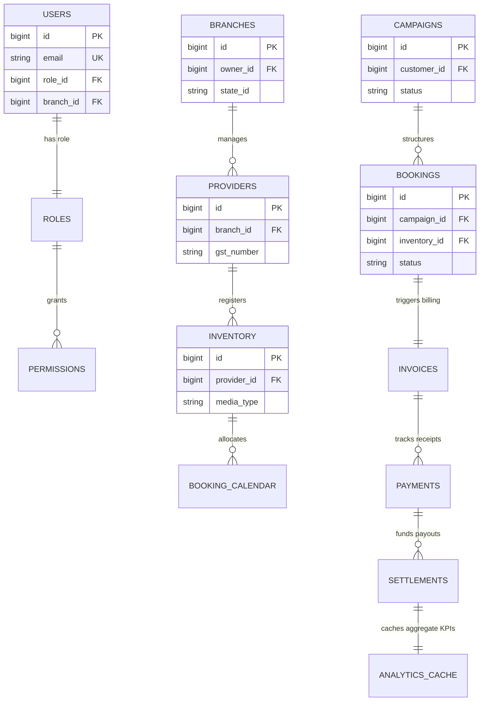
```mermaid
erDiagram
    USERS ||--|| ROLES : "has role"
    ROLES ||--o{ PERMISSIONS : "grants"
    BRANCHES ||--o{ PROVIDERS : "manages"
    PROVIDERS ||--o{ INVENTORY : "registers"
    INVENTORY ||--o{ BOOKING_CALENDAR : "allocates"
    CAMPAIGNS ||--o{ BOOKINGS : "structures"
    BOOKINGS ||--|| INVOICES : "triggers billing"
    INVOICES ||--o{ PAYMENTS : "tracks receipts"
    PAYMENTS ||--o{ SETTLEMENTS : "funds payouts"
    SETTLEMENTS ||--|| ANALYTICS_CACHE : "caches aggregate KPIs"

    USERS {
        bigint id PK
        string email UK
        bigint role_id FK
        bigint branch_id FK
    }
    BRANCHES {
        bigint id PK
        bigint owner_id FK
        string state_id
    }
    PROVIDERS {
        bigint id PK
        bigint branch_id FK
        string gst_number
    }
    INVENTORY {
        bigint id PK
        bigint provider_id FK
        string media_type
    }
    CAMPAIGNS {
        bigint id PK
        bigint customer_id FK
        string status
    }
    BOOKINGS {
        bigint id PK
        bigint campaign_id FK
        bigint inventory_id FK
        string status
    }
```

---

# 3. USER & RBAC SCHEMA
Manages global credentials, custom role definitions, and granular action gates across all portals.

## A. ER Relationship Mapping
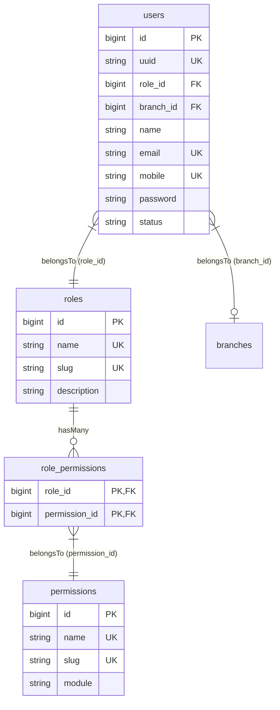
```mermaid
erDiagram
    users }|--|| roles : "belongsTo (role_id)"
    users }|--o| branches : "belongsTo (branch_id)"
    roles ||--o{ role_permissions : "hasMany"
    role_permissions }|--|| permissions : "belongsTo (permission_id)"

    users {
        bigint id PK
        string uuid UK
        bigint role_id FK
        bigint branch_id FK
        string name
        string email UK
        string mobile UK
        string password
        string status
    }
    roles {
        bigint id PK
        string name UK
        string slug UK
        string description
    }
    permissions {
        bigint id PK
        string name UK
        string slug UK
        string module
    }
    role_permissions {
        bigint role_id PK,FK
        bigint permission_id PK,FK
    }
```

---

# 4. BRANCH SCHEMA (District-wise)
Defines the regional operational boundaries, branch staff scopes, and dynamic district-wise commission metrics.

## A. ER Relationship Mapping
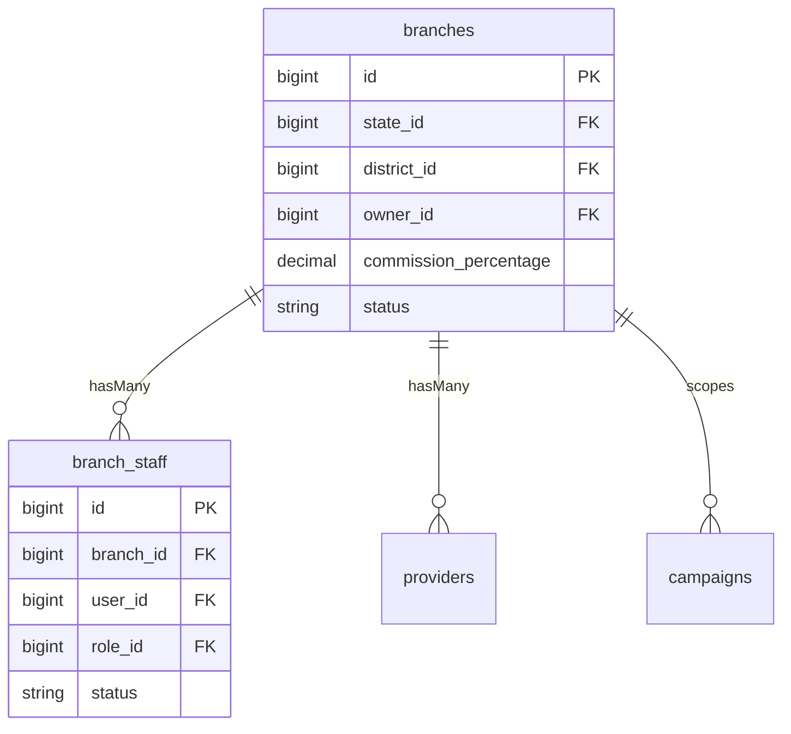
```mermaid
erDiagram
    branches ||--o{ branch_staff : "hasMany"
    branches ||--o{ providers : "hasMany"
    branches ||--o{ campaigns : "scopes"

    branches {
        bigint id PK
        bigint state_id FK
        bigint district_id FK
        bigint owner_id FK
        decimal commission_percentage
        string status
    }
    branch_staff {
        bigint id PK
        bigint branch_id FK
        bigint user_id FK
        bigint role_id FK
        string status
    }
```

---

# 5. LOCATION HIERARCHY SCHEMA
Forms the foundation of geo-intelligence. Each level is strictly bound via one-to-many hierarchies down to road-level coordinates.

## A. ER Relationship Mapping
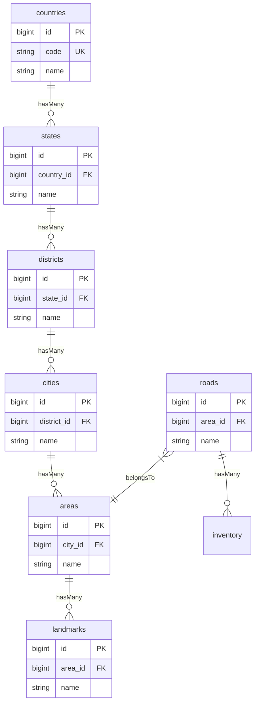
```mermaid
erDiagram
    countries ||--o{ states : "hasMany"
    states ||--o{ districts : "hasMany"
    districts ||--o{ cities : "hasMany"
    cities ||--o{ areas : "hasMany"
    areas ||--o{ landmarks : "hasMany"
    roads }|--|| areas : "belongsTo"
    roads ||--o{ inventory : "hasMany"

    countries {
        bigint id PK
        string code UK
        string name
    }
    states {
        bigint id PK
        bigint country_id FK
        string name
    }
    districts {
        bigint id PK
        bigint state_id FK
        string name
    }
    cities {
        bigint id PK
        bigint district_id FK
        string name
    }
    areas {
        bigint id PK
        bigint city_id FK
        string name
    }
    landmarks {
        bigint id PK
        bigint area_id FK
        string name
    }
    roads {
        bigint id PK
        bigint area_id FK
        string name
    }
```

---

# 6. PROVIDERS SCHEMA
Identifies billboard owners, onboarding portfolios, corporate KYC, bank configurations, and branch tracking coordinates.

## A. ER Relationship Mapping
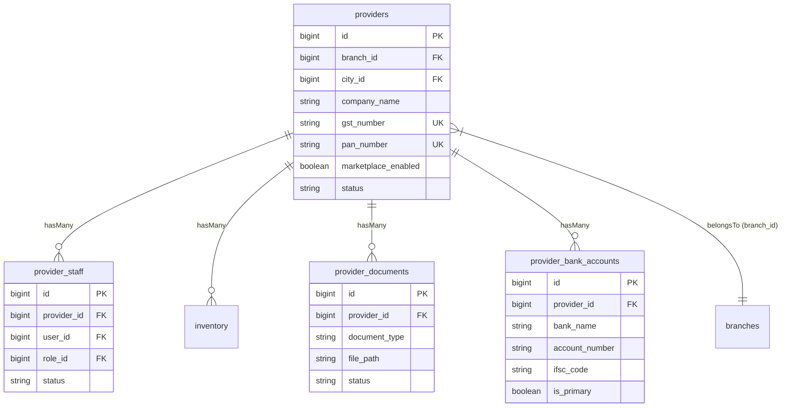
```mermaid
erDiagram
    providers ||--o{ provider_staff : "hasMany"
    providers ||--o{ inventory : "hasMany"
    providers ||--o{ provider_documents : "hasMany"
    providers ||--o{ provider_bank_accounts : "hasMany"
    providers }|--|| branches : "belongsTo (branch_id)"

    providers {
        bigint id PK
        bigint branch_id FK
        bigint city_id FK
        string company_name
        string gst_number UK
        string pan_number UK
        boolean marketplace_enabled
        string status
    }
    provider_staff {
        bigint id PK
        bigint provider_id FK
        bigint user_id FK
        bigint role_id FK
        string status
    }
    provider_documents {
        bigint id PK
        bigint provider_id FK
        string document_type
        string file_path
        string status
    }
    provider_bank_accounts {
        bigint id PK
        bigint provider_id FK
        string bank_name
        string account_number
        string ifsc_code
        boolean is_primary
    }
```

---

# 7. INVENTORY SCHEMA
Catalogs available physical assets (digital screens, boards, hoarding sizes) coupled with pricing matrix tables and schedules.

## A. ER Relationship Mapping
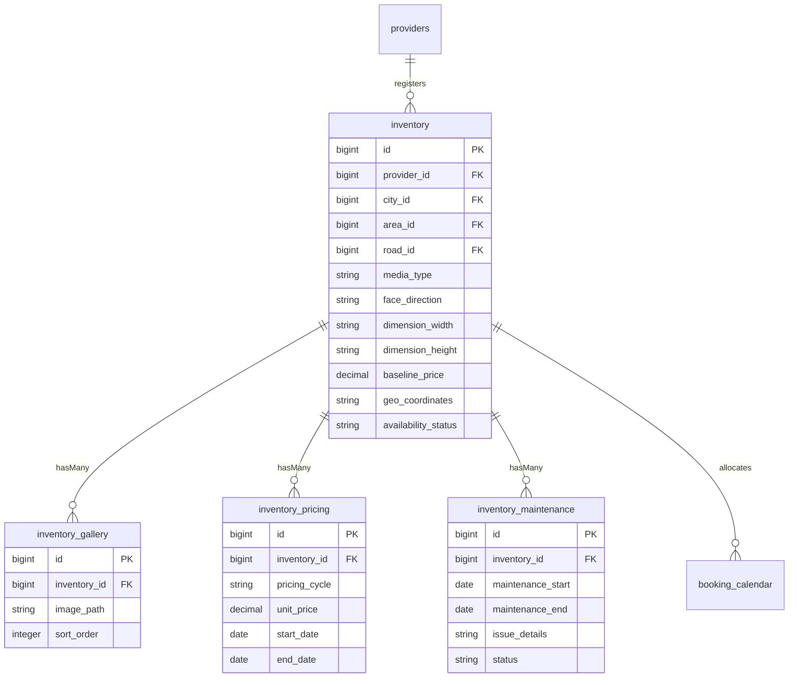
```mermaid
erDiagram
    providers ||--o{ inventory : "registers"
    inventory ||--o{ inventory_gallery : "hasMany"
    inventory ||--o{ inventory_pricing : "hasMany"
    inventory ||--o{ inventory_maintenance : "hasMany"
    inventory ||--o{ booking_calendar : "allocates"

    inventory {
        bigint id PK
        bigint provider_id FK
        bigint city_id FK
        bigint area_id FK
        bigint road_id FK
        string media_type
        string face_direction
        string dimension_width
        string dimension_height
        decimal baseline_price
        string geo_coordinates
        string availability_status
    }
    inventory_gallery {
        bigint id PK
        bigint inventory_id FK
        string image_path
        integer sort_order
    }
    inventory_pricing {
        bigint id PK
        bigint inventory_id FK
        string pricing_cycle
        decimal unit_price
        date start_date
        date end_date
    }
    inventory_maintenance {
        bigint id PK
        bigint inventory_id FK
        date maintenance_start
        date maintenance_end
        string issue_details
        string status
    }
```

---

# 8. CAMPAIGN SCHEMA
Houses master configurations, target locations, client artwork setups, and conversion states.

## A. ER Relationship Mapping
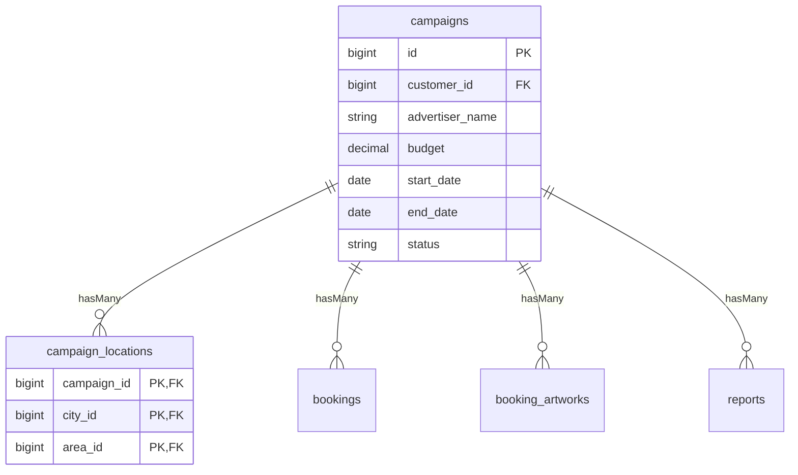
```mermaid
erDiagram
    campaigns ||--o{ campaign_locations : "hasMany"
    campaigns ||--o{ bookings : "hasMany"
    campaigns ||--o{ booking_artworks : "hasMany"
    campaigns ||--o{ reports : "hasMany"

    campaigns {
        bigint id PK
        bigint customer_id FK
        string advertiser_name
        decimal budget
        date start_date
        date end_date
        string status
    }
    campaign_locations {
        bigint campaign_id PK,FK
        bigint city_id PK,FK
        bigint area_id PK,FK
    }
```

---

# 9. BOOKING ENGINE SCHEMA
Coordinates transaction holding patterns, Redis temporal holds (30 mins), conflict mappings, and physical verification logs.

## A. ER Relationship Mapping
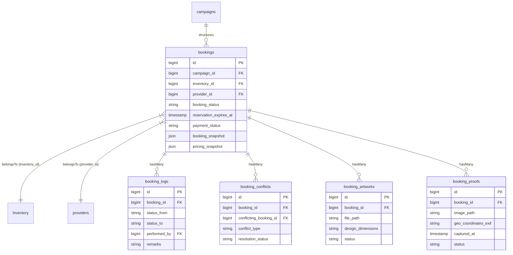
```mermaid
erDiagram
    campaigns ||--o{ bookings : "structures"
    bookings }|--|| inventory : "belongsTo (inventory_id)"
    bookings }|--|| providers : "belongsTo (provider_id)"
    bookings ||--o{ booking_logs : "hasMany"
    bookings ||--o{ booking_conflicts : "hasMany"
    bookings ||--o{ booking_artworks : "hasMany"
    bookings ||--o{ booking_proofs : "hasMany"

    bookings {
        bigint id PK
        bigint campaign_id FK
        bigint inventory_id FK
        bigint provider_id FK
        string booking_status
        timestamp reservation_expires_at
        string payment_status
        json booking_snapshot
        json pricing_snapshot
    }
    booking_logs {
        bigint id PK
        bigint booking_id FK
        string status_from
        string status_to
        bigint performed_by FK
        string remarks
    }
    booking_conflicts {
        bigint id PK
        bigint booking_id FK
        bigint conflicting_booking_id FK
        string conflict_type
        string resolution_status
    }
    booking_artworks {
        bigint id PK
        bigint booking_id FK
        string file_path
        string design_dimensions
        string status
    }
    booking_proofs {
        bigint id PK
        bigint booking_id FK
        string image_path
        string geo_coordinates_exif
        timestamp captured_at
        string status
    }
```

---

# 10. BOOKING CALENDAR SCHEMA
The single source of truth for slot availability. Every day of a slot must be represented by a unique row in this engine.

## A. ER Relationship Mapping
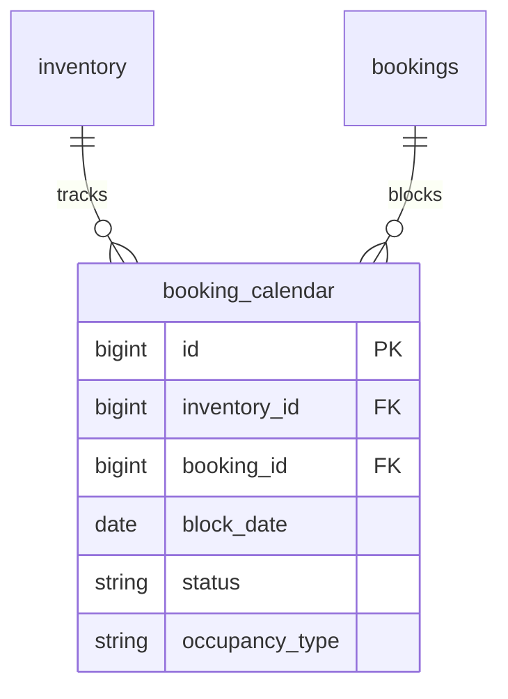
```mermaid
erDiagram
    inventory ||--o{ booking_calendar : "tracks"
    bookings ||--o{ booking_calendar : "blocks"

    booking_calendar {
        bigint id PK
        bigint inventory_id FK
        bigint booking_id FK
        date block_date
        string status
        string occupancy_type
    }
```

## B. Lifecycle Status Options
A calendar day's state transition operates within specific boundaries:
*   **Temporary Reserved**: Set during checkout (enforced by a 30-minute Redis lock).
*   **Reserved**: Blocked by an administrator awaiting payout verification.
*   **Booked**: Confirmed, paid, and locked in the schedule.
*   **Maintenance**: Physical billboard under repair.
*   **Blocked**: Staged out of service for internal operations.

---

# 11. AVAILABILITY ENGINE SCHEMA
Evaluates and validates calendars against reservation conflicts, Redis hold arrays, and maintenance blocks before releasing inventory slot results.

## A. ER Relationship Mapping
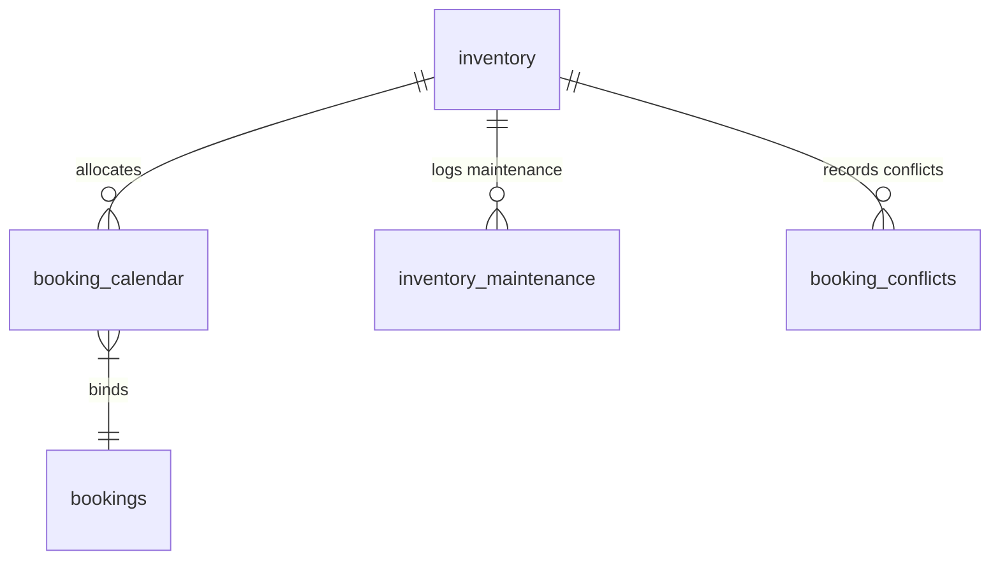
```mermaid
erDiagram
    inventory ||--o{ booking_calendar : "allocates"
    inventory ||--o{ inventory_maintenance : "logs maintenance"
    inventory ||--o{ booking_conflicts : "records conflicts"

    booking_calendar }|--|| bookings : "binds"
```

---

# 12. FINANCE SCHEMA
Structures accounts payable/receivable, taxes (GST/CGST), payments, commissions, payouts, and historical trace parameters.

## A. ER Relationship Mapping
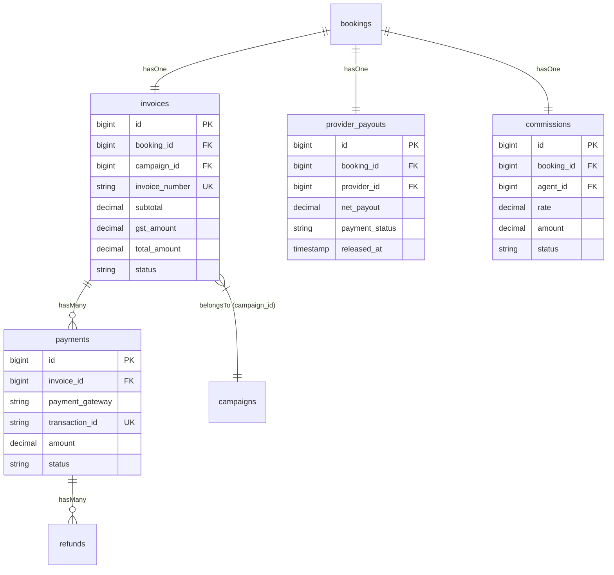
```mermaid
erDiagram
    bookings ||--|| invoices : "hasOne"
    invoices ||--o{ payments : "hasMany"
    invoices }|--|| campaigns : "belongsTo (campaign_id)"
    bookings ||--|| provider_payouts : "hasOne"
    bookings ||--|| commissions : "hasOne"
    payments ||--o{ refunds : "hasMany"

    invoices {
        bigint id PK
        bigint booking_id FK
        bigint campaign_id FK
        string invoice_number UK
        decimal subtotal
        decimal gst_amount
        decimal total_amount
        string status
    }
    payments {
        bigint id PK
        bigint invoice_id FK
        string payment_gateway
        string transaction_id UK
        decimal amount
        string status
    }
    provider_payouts {
        bigint id PK
        bigint booking_id FK
        bigint provider_id FK
        decimal net_payout
        string payment_status
        timestamp released_at
    }
    commissions {
        bigint id PK
        bigint booking_id FK
        bigint agent_id FK
        decimal rate
        decimal amount
        string status
    }
```

---

# 13. CRM SCHEMA
Logs leads, agent follow-up schedules, conversions, and campaign associations.

## A. ER Relationship Mapping
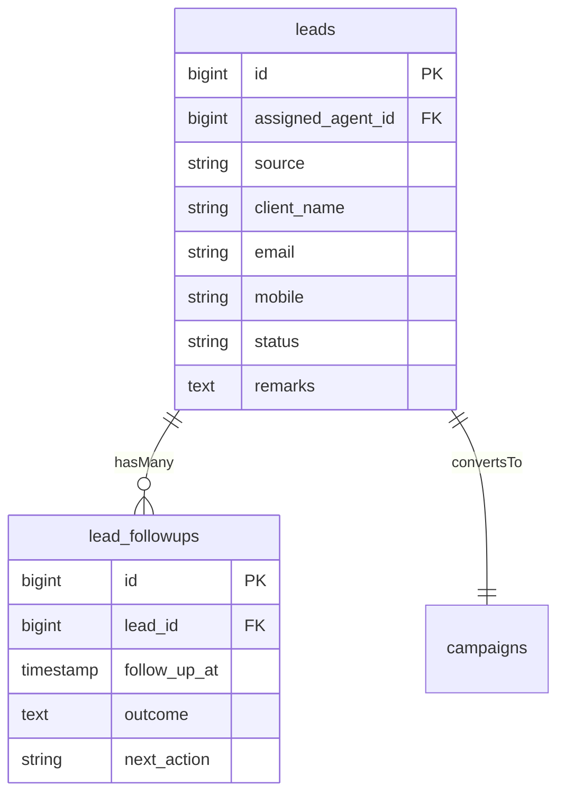
```mermaid
erDiagram
    leads ||--o{ lead_followups : "hasMany"
    leads ||--|| campaigns : "convertsTo"

    leads {
        bigint id PK
        bigint assigned_agent_id FK
        string source
        string client_name
        string email
        string mobile
        string status
        text remarks
    }
    lead_followups {
        bigint id PK
        bigint lead_id FK
        timestamp follow_up_at
        text outcome
        string next_action
    }
```

---

# 14. AGENTS SCHEMA
Demarcates agent profiles, KYC parameters, historical campaigns closed, commission scales, and aggregate conversions.

## A. ER Relationship Mapping
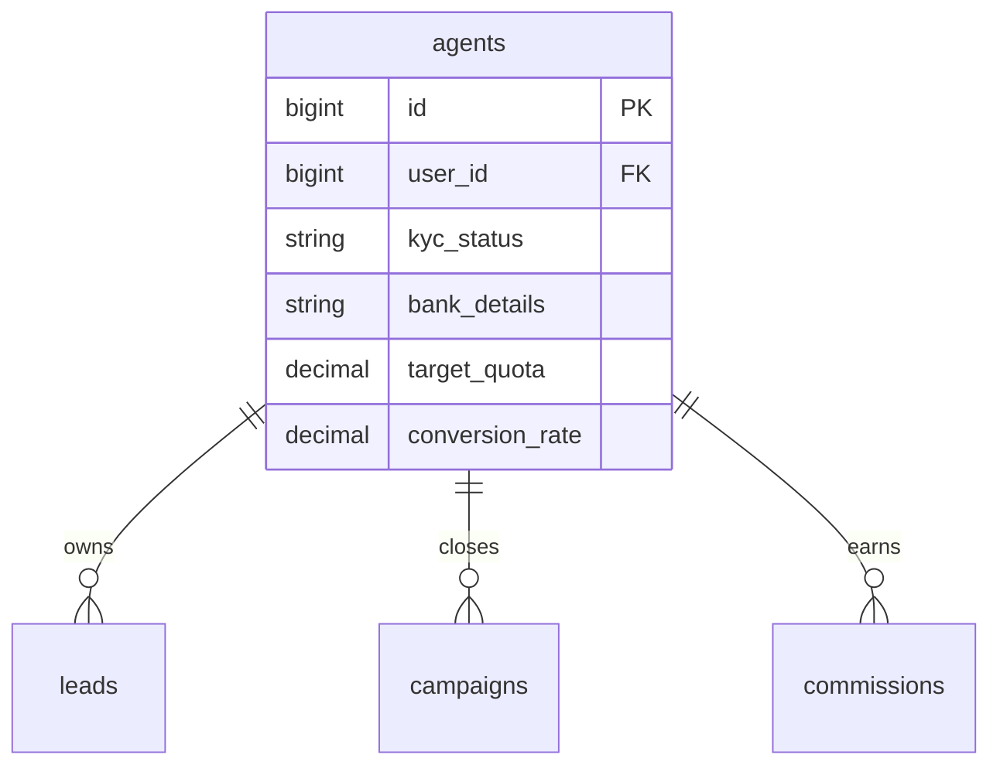
```mermaid
erDiagram
    agents ||--o{ leads : "owns"
    agents ||--o{ campaigns : "closes"
    agents ||--o{ commissions : "earns"

    agents {
        bigint id PK
        bigint user_id FK
        string kyc_status
        string bank_details
        decimal target_quota
        decimal conversion_rate
    }
```

---

# 15. MARKETPLACE SCHEMA
Coordinates public queries, search keywords logs, and premium featured billboard listings.

## A. ER Relationship Mapping
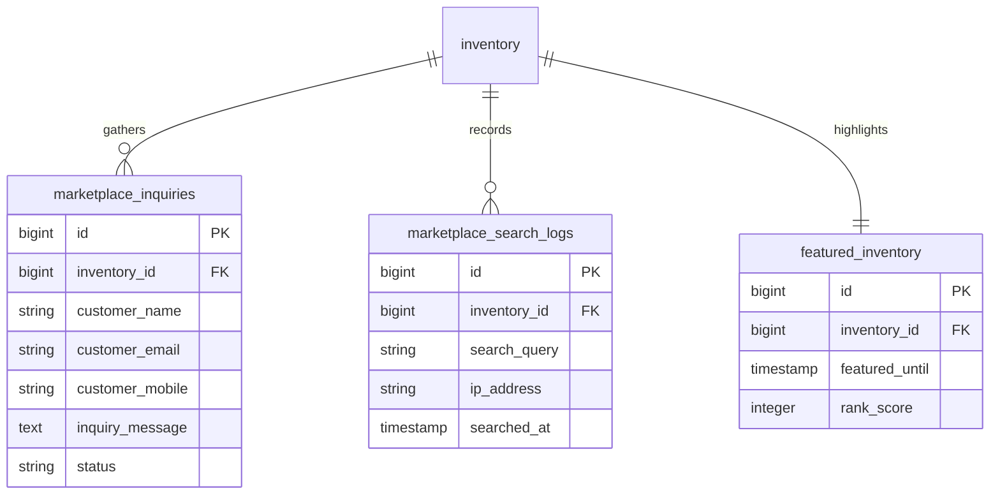
```mermaid
erDiagram
    inventory ||--o{ marketplace_inquiries : "gathers"
    inventory ||--o{ marketplace_search_logs : "records"
    inventory ||--|| featured_inventory : "highlights"

    marketplace_inquiries {
        bigint id PK
        bigint inventory_id FK
        string customer_name
        string customer_email
        string customer_mobile
        text inquiry_message
        string status
    }
    marketplace_search_logs {
        bigint id PK
        bigint inventory_id FK
        string search_query
        string ip_address
        timestamp searched_at
    }
    featured_inventory {
        bigint id PK
        bigint inventory_id FK
        timestamp featured_until
        integer rank_score
    }
```

---

# 16. NOTIFICATIONS SCHEMA
Coordinates alert events, dispatch buffers, logs, and gateway responses.

## A. ER Relationship Mapping
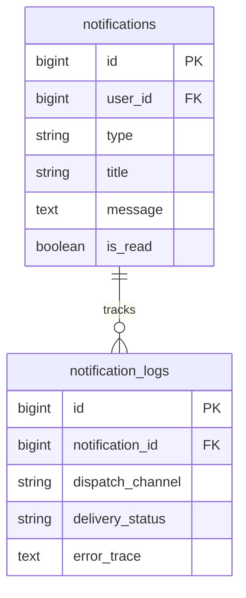
```mermaid
erDiagram
    notifications ||--o{ notification_logs : "tracks"

    notifications {
        bigint id PK
        bigint user_id FK
        string type
        string title
        text message
        boolean is_read
    }
    notification_logs {
        bigint id PK
        bigint notification_id FK
        string dispatch_channel
        string delivery_status
        text error_trace
    }
```

---

# 17. ANALYTICS SCHEMA
Read-optimized analytical cache table consolidating platform-wide operational KPIs.

## A. ER Relationship Mapping
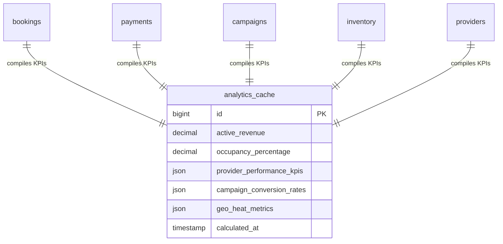
```mermaid
erDiagram
    bookings ||--|| analytics_cache : "compiles KPIs"
    payments ||--|| analytics_cache : "compiles KPIs"
    campaigns ||--|| analytics_cache : "compiles KPIs"
    inventory ||--|| analytics_cache : "compiles KPIs"
    providers ||--|| analytics_cache : "compiles KPIs"

    analytics_cache {
        bigint id PK
        decimal active_revenue
        decimal occupancy_percentage
        json provider_performance_kpis
        json campaign_conversion_rates
        json geo_heat_metrics
        timestamp calculated_at
    }
```

---

# 18. MASTER OPERATION FLOW
Shows the transactional and relational sequence across the main database schemas.

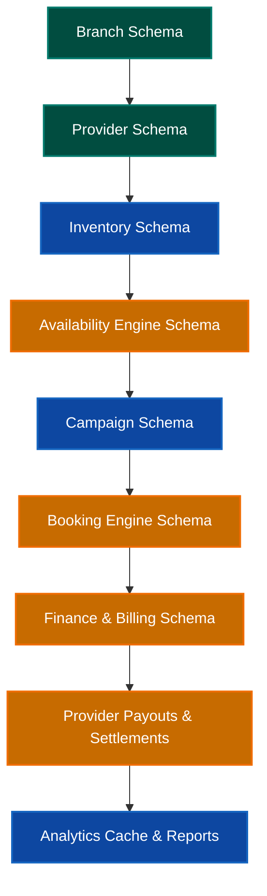
```mermaid
graph TD
    classDef branch fill:#014D40,stroke:#00796B,stroke-width:2px,color:#fff;
    classDef engine fill:#C76B00,stroke:#EF6C00,stroke-width:2px,color:#fff;
    classDef core fill:#0D47A1,stroke:#1565C0,stroke-width:2px,color:#fff;

    BranchSchema[Branch Schema]:::branch --> ProviderSchema[Provider Schema]:::branch
    ProviderSchema --> InventorySchema[Inventory Schema]:::core
    InventorySchema --> Availability[Availability Engine Schema]:::engine
    Availability --> CampaignSchema[Campaign Schema]:::core
    CampaignSchema --> BookingSchema[Booking Engine Schema]:::engine
    BookingSchema --> FinanceSchema[Finance & Billing Schema]:::engine
    FinanceSchema --> PayoutsSchema[Provider Payouts & Settlements]:::engine
    PayoutsSchema --> AnalyticsSchema[Analytics Cache & Reports]:::core
```

---

# 19. MOST IMPORTANT RELATIONSHIPS
These four relationships define the database integrity constraints across the core transaction loop.

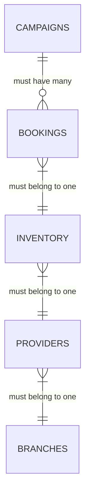
```mermaid
erDiagram
    CAMPAIGNS ||--o{ BOOKINGS : "must have many"
    BOOKINGS }|--|| INVENTORY : "must belong to one"
    INVENTORY }|--|| PROVIDERS : "must belong to one"
    PROVIDERS }|--|| BRANCHES : "must belong to one"
```

---

# 20. MOST IMPORTANT DATABASE TABLES
These seven core tables manage state, transactional calendars, and payouts for the entire platform.

| Table Name | Segment | Key Dependencies | Primary Purpose |
| :--- | :--- | :--- | :--- |
| `inventory` | Core Media Catalog | `provider_id`, `city_id` | Tracks details, dimensions, and specifications of every hoarding asset. |
| `bookings` | Transactional Holds | `campaign_id`, `inventory_id` | Manages checkout processes, 30-minute holds, approvals, and physical proofs. |
| `booking_calendar` | Schedule Control | `inventory_id`, `booking_id` | Single source of truth for daily occupancy blocks and conflict detection. |
| `campaigns` | Client Structures | `customer_id` | Groups multiple booking requests and tracks budgets under a single shell. |
| `invoices` | Billing Ledger | `booking_id`, `campaign_id` | Logs structural payouts, totals, sub-totals, and applicable GST amounts. |
| `payments` | Gateway Audits | `invoice_id` | Records transactional details from payment gateways. |
| `provider_payouts` | Releases & Ledger | `booking_id`, `provider_id` | Records net payout sums released to providers post branch-level audits. |

---

# 21. CORE BUSINESS ENGINES
The five database execution layers representing calculations and operational rules.

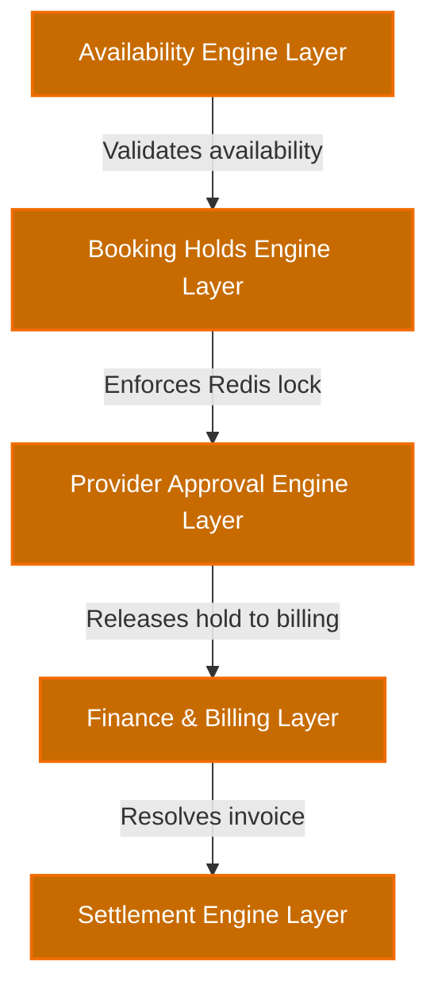
```mermaid
graph TD
    classDef layer fill:#C76B00,stroke:#EF6C00,stroke-width:2px,color:#fff;

    Avail[Availability Engine Layer]:::layer
    Book[Booking Holds Engine Layer]:::layer
    Fin[Finance & Billing Layer]:::layer
    Settle[Settlement Engine Layer]:::layer
    Approve[Provider Approval Engine Layer]:::layer

    Avail --> |Validates availability| Book
    Book --> |Enforces Redis lock| Approve
    Approve --> |Releases hold to billing| Fin
    Fin --> |Resolves invoice| Settle
```

---
*SODARS platform specification - Enterprise Database Schema Diagrams & Relationships*
