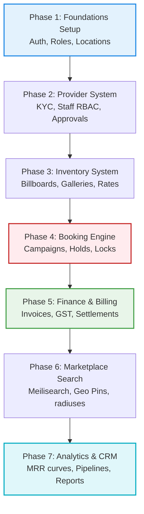

# SODARS Complete Development Specification & Implementation Guide
## Master Engineering Blueprint (development_guide.md)

---

# 1. OVERVIEW
This **Master Development Specification** establishes the development phases, technical order of operations, execution rules, core engines workflows, and structural boundaries for the SODARS (Streamline Outdoor Advertising Reach Solutions) platform. It binds all four portal client applications and the central API engine into a single unified implementation pipeline.

```
sodars/
├── apis/          # Central Laravel 12 API Engine (api.sodars.com)
├── website/       # Public Marketplace Website (www.sodars.com)
├── admin/         # Admin Command Center Portal (admin.sodars.com)
├── business/      # Media Vendor Operations Portal (business.sodars.com)
├── agents/        # Inbound Sales Agents Portal (agents.sodars.com)
├── docs/          # Complete Documentation Repository
└── deployment/    # Docker configurations and CD deployment pipelines
```

---

# 2. PURPOSE
The implementation plan is designed to coordinate engineering efforts, ensuring that key architectural foundations (like the central SQL database schema, Spatie permissions registry, and Redis concurrency guards) are completed first before proceeding to customer campaigns, billing systems, and frontend views.

---

# 3. BUSINESS LOGIC
* **The Golden Rules of Development Compliance**:
  * **Rule 1 (The Calendar Core)**: The Availability Engine and `booking_calendar` table are the authoritative source of truth.
  * **Rule 2 (No Simple CRUD)**: The Booking Engine handles dynamic dates, reservations, conflict alerts, and invoice triggers.
  * **Rule 3 (Provider Hold Checks)**: Pre-reservations require verified provider approvals before invoices are released.
  * **Rule 4 (Verified Settlements)**: Settlements are locked in escrow, releasing only after geotagged proof photos are uploaded.
  * **Rule 5 (Soft Deletes Only)**: Financial ledgers and bookings rows must never undergo hard deletes. Soft deletes must be enforced globally (`use SoftDeletes;` trait).

---

# 4. WORKFLOW
The development order of operations is partitioned across 7 developmental phases:



---

# 5. DATABASE TABLES
Development priorities are assigned to the following priority core database tables:
* **Tier 1 (Foundations)**: `users`, `roles`, `permissions`, `countries`, `states`, `districts`, `cities`, `areas`.
* **Tier 2 (Vendors & Inventory)**: `providers`, `provider_staff`, `inventory`, `inventory_gallery`, `inventory_pricing`.
* **Tier 3 (Transactions)**: `campaigns`, `bookings`, `booking_calendar`, `invoices`, `payments`, `provider_payouts`.

---

# 6. APIs
API endpoints are developed in the following priority order:
* **Priority 1 (Authentication & Locations)**:
  * `/auth/login`, `/auth/profile`, `/locations/states-by-country/{id}`, `/locations/cities-by-district/{id}`.
* **Priority 2 (Providers & Active Inventory)**:
  * `/providers/{id}/approve`, `/inventory/search`, `/inventory/{id}/gallery`.
* **Priority 3 (Campaigns, Bookings, & settlements)**:
  * `/bookings/check-availability`, `/bookings/{id}/approve`, `/finance/invoices`.

---

# 7. FRONTEND STRUCTURE
Frontend portal implementation steps are mapped to their respective user role segments:
* **Step 1 (Basic Controls)**: Auth screens, main dashboard navigation menus, collapsible sidebar trees, and topbar widgets.
* **Step 2 (Data Ingestion Views)**: Geolocation mapping, vendor KYC document upload cards, and billboard listing grids.
* **Step 3 (Transactional Views)**: Interactive booking calendars, checkout forms, payment statuses displays, and invoice panels.

---

# 8. BACKEND LOGIC
* **Framework Layer**: Powered by **Laravel 12 RESTful APIs** running on PHP 8.3+.
* **State & Guards Routing**: Decouples roles using four distinct Laravel authentication guards mapping to corresponding database entities:
  ```php
  'guards' => [
      'web'      => ['driver' => 'session', 'provider' => 'users'],
      'api'      => ['driver' => 'sanctum', 'provider' => 'users'],
      'provider' => ['driver' => 'sanctum', 'provider' => 'provider_staff'],
      'agent'    => ['driver' => 'sanctum', 'provider' => 'users'],
  ]
  ```
* **Search Engine**: **Meilisearch** integrates as the primary search engine backend to process fuzzy autocomplete terms and geographical coordinates.
* **Background Queues**: **Redis** cluster queue workers managed by Supervisor handle tasks like sending email confirmations, WhatsApp notifications, compiling reports, and compressing images.

---

# 9. VALIDATION RULES
Parameter validation rules enforce strict system requirements:
* Coordinates: `DECIMAL(10,8)` (validation rules enforce boundaries within `-90,90` and `-180,180` ranges).
* Budget constraints: `DECIMAL(12,2)` (verified positive amounts matching pricing limits).
* Files upload formats: `MIMES:WebP,JPEG,PNG,PDF` (size constraints strictly enforced under 10MB limits).

---

# 10. STATUSES
Critical workflows check for the following database states:
* Provider KYC: `Pending` -> `Approved` / `Rejected` -> `Suspended`.
* Inventory Availability: `Available` -> `Temporary Reserved` -> `Booked` -> `Maintenance`.
* Campaign Lifecycles: `Draft` -> `Pending` -> `Confirmed` -> `Active` -> `Completed` -> `Cancelled`.

---

# 11. PERMISSIONS
Access controls utilize **Spatie Laravel-Permission** mapping role hierarchies across specific capabilities:
* **Internal Admins Roles**: `Super Admin`, `Admin`, `Branch Manager`, `Agent`.
* **Vendor Owner Roles**: `Provider Owner`, `Inventory Manager`, `Booking Manager`, `Finance Manager`, `Operations Manager` (stored in `provider_staff` table).
* **Granular Action Gates**: Mapped strictly to role capabilities (`view`, `create`, `edit`, `delete`, `approve`, `export`, `manage`).

---

# 12. UI/UX NOTES
* Displays using the corporate brand identity colors: **Dark Emerald Green** (`#014D40`) for primary sidebars/action keys and **Dark Saffron** (`#C76B00`) accent indicators for alerts/holds.
* Uses Framer Motion for micro-interactions and transitions, collapsible sidebars (`280px` to `88px` on mobile), and responsive tables containing status badges.

---

# 13. FUTURE SCOPE
* **Predictive AI Modeling**: Dynamic pricing algorithms based on occupancy trends and historical traffic.
* **Geofenced Heatmaps**: Proximity metrics calculations representing road-traffic volumes.
* **Route Advertising**: Buffering algorithms grouping inventory along physical transport paths.
* **SaaS Subscription Matrix**: Auto-billing plans based on vendor tiers.

---
*SODARS ERP Project Master Development Guide - Confidential Engineering Guidelines*
