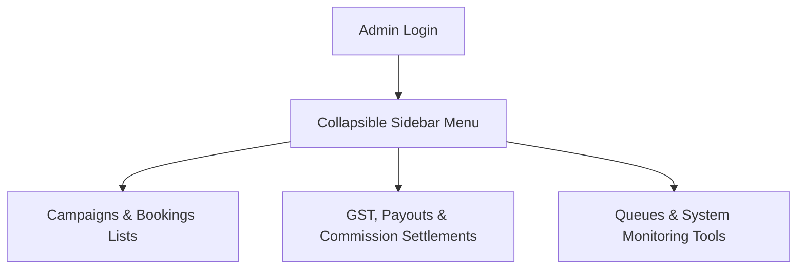

# SODARS Portal Menus & Pages: Admin Portal (admin.sodars.com)
## Component: Admin Portals > Menus & Pages

---

# 1. OVERVIEW
The **Admin Portal** acts as the central command center for SODARS administrators, managers, and branch operations teams, controlling the booking calendar, dynamic approvals, and settlements.

---

# 2. PURPOSE
To catalog the collapsible sidebar menus, dashboard layouts, operational modules, and system diagnostic pages for administrators.

---

# 3. BUSINESS LOGIC
* **Enterprise Control**: Complete authorization scope across all portals.
* **Organizational Decoupling**: Restricts branch managers to their designated regional data.

---

# 4. WORKFLOW

---

# 5. DATABASE TABLES
This portal interacts with all 49 system tables, primarily:
* `users`
* `roles`
* `providers`
* `bookings`
* `activity_logs`

---

# 6. APIs
Protected endpoints route via `/api/admin/*` paths.

---

# 7. FRONTEND STRUCTURE
* **Menu Listings**:
  * **Sidebar**: Dashboard, Users & RBAC, Branches, Locations, Providers, Inventory, Campaigns, Bookings, Finance, CRM, Marketplace, Reports, Analytics, Notifications, Settings, System Tools.
  * **Dashboard Views**: Overview, Revenue, Booking, Provider, Campaign, Occupancy.
  * **Module Sub-pages**: Branch Mapping, District Mapping, Commissions Setup, Provider Documents, KYC Approvals, Inventory Galleries, Booking Calendar Engine, System Tools Logs.

---

# 8. BACKEND LOGIC
Laravel REST controller layers utilizing persistent DB connections and dynamic cache structures.

---

# 9. VALIDATION RULES
Strict parameter check classes are configured under `App\Http\Requests\Admin`.

---

# 10. STATUSES
Monitors all transaction states: `Draft`, `Pending`, `Confirmed`, `Active`, `Completed`, `Cancelled`.

---

# 11. PERMISSIONS
Access requires the `manage-admin` flag and specific role parameters.

---

# 12. UI/UX NOTES
* Sidebar uses `#062F28` backgrounds with saffron active indicators.
* Displays widgets with drop shadows and rounded corner frameworks.

---

# 13. FUTURE SCOPE
* AI forecasting dashboards predicting occupancy curves.
