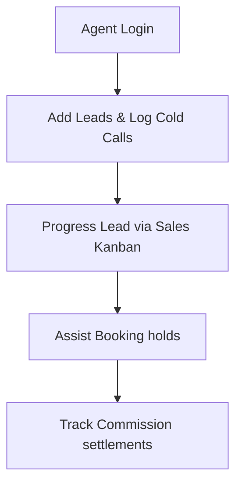

# SODARS Portal Menus & Pages: Agents Portal (agents.sodars.com)
## Component: Agents Portals > Menus & Pages

---

# 1. OVERVIEW
The **Agents Portal** provides lead management and CRM follow-up systems for sales agents, marketers, and field executives.

---

# 2. PURPOSE
To catalog the leads lists, commission trackers, sales pipelines, and customer follow-up pages.

---

# 3. BUSINESS LOGIC
* **Commission Mapping**: Commissions are calculated automatically on booking values during checkouts.
* **Lead Conversion**: Integrates lead progression metrics through a CRM pipeline.

---

# 4. WORKFLOW

---

# 5. DATABASE TABLES
* `leads`
* `lead_followups`
* `commissions`
* `customers`

---

# 6. APIs
* `GET /leads`
* `POST /leads`
* `GET /commissions`

---

# 7. FRONTEND STRUCTURE
* **Menu Listings**:
  * **Sidebar**: Dashboard, Leads, Customers, Campaigns, Bookings, Providers, Commissions, Reports, Notifications, Profile.
  * **Dashboard Views**: Overview, Revenue, Leads, Commission.
  * **Module Sub-pages**: Lead List, Follow-Ups, Meetings, Conversions, Customer Profiles, Commission History, Performance Reports, KYC/Bank Details.

---

# 8. BACKEND LOGIC
Laravel CRM services with automated callback notifications dispatched dynamically via Twilio SMS queues.

---

# 9. VALIDATION RULES
Phone numbers validated against regional formats during lead ingestion.

---

# 10. STATUSES
Lead states: `New`, `Contacted`, `Interested`, `Negotiation`, `Converted`, `Lost`.

---

# 11. PERMISSIONS
Access requires the `manage-leads` gate and Spatie role allocations.

---

# 12. UI/UX NOTES
* Leads pipeline displays inside an interactive Kanban board grid.
* Displays commission trends using saffron line graphs.

---

# 13. FUTURE SCOPE
* AI lead scoring algorithms suggesting high-yield opportunities automatically.
