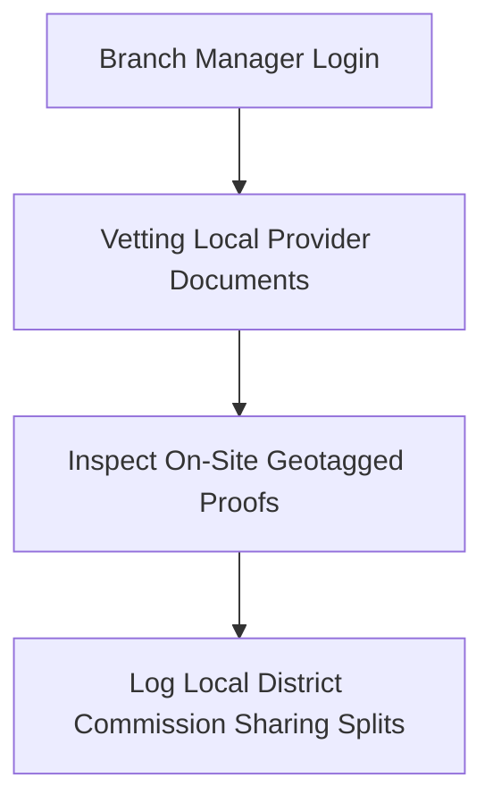

# SODARS Portal Menus & Pages: Branch Portal (district.sodars.com)
## Component: Branch Portals (District-wise) > Menus & Pages

---

# 1. OVERVIEW
The **Branch Portal (District-wise)** acts as the regional operational hub for district branch managers, enabling localized auditing of inventory assets, vetting provider registrations, and verifying campaign proof of placements within designated territory boundaries.

---

# 2. PURPOSE
To catalog the branch dashboard interfaces, district-specific inventory lists, local advertising databases, and proof verification workflows.

---

# 3. BUSINESS LOGIC
* **Territorial Isolation**: Branch staff are restricted to managing only providers and inventory listed within their assigned geographic municipal city or area coordinates.
* **Commission Mapping**: Automates logging of dynamic regional commission metrics splits during final settlements.

---

# 4. WORKFLOW


---

# 5. DATABASE TABLES
This portal scopes parameters across regional tables:
* `branches`
* `providers`
* `bookings`
* `booking_proofs`

---

# 6. APIs
Secure integrations route via localized endpoints:
* `GET /api/branch/dashboard`
* `POST /api/branch/verifications`

---

# 7. FRONTEND STRUCTURE
* **Menu Listings**:
  * **Sidebar**: Dashboard, Providers, Inventory, Campaigns, Bookings, Finance, CRM, Reports, Staff, Settings.
  * **Modules Pages**: District Operations, Provider Verification, Inventory Verification, Campaign Coordination, Proof Verification, Local Finance, Local Advertisers, District Reports.

---

# 8. BACKEND LOGIC
Eloquent repository methods scope all resource queries dynamically with regional checks matching the active user branch profile:
```php
public function scopeForBranch($query, $user)
{
    return $query->where('city_id', $user->branch->city_id);
}
```

---

# 9. VALIDATION RULES
Verification workflows enforce geotag audits. Physical checks must match exact hoarding coordinates within a standard 100-meter threshold.

---

# 10. STATUSES
* Branch state: `Active`, `Inactive`.
* Verification status: `Pending`, `Approved`, `Rejected`.

---

# 11. PERMISSIONS
Access requires specific role gates:
* `verify-local-proofs`
* `view-district-finance`

---

# 12. UI/UX NOTES
* Sidebar uses `#062F28` base with `#014D40` hover scales.
* Dashboard maps render localized color-coded geographic heatmaps depicting high-traffic junctions and occupied billboards.

---

# 13. FUTURE SCOPE
* Localized advertising algorithms mapping in-car routes density variables.
* Multi-district scheduling setups for regional branch expansion.

---
*SODARS Portals Branch Portal Pages Matrix - Enterprise System Blueprint*
