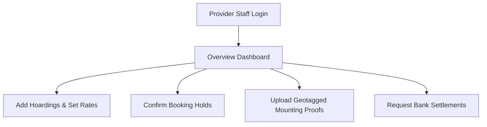

# SODARS Portal Menus & Pages: Business Portal (business.sodars.com)
## Component: Business Portals > Menus & Pages

---

# 1. OVERVIEW
The **Business Portal** is the operational dashboard for hoarding owners and billboard providers to manage assets and track payouts.

---

# 2. PURPOSE
To catalog the provider dashboard, inventory uploads, booking approvals, and financial payout pages.

---

# 3. BUSINESS LOGIC
* **Inventory Control**: Providers can edit only their registered assets.
* **Escrow Releases**: Payouts are triggered only after geotagged proof uploads are verified.

---

# 4. WORKFLOW

---

# 5. DATABASE TABLES
* `providers`
* `provider_staff`
* `inventory`
* `provider_payouts`

---

# 6. APIs
* `GET /providers/{id}/inventory`
* `POST /bookings/{id}/approve`
* `POST /uploads/proofs`

---

# 7. FRONTEND STRUCTURE
* **Menu Listings**:
  * **Sidebar**: Dashboard, Inventory, Availability, Bookings, Campaigns, Artworks, Proof Uploads, Finance, Reports, Staff Management, Notifications, Settings.
  * **Dashboard Views**: Overview, Revenue, Occupancy, Bookings, Performance.
  * **Modules Pages**: All Inventory, Add Inventory, Availability Calendar, Blocked Dates, Pending Approvals, Mounting Proofs, TDS/GST, Company Profile, Bank Settings.

---

# 8. BACKEND LOGIC
Domain service routing restricting datasets to matching `provider_id` headers.

---

# 9. VALIDATION RULES
KYC document file sizes restricted to `MAX:10MB` in PDF formats.

---

# 10. STATUSES
Inventory availability: `Available`, `Reserved`, `Booked`, `Maintenance`, `Blocked`.

---

# 11. PERMISSIONS
Spatie gates map specific actions to role profiles (e.g. Finance Managers access payouts, Designers approve artworks).

---

# 12. UI/UX NOTES
* Displays widgets styled in white border containers.
* Color codes active play states using success green alerts.

---

# 13. FUTURE SCOPE
* Mobile app integrations enabling automatic GPS camera proof uploads.
