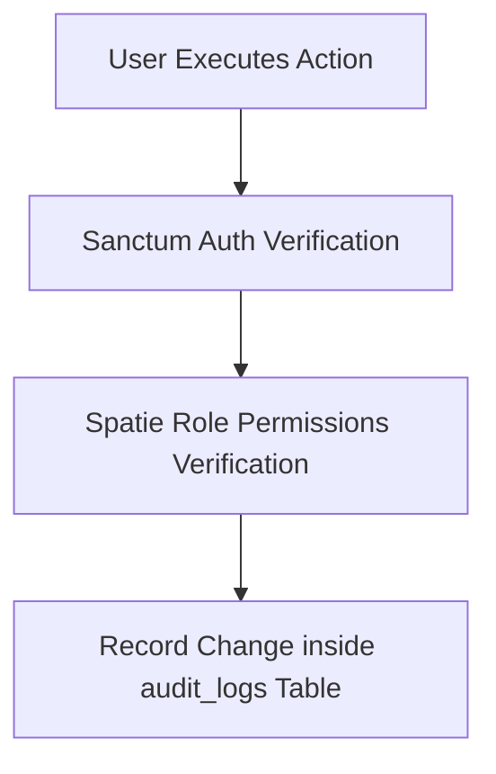

# SODARS Portal Menus & Pages: Common System Modules
## Component: Common Modules > Menus & Pages

---

# 1. OVERVIEW
Common modules represent the shared workflows, pages, and components used by internal admins, media owners, and field sales teams.

---

# 2. PURPOSE
To catalog key components, including user logins, role configurations, notifications centers, and system audits.

---

# 3. BUSINESS LOGIC
* **State Mapping**: Roles and permissions are checked across all client applications.
* **Security Logs**: Session logs trace user actions chronologically.

---

# 4. WORKFLOW

---

# 5. DATABASE TABLES
* `users`
* `roles`
* `permissions`
* `activity_logs`
* `audit_logs`

---

# 6. APIs
* `/api/auth/*`
* `/api/notifications`
* `/api/uploads`

---

# 7. FRONTEND STRUCTURE
* **System Modules**:
  * **Authentication**: Login, Registration, Password resets, Session logs.
  * **RBAC Controls**: Roles grids, Permissions checkboxes, and Active session logs.
  * **Notifications Center**: Real-time alerts alerts, Broadcasters, and email configuration templates.
  * **Storage System**: Ingestion loaders tracking uploads progress.

---

# 8. BACKEND LOGIC
Laravel services providing consistent authentication checking, and file uploading handling.

---

# 9. VALIDATION RULES
Strong password requirements (minimum 8 characters, containing uppercase, lowercase, numbers, and special symbols).

---

# 10. STATUSES
* Notification read flags: `Unread` (`0`), `Read` (`1`).

---

# 11. PERMISSIONS
* `view-logs` (Allows checking audit databases)
* `configure-system` (Aesthetic and tax rules configurations)

---

# 12. UI/UX NOTES
* Uses standardized **Lucide React Icons** and Framer Motion alert boxes across all client portals.

---

# 13. FUTURE SCOPE
* Multi-factor verification (MFA) via SMS/WhatsApp code dispatches.
