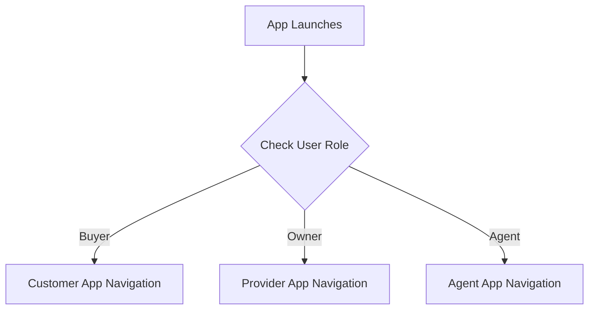

# SODARS Portal Menus & Pages: Mobile App Menus (Future)
## Component: Mobile Apps > Menus & Pages

---

# 1. OVERVIEW
The future SODARS Native Mobile Applications extend core ERP and marketplace workflows into the field for advertisers, media providers, and sales agents.

---

# 2. PURPOSE
To outline the layout structures, drawer navigations, and profile views for the Customer, Provider, and Agent mobile applications.

---

# 3. BUSINESS LOGIC
* **Field Proofing**: Camera integrations capture mounting proofs, embedding metadata directly inside file uploads.
* **Fast Navigation**: Drawer and tab layouts ensure instant access to schedules.

---

# 4. WORKFLOW

---

# 5. DATABASE TABLES
* `users`
* `bookings`
* `booking_proofs`

---

# 6. APIs
Uses Sanctum bearer tokens to connect securely with central Laravel REST APIs.

---

# 7. FRONTEND STRUCTURE
* **Menu Listings**:
  * **Customer App**: Home, Search, Map View, Campaigns, Bookings, Profile.
  * **Provider App**: Dashboard, Bookings, Proof Uploads (Day/Night camera targets), Availability, Finance.
  * **Agent App**: Leads, Campaigns, Bookings, Commissions.

---

# 8. BACKEND LOGIC
Stateless token check validations on every API call.

---

# 9. VALIDATION RULES
GPS tracking coordinates must match target physical boards coordinates within minor tolerances.

---

# 10. STATUSES
App authentication status is stored securely in local device storage.

---

# 11. PERMISSIONS
Requires standard camera and geotagging permissions from the smartphone OS.

---

# 12. UI/UX NOTES
* Built with custom responsive drawers and tabbed navigation.
* Displays charts and stats inside high-contrast, thumb-friendly cards.

---

# 13. FUTURE SCOPE
* Offline database synchronization enabling field work in low-connectivity areas.
