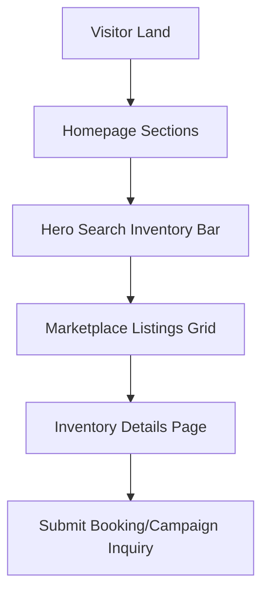

# SODARS Portal Menus & Pages: Website Portal (www.sodars.com)
## Component: Website Portals > Menus & Pages

---

# 1. OVERVIEW
The public Marketplace Website (`www.sodars.com`) is the public storefront and client acquisition interface for SODARS. It enables advertisers, agencies, brands, and consumers to discover, analyze, and initiate bookings of outdoor media.

---

# 2. PURPOSE
To catalog the navigational structures, header menus, search filter matrices, and customer landing pages to facilitate seamless public discoverability.

---

# 3. BUSINESS LOGIC
* **Headers Navigation**: Static and context-sensitive routes checking for active session tokens.
* **Search Filter Rules**: Concurrently checks locations hierarchy and availability calendars.
* **CTAs Routing**: Lead generation actions immediately route inquiries to the central CRM pipeline.

---

# 4. WORKFLOW

---

# 5. DATABASE TABLES
This module interfaces with:
* `marketplace_inquiries`
* `marketplace_search_logs`
* `inventory`
* `cities`

---

# 6. APIs
Secure integrations route via:
* `GET /marketplace/inventory`
* `GET /marketplace/search`
* `POST /marketplace/inquiries`

---

# 7. FRONTEND STRUCTURE
* **Menu Listings**:
  * **Main Header**: Home, Marketplace, Digital Screens, Transit Media, Cities, Providers, Campaigns, About Us, Contact Us, Login.
  * **Homepage Sections**: Hero Banner, Search Inventory, Featured Inventory, Top Cities, Premium Providers, Digital Screens, Campaign Solutions, How It Works, Testimonials, Blogs, Contact CTA.
  * **Marketplace Pages**: Inventory Listing, Inventory Details, Nearby Inventory, Map View, Featured Listings, Provider Listings, Campaign Inquiry, Search Results.
  * **Customer Pages**: Register, Login, Forgot Password, Dashboard, My Inquiries, My Campaigns, Invoices, Profile.
  * **Informational**: About, Privacy Policy, Terms & Conditions, Refund Policy, Blogs, Careers, Support.

---

# 8. BACKEND LOGIC
Laravel Blade template rendering with server-side caching of static informational menus to ensure `<50ms` page loads.

---

# 9. VALIDATION RULES
* Search query inputs: `MAX:100 characters`.
* Filter parameters: pincodes validated against regional databases.

---

# 10. STATUSES
* Inquiry states: `Pending`, `Contacted`, `Converted`, `Closed`.

---

# 11. PERMISSIONS
* **Guests**: Read-only marketplace browsing.
* **Advertisers**: Create campaign requests and upload artworks.

---

# 12. UI/UX NOTES
* Displays with clean white background cards and **Dark Emerald Green** (`#014D40`) primary banners.
* Accent buttons use **Dark Saffron** (`#C76B00`) for high-conversion visibility.

---

# 13. FUTURE SCOPE
* Personalization blocks dynamically suggesting local boards based on cookies.
