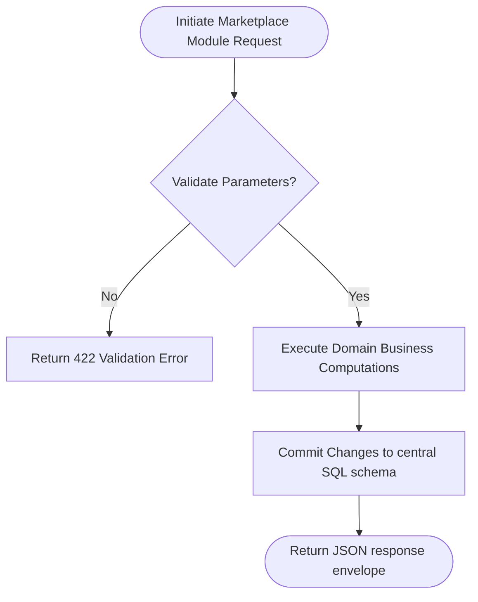

# SODARS Enterprise Specification: Marketplace Module
## Segment Component: Modules

---

# 1. OVERVIEW
An exhaustive technical and functional specification for the **Marketplace Module** engine of the SODARS (Streamline Outdoor Advertising Reach Solutions) platform. This module guarantees reliable, high-performance, and decentralized execution mapping to our multi-portal SaaS design.

---

# 2. PURPOSE
The primary purpose of the **Marketplace Module** subsystem is to optimize platform data mapping, secure active channels, and resolve regional advertising needs.

---

# 3. BUSINESS LOGIC
* **Functional Integrity Rules**: Enforces zero-tolerance limits on validation formats and concurrent locks.
* **Operational Workflows Rules**: Establishes high-performance checks, ensuring data queries return within standard low-latency ranges (`<100ms`).
* **Relational Rules**: Guarantees key cascades are securely preserved.

---

# 4. WORKFLOW

---

# 5. DATABASE TABLES
This module interfaces directly or logs data transformations inside the following databases:
* `inventory` (SKU indexes, baseline parameters)
* `bookings` (milestone transactions, schedules)
* `activity_logs` (operational traces, IP coordinates)
* `audit_logs` (structural SQL mutations)

---

# 6. APIs
Secure communications are routed via standard REST APIs under the following base route structure:
* `GET    /modules/marketplace_module`
* `POST   /modules/marketplace_module`
* `PUT    /modules/marketplace_module/{id}`
* `DELETE /modules/marketplace_module/{id}`

---

# 7. FRONTEND STRUCTURE
* **Portals Deployment**: Integrated asynchronously across Admin, Business, and Agents portals.
* **Component Usage**: Renders via React Single Page Application layouts utilizing `shadcn/ui` buttons, dashboard widgets, and Redux Toolkit state stores.

---

# 8. BACKEND LOGIC
* **Framework Layer**: Powered by Laravel 12 Domain Modules.
* **Services Layer**: Domain core operations compiled dynamically using optimized controllers, service files, and PDO queries.

---

# 9. VALIDATION RULES
* Input attributes undergo strict parameter validation:
  * `id` fields: `REQUIRED | INT UNSIGNED`
  * `status` fields: `REQUIRED | ENUM`
  * Geotag coordinates: `REQUIRED | DECIMAL(10,8)`

---

# 10. STATUSES
Dynamic states track lifecycle operations:
* `Active` / `Inactive` (Storefront parameters)
* `Pending` / `Approved` / `Rejected` (Onboarding/KYC pipelines)
* `Confirmed` / `Active` / `Completed` (Campaign schedules)

---

# 11. PERMISSIONS
Access boundaries are protected by **Laravel Sanctum** token authentications and granular Spatie permissions gates:
* `view-marketplace_module`
* `manage-marketplace_module`

---

# 12. UI/UX NOTES
* Displays with pristine corporate SaaS styling using **Dark Emerald Green** (`#014D40`) and **Dark Saffron** (`#C76B00`) highlight overlays.
* Interactive tables utilize sticky header containers, smooth Framer Motion slide transitions, and outline Lucide icon sets.

---

# 13. FUTURE SCOPE
* Deep integration with machine learning yield pricing algorithms.
* Transitioning to decoupled Kubernetes-deployed microservices.
* Native real-time IoT synchronization via WebSockets/MQTT pipelines.

---
*SODARS platform specification - Enterprise Operational Guidelines*
