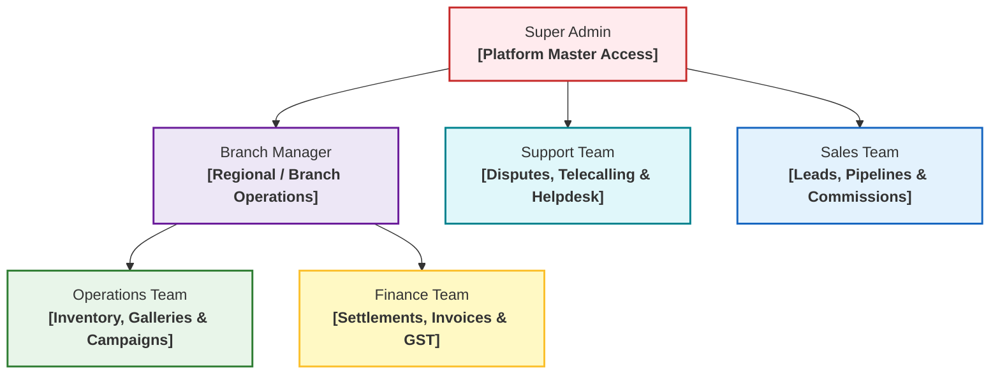
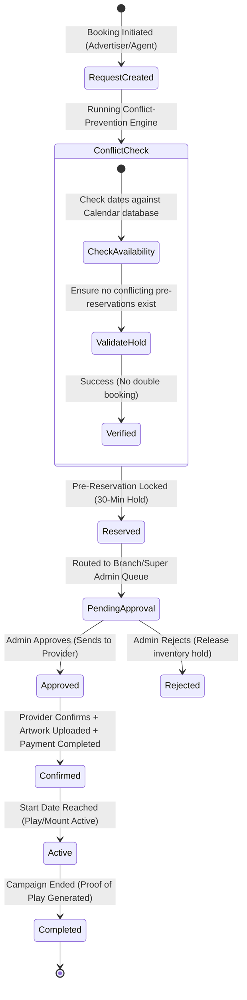

# SODARS Admin Portal Architecture & Specification
## Central Operating System & Command Center

The SODARS Admin Portal acts as the **Central Operating System** of the entire marketplace. It coordinates inventory ingestion, provider settlements, real-time conflict-free bookings, and dynamic multi-region campaign scheduling.

---

## 🗺️ Portal Navigation & Visual Layout Structure

To ensure a seamless user experience, the system utilizes a **Premium Dark Sidebar** for module switches, a **Sticky Topbar** displaying live operations alerts, and a modular **Widget-Driven Dashboard**.

```
+-----------------------------------------------------------------------------------+
|  [Logo] SODARS Admin |  🔍 Search Anything...          🔔 [3] Live  👤 Super Admin |
+----------------------+------------------------------------------------------------+
|  📊 Dashboard        |                                                            |
|  ⚙️ Operations       |  [📊 Active Bookings: 142]   [💰 Today's Revenue: $12.4K]  |
|     ├─ Campaigns     |  [📍 Occupancy Rate: 84.6%]  [⚠️ Conflicts Pending: 0 ]    |
|     ├─ Bookings      |                                                            |
|     ├─ Providers     +------------------------------------------------------------+
|     ├─ Advertisers   |  🌐 Map & Geolocation Intelligence View (Google Maps API)  |
|     └─ CRM           |                                                            |
|  📦 Inventory        |  [● Hoarding 104 - Occupied]   [● Hoarding 205 - Available]|
|  📍 Locations        |  [● Digital Billboard - Play]  [● Route Heatmap - High]   |
|  🛒 Marketplace      |                                                            |
|  💵 Finance          |                                                            |
|  📈 Analytics        +------------------------------------------------------------+
|  👥 Users & Access   |  🕒 Recent Alerts & Critical Bookings Approval Queue       |
|  🔧 Settings         |  - Booking #B-2049 requires Artwork Approval (Hoarding A)  |
+----------------------+------------------------------------------------------------+
```

---

## 🔑 User Roles & Platform Hierarchy (RBAC)

The portal is designed for secure **Role-Based Access Control (RBAC)** using hierarchical gate permissions managed by Laravel Sanctum & Spatie Permissions.



---

## 🎛️ Detailed Module Blueprint

Here is the exhaustive functional, database-linked schema mapping of the **18 Core Admin Portal Modules**:

---

### 1. Dashboard Module
* **Scope**: Executive cockpit for platform operational and financial health.
* **Pages & Views**:
  * `Dashboard` (Main aggregation widget panel)
  * `Marketplace Overview` (Live consumer metrics)
  * `Live Activities` (Real-time logs of updates)
  * `Notifications` (Operational messages queue)
  * `Quick Actions` (Launchers for fast operations)
* **Core Operations**: Dynamic charts tracking monthly recurring revenue (MRR), total booking counts, global inventory occupancy percentages, provider verification backlogs, and critical warning alerts.

---

### 2. Authentication & Security Module
* **Scope**: Hardened gateway securing organizational access.
* **Pages & Views**:
  * `Login` (MFA / single sign-on compatible)
  * `Forgot Password` / `Reset Password`
  * `Profile` (Personal configuration settings)
  * `Change Password`
  * `Sessions` (Track and force logout other active user agents)
  * `Activity Logs` (Personal audits)
* **Core Operations**: IP rate-limiting, Laravel Sanctum secure session validation, role check middleware, device fingerprinting, and audit trails.

---

### 3. User & Access Management Module
* **Scope**: Decentralized staff control and regional operational bounds.
* **Pages & Views**:
  * `Users` / `Roles` / `Permissions` (Dynamic CRUD grid)
  * `Staff Management` (Add / lock internal admin profiles)
  * `Branches` (Create and manage regional branch offices)
  * `Departments` (Grouping for operational workflows)
* **Core Operations**: Granular branch-level filtering ensuring local branch managers can only view or manage inventory/bookings matching their designated region.

---

### 4. Location Intelligence Module
* **Scope**: The geographic framework structuring all media inventory assets.
* **Pages & Views**:
  * `Countries` / `States` / `Districts` / `Cities` / `Areas`
  * `Landmarks` (High-value points of interest matching high ad-rates)
  * `Roads` (Route segmentation mapping)
  * `Analytics` (Heatmaps by occupancy and revenue yield per location)
* **Core Operations**: Google Places auto-complete integrations, geospatial coordinates mapping, traffic intelligence ingestion, and site proximity scoring.

---

### 5. Provider Management Module
* **Scope**: Complete vendor lifecycle management for third-party media owners.
* **Pages & Views**:
  * `All Providers` (Searchable vendor registry)
  * `Add Provider` / `Approvals` (KYC & verification queue)
  * `Provider Staff` / `Performance`
  * `Subscriptions` (SaaS licensing tier plans)
  * `Documents` (GSTIN certificate, ownership deeds, structural safety sheets)
  * `Payouts` (Vendor settlement accounts ledger)
* **Core Operations**: Automated business validation, subscription payment gateways, document approval engines, and review logs.

---

### 6. Advertiser Management Module
* **Scope**: Media buyer account setups, corporate profiles, and agency models.
* **Pages & Views**:
  * `Advertisers` (Standard direct accounts list)
  * `Agencies` (Umbrella corporations handling multiple sub-brands)
  * `Brand Accounts` (Individual brand directory)
  * `Campaign Owners` (Authorized campaign execution members)
* **Core Operations**: Agency hierarchy setups, credit limits control, tax profiles validation, and campaign linkage.

---

### 7. Inventory Management Module
* **Scope**: Complete repository for hoardings, digital screens, and mobile transit formats.
* **Pages & Views**:
  * `Hoardings` / `Digital Screens` / `Transit Media` (Asset CRUD forms)
  * `Availability` (Real-time occupancy calendar)
  * `Pricing` (Dynamic baseline models)
  * `Gallery` (High-res asset media gallery with mockups)
  * `Maintenance` (Damage reporting and restoration logs)
* **Core Operations**: Custom pricing modifiers, geotag verification, visibility scores, and batch inventory import/export utilities.

---

### 8. Campaign Management Module
* **Scope**: Global campaign definition and progress tracking.
* **Pages & Views**:
  * `Campaigns` (Unified campaigns list)
  * `Create Campaign` (Multi-location booking wizard)
  * `Active Campaigns` / `Completed Campaigns`
  * `Analytics` / `Reports` (Performance dashboards)
* **Core Operations**: Consolidated planning, progress trackers, budget checks, and booking assignment linkage.

---

### 9. Booking Management Module
> [!IMPORTANT]
> **Core System Engine**: This module handles real-time concurrency, inventory blocking, and strict conflict avoidance logic.



* **Pages & Views**:
  * `Booking Requests` / `Pending Approvals` (Action queues)
  * `Reserved Inventory` (Temporary locks status)
  * `Confirmed Bookings` / `Active Bookings` / `Completed Bookings` / `Cancelled Bookings`
  * `Booking Calendar` (Interactive scheduling timeline grid)
  * `Artwork Uploads` (Resolution and size validator panel)
  * `Conflict Management` (Double-booking troubleshooting dashboard)
* **Core Operations**: Automated double-booking lockouts, time-limited cart holds, size and DPI verification for uploaded creatives, and payment milestone trackers.

---

### 10. Marketplace Module
* **Scope**: Backend curation for the public-facing storefront.
* **Pages & Views**:
  * `Marketplace Dashboard` / `Inventory Search`
  * `Featured Listings` (Promotional slot setup)
  * `Booking Requests` (Inbound consumer enquiries)
  * `Maps View` (Public geographical layout curation)
  * `Marketplace Analytics` (Search term patterns)
* **Core Operations**: Search indexing optimization, featured placements billing, map query tracking, and conversion metrics.

---

### 11. Finance & GST Module
* **Scope**: Billing pipelines, dynamic tax engines, and automated vendor payout ledgers.
* **Pages & Views**:
  * `Invoices` (Automated generation, PDF exports)
  * `Payments` (Gateway integrations tracking)
  * `Provider Settlements` (Ledgers for vendor payments)
  * `GST Reports` (Regional CGST, SGST, IGST calculations)
  * `Commission Reports` (Sales agent commissions payout ledgers)
  * `Revenue Reports` / `Expenses`
* **Core Operations**: Dynamic GST taxation matrices, automatic calculation of commission percentages, and gateway integrations (e.g., Stripe, Razorpay).

---

### 12. CRM & Leads Module
* **Scope**: Inbound sales tracker and telecalling CRM system.
* **Pages & Views**:
  * `Leads` (Standard ingestion list)
  * `Enquiries` (General site form conversions)
  * `Follow Ups` (Calendar for call schedules)
  * `Sales Pipeline` (Kanban layout: New -> Contacted -> Quoted -> Won -> Closed)
  * `Deals` / `Telecalling` (Integration panel)
* **Core Operations**: Lead assignment rules, status flows, communication logs, and sales pipeline estimations.

---

### 13. Reports & Analytics Module
* **Scope**: Platform-wide reports compiling and analytics generation.
* **Pages & Views**:
  * `Revenue Reports` / `Occupancy Reports` / `Booking Reports`
  * `Provider Reports` / `Campaign Reports` / `Marketplace Reports`
  * `Custom Reports` (Advanced multi-filter query builder)
* **Core Operations**: CSV, PDF, and Excel exports, automated email report dispatch schedules, and historical trend plotting.

---

### 14. Notifications & Communication Module
* **Scope**: Alerts orchestrator connecting providers, internal staff, and advertisers.
* **Pages & Views**:
  * `Notifications` (Logs of sent and triggered alerts)
  * `Email Templates` (Interactive WYSIWYG editor)
  * `SMS Templates` / `WhatsApp Templates`
  * `Push Notifications` / `Announcements` (System-wide banners)
* **Core Operations**: Event-driven notification dispatch triggers (e.g., BookingConfirmed event routes template via Twilio/SendGrid).

---

### 15. Activity Logs Module
* **Scope**: Forensic accountability logs recording every database modification.
* **Pages & Views**:
  * `System Logs` (Server health alerts and framework warnings)
  * `User Activity` (Admin-by-admin change tracker)
  * `Booking Logs` / `Finance Logs` / `Security Logs`
* **Core Operations**: Detailed database diff logging, user session identification mapping, IP verification, and secure export.

---

### 16. Settings Module
* **Scope**: General constants configuring platform parameters.
* **Pages & Views**:
  * `General Settings` (Base configurations)
  * `Branding` / `Theme Settings` (Light/Dark themes, CSS styling controls)
  * `Tax Settings` (Global VAT/GST brackets setup)
  * `Payment Gateway` / `Storage Settings` (S3/R2 configurations)
  * `Notification Settings` / `API Settings` (Key management)
* **Core Operations**: Configuration variables caching, dynamic loading of gateway keys, and SMTP server validation.

---

### 17. AI & Future Modules
* **Scope**: Advanced data modeling layers predicting yield and dynamic pricing models.
* **Pages & Views**:
  * `AI Pricing` (Dynamic pricing engine based on historical demand)
  * `AI Campaign Planner` (Automated budget assignment helper)
  * `Traffic Intelligence` (Pulls foot-traffic and route visibility indices)
  * `Heatmaps` (Spatio-temporal mapping of inventory demand)
  * `Revenue Forecasting` / `AI Recommendations`
* **Core Operations**: Regression algorithms for occupancy curves, geo-demand analysis, and automated budget optimized campaign planning.

---

## 🗂️ Sidebar Navigation Structure

```txt
Dashboard                 # Platform Analytics & live metrics
 
Operations                # Main transactional control panel
 ├── Campaigns            # Multi-hoarding campaign definitions
 ├── Bookings             # Dynamic reservations, calendar & scheduling
 ├── Providers            # Media vendor registrations & performance audits
 ├── Advertisers          # Agency and direct buyer profiles
 └── CRM                  # Sales pipeline & inbound lead tracker

Inventory                 # Master assets repository
 ├── Hoardings            # Static physical boards CRUD
 ├── Digital Screens      # Real-time programmable media
 ├── Availability         # Master occupancy calendar grid
 ├── Pricing              # Custom rate matrices
 └── Gallery              # Media library, mockups & drone uploads

Locations                 # Geospatial taxonomy definitions
 ├── Countries            # Global operational nodes
 ├── States               # State level hubs
 ├── Districts            # Regional subdivisions
 ├── Cities               # City hubs
 ├── Areas                # Local area segments
 ├── Landmarks            # Point of interest markers
 └── Roads                # Dynamic route mapping

Marketplace               # Storefront configurations
 ├── Listings             # Curation of web-facing listings
 ├── Search               # Search logging and mapping
 ├── Requests             # Incoming direct inquiry forms
 └── Maps                 # Pin placements and route overlaps

Finance                   # Fiscal ledger management
 ├── Invoices             # Automated client invoicing pipelines
 ├── Payments             # Credit collections & transactional listings
 ├── GST                  # Comprehensive tax matrices
 ├── Settlements          # Provider payouts ledger
 └── Reports              # Monthly yield and financial balances

Analytics                 # Performance dashboards
 ├── Revenue              # MRR, ARR and branch comparisons
 ├── Occupancy            # Asset metrics (occupied vs vacant ratios)
 ├── Campaigns            # Media performance insights
 ├── Providers            # Vendor yield analyses
 └── Marketplace          # Search vs booking conversions

Users & Access            # Internal security controls
 ├── Users                # Super admin, staff profiles list
 ├── Roles                # Access groups definitions
 ├── Permissions          # Granular action gates mapping
 └── Activity Logs        # Traceable action logs audits

Settings                  # Base environment modifiers
 ├── General              # Title, currency and parameters
 ├── Branding             # Visual assets, email templates
 ├── APIs                 # Gateway, Google Maps and Twilio configurations
 └── Notifications        # Custom triggers layout setup
```

---

## 💻 Tech Stack Summary & APIs

### 1. Frontend Framework
* **Engine**: ReactJS + Vite (ultra-responsive state updates)
* **CSS Framework**: Tailwind CSS (pixel-perfect responsive styles)
* **State Management**: Redux Toolkit (central stores for inventory configurations, authentication sessions, and alerts)
* **Request Handler**: Axios (with custom token intercepts)
* **UI Elements & Motion**: `shadcn/ui` components combined with `Framer Motion` animations for micro-interactions and transitions.

### 2. Backend Infrastructure
* **API Framework**: Laravel 12 RESTful API with structured resource transformers.
* **Database**: MySQL.
* **Authentication**: Laravel Sanctum stateful API tokens.
* **Roles Engine**: Spatie Laravel-Permission (handling permissions cache structures).
