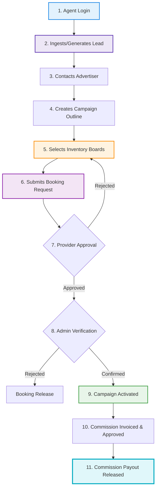
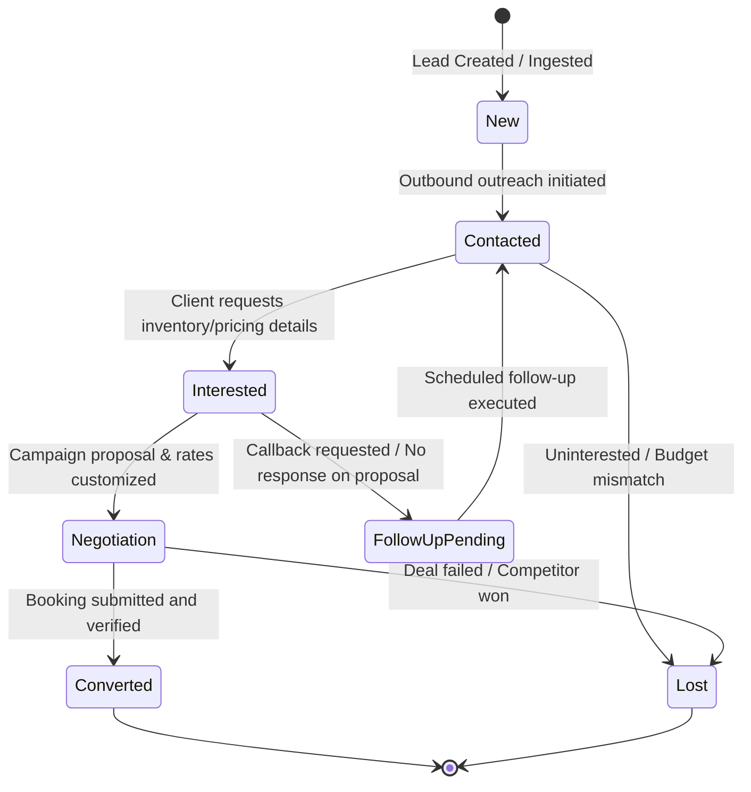

# SODARS Agents Portal Architecture & Specification
## Outdoor Advertising Sales Operating System (agents.sodars.com)

The **SODARS Agents Portal** acts as the sales engine and field operations command center for sales agents, marketing executives, field representatives, affiliates, and business development managers. It streamlines lead tracking, customer CRM follow-ups, dynamic commission accounting, and third-party media owner acquisition.

---

## 🚀 Sales & Onboarding Lifecycle Workflow

Agents generate leads from outreach campaigns, structure custom billboard campaigns, search geospatial inventory, execute booking requests on behalf of advertisers, and track their earned commission cycles.



---

## 👥 Agent Persona Descriptions & Permissions

The platform supports different agent profiles to enable both office-based sales teams and distributed field affiliates.

| Agent Persona | Focus Area | Primary Capabilities & Access |
| :--- | :--- | :--- |
| **Sales Agent** | Inbound enquiries & CRM management. | Complete access to CRM, leads creation, and campaigns creation. |
| **Field Executive** | Outdoor site scouting & offline agency deals. | Location tagging, inventory exploration, site geotag tracking. |
| **Affiliate Partner** | External referrals & link-based conversions. | Limited dashboard tracking, link generations, payout history checks. |
| **Marketing Executive** | Lead generation campaigns & corporate outreach. | Leads module control, conversion trend analytics. |
| **Provider Acquisition Agent** | Recruiting new media vendors / hoarding owners. | Provider module, vendor registration, acquisition ledgers. |
| **Campaign Executive** | Handholding active advertisers and coordinate artwork. | Active bookings calendar tracking, artwork upload logs. |

---

## 📊 Lead Status Lifecycle State Machine

The CRM core tracks the status of inbound advertiser relationships through a structured state machine.



---

## 🎛️ Detailed Module Blueprint

The Agents Portal is divided into **17 functional modules** designed for high-conversion field operations.

---

### 1. Authentication Module
* **Scope**: Secure user gateway ensuring strict credential integrity.
* **Pages & Views**:
  * `Login` (MFA secure login verification)
  * `Forgot Password` / `Reset Password`
  * `Profile` (Agent account configuration settings)
  * `Change Password`
  * `Sessions` (Terminating alternative active browser sessions)
* **Core Operations**: Session validation via JWT and Laravel Sanctum tokens, security auditing, and account locking settings.

---

### 2. Dashboard Module
* **Scope**: Centralized workspace summarizing daily milestones.
* **Pages & Views**:
  * `Dashboard` (Widget summary view)
  * `Activities` (Outbound/Inbound historical timeline)
  * `Notifications` (Unread alerts container)
  * `Quick Actions` (Launchers: Add Lead, Search Inventory, Request Payout)
* **KPI Matrix Dashboard**:
  * **Total Leads**: gross pipeline accounts.
  * **Active Campaigns**: Client boards running.
  * **Bookings Created**: Conversion orders submitted.
  * **Pending Follow Ups**: Critical call queues.
  * **Commission Earnings**: Total balance ready/withdrawn.

---

### 3. Leads Management Module
> [!IMPORTANT]
> **Primary Sales Ingestion Ledger**: Built for capturing, scoring, and moving prospective buyers through the pipeline.

* **Pages & Views**:
  * `All Leads` / `Lead Details` (Searchable details tables)
  * `Add Lead` (Onboarding form)
  * `Lead Follow Ups` (Priority callback panel)
  * `Converted Leads` / `Lost Leads` (Pipeline outcomes)
* **Data Fields Model**:
  * *Customer Info*: Customer name, company name, phone, email, city, business vertical.
  * *Campaign Demands*: Format required (LED, Billboard, Transit), targeted city/regions, allocated budget range, campaign duration.
  * *Metadata*: Lead source (Direct call, Web, Reference, Field outreach, Cold calling, Provider referral), assigned owner.

---

### 4. Campaign Support Module
* **Scope**: Structuring, planning, and scheduling billboard packages for advertisers.
* **Pages & Views**:
  * `Campaigns` (Master overview grid)
  * `Create Campaign` (Wizard for selecting multi-board routes)
  * `Campaign Requests` / `Active Campaigns` / `Completed Campaigns`
* **Core Operations**: Building customized multi-board campaign maps, matching advertiser budgets to provider baseline lists, and checking temporal date conflicts.

---

### 5. Booking Assistance Module
* **Scope**: Placing temporary inventory locks and managing transaction checkouts.
* **Pages & Views**:
  * `Booking Requests` (Pending submissions queue)
  * `Pending Approvals` (Awaiting Super Admin / Provider actions)
  * `Confirmed Bookings` / `Active Bookings` / `Completed Bookings`
* **Assistance Workflow**:
  ```
  Agent Submits Booking on behalf of Advertiser 
    → Provider Approves Availability 
      → Super Admin Validates Credit/Payment 
        → Booking Formally Confirmed
  ```

---

### 6. Provider Acquisition Module
* **Scope**: Recruiting, onboarding, and registering new media vendors.
* **Pages & Views**:
  * `Providers` (Directory of onboarded media owners)
  * `Add Provider` (Legal registration form)
  * `Pending Providers` / `Approved Providers`
  * `Provider Leads` (Cold vendor targets list)
* **Acquisition Ingestion Fields**: Legal company name, contact person, mobile, GSTIN details, active hoarding counts, and geographic coverage zones.

---

### 7. Inventory Discovery Module
* **Scope**: Map-centric search console mapping real-time pricing and availability.
* **Pages & Views**:
  * `Marketplace Inventory` (Standard inventory database grid)
  * `Inventory Search` (Advanced multi-filter screen)
  * `Map View` (Google Maps API spatial display)
  * `Nearby Inventory` / `Featured Inventory`
* **Search Filter Layer**: Mappable by Target City, Local Area, Illumination type, Traffic flow classification, Baseline Budget margins, and exact calendar date availability constraints.

---

### 8. CRM & Follow Ups Module
* **Scope**: Keeping track of tasks, outbound calls, and face-to-face advertiser schedules.
* **Pages & Views**:
  * `Follow Ups` / `Reminders` (Interactive action items list)
  * `Calls` / `Meetings` / `Tasks` / `Notes` (CRM logs)
* **Core Status Flow**: Follow-up elements track statuses: `Pending`, `Completed`, `Rescheduled`, or `Cancelled`.

---

### 9. Commissions Module
* **Scope**: Transparent real-time tracker mapping commissions earned from closed deals and onboarded providers.
* **Pages & Views**:
  * `Commission Dashboard` (Summary widgets)
  * `Pending Commissions` / `Paid Commissions`
  * `Commission History` (Detailed ledger sheets)
  * `Invoices` (Agent-to-marketplace commission invoices)
* **Commission Release Pipeline**:
  ```
  Booking Marked Completed 
    → Commission Percentage Computed automatically 
      → Super Admin Compliance Signoff 
        → Commission Payout Disbursed
  ```

---

### 10. Customer Management Module
* **Scope**: Direct accounts log detailing client historical data.
* **Pages & Views**:
  * `Customers` / `Advertisers` (Master direct lists)
  * `Agencies` (Multi-brand representation configurations)
  * `Brand Accounts`

---

### 11. Notifications Module
* **Scope**: Communication center managing incoming action indicators.
* **Pages & Views**:
  * `Notifications` / `Email Alerts` / `SMS Alerts` / `WhatsApp Alerts`
* **Triggers**: Receives notifications on: *New Allocated Lead*, *Booking Request Confirmed*, *Scheduled Follow-Up Due*, *Onboarded Provider Approved*, and *Commission Payout Disbursed*.

---

### 12. Reports Module
* **Scope**: Compiling agent-level performance indexes.
* **Pages & Views**:
  * `Lead Reports` / `Booking Reports` / `Campaign Reports`
  * `Commission Reports` / `Performance Reports` (Earnings vs target quotas)

---

### 13. Geo Intelligence Module
* **Scope**: Geospatial overlay models matching high-volume traffic nodes.
* **Pages & Views**:
  * `Map View` (Proximity overlays maps)
  * `Nearby Inventory` / `Top Cities` (Top converting metropolitan grids)
  * `Traffic Analytics` / `Route Advertising` (Plotting billboards along routes)

---

### 14. Profile & Settings Module
* **Scope**: Legal identity registration, credentials, and payment targets.
* **Pages & Views**:
  * `Profile` (Personal parameters edit)
  * `Documents` (ID proof upload, PAN card registration)
  * `Bank Details` (Payout details verification check)
  * `Notifications` / `Security Settings`
* **Agent Fields Model**: Full legal name, mobile phone number, verification email, spatial address, Bank account layout (IBAN, Swift, Routing details), and structural photo identification.

---

### 15. Activity Logs Module
* **Scope**: Audit trails recording user operations for system security.
* **Core Tracker**: Records every lead edit, booking creations checklist, campaign allocation request, login attempt, and payout extraction request.

---

### 16. Future AI Features
* **Scope**: AI pipelines mapping yield probabilities.
* **Core Functions**: Predictive *AI Lead Scoring*, automated *Smart Inventory Recommendations* (budget to board optimizations), *AI Follow-up Scheduling reminders*, and *Deal Win-Rate Probability projections*.

---

## 🗂️ Sidebar Navigation Hierarchy

```txt
Dashboard                 # Global operations cockpit & daily goals

Leads                     # Customer pipeline ingestion
 ├── All Leads            # Database grid of pipeline accounts
 ├── Add Lead             # Onboarding customer wizard form
 ├── Follow Ups           # Daily callback queue checklist
 ├── Converted Leads      # High-value won listings
 └── Lost Leads           # Lost leads archives

Campaigns                 # Campaign support & outlines
 ├── Campaigns            # Active customer campaign plans list
 ├── Create Campaign      # Route and budget mapping wizard
 ├── Active Campaigns     # Currently playing campaign sites
 └── Completed            # Historical campaigns records

Bookings                  # Transactions coordination
 ├── Booking Requests     # Inbound requests checklist
 ├── Active Bookings      # Active hoarding timelines
 ├── Pending Approvals    # Bookings holding in verification queue
 └── Completed            # Archive of completed bookings

Providers                 # Vendor acquisition module
 ├── Providers            # Currently registered providers directory
 ├── Add Provider         # Vendor onboarding form
 ├── Pending Providers    # Awaiting verification lists
 └── Marketplace Enrollment # Listing setups console

Marketplace               # Inventory explore & matching
 ├── Inventory Search     # Multi-filter search console
 ├── Map View             # Google Maps coordinates screen
 ├── Featured Inventory   # High-conversion boards highlight
 └── Nearby Inventory     # Spatial boards tracker

CRM                       # Customer touchpoints tracking
 ├── Customers            # Master direct accounts directories
 ├── Meetings             # Field meetings records
 ├── Calls                # Outbound telecall loggers
 └── Tasks                # General action items checks

Commissions               # Earnings and payouts dashboard
 ├── Earnings             # Balance and dynamic ledger metrics
 ├── Pending              # Awaiting completion reserves
 ├── Paid                 # Paid out history ledger
 └── Reports              # Detailed tax and payout summaries

Reports                   # Performance analytics exports
 ├── Leads                # Ingestion conversion charts
 ├── Campaigns            # Customer campaign yields
 ├── Bookings             # Dynamic booking trends
 └── Performance          # Agent target quota metrics

Settings                  # Local environment adjustments
 ├── Profile              # Personal details
 ├── Documents            # ID documentation uploads
 ├── Notifications        # Alerts settings setup
 └── Security             # MFA adjustments console
```

---

## 💻 Tech Stack Summary

> [!TIP]
> **Mobile Field Execution ready**: ReactJS + Vite ensures the Agents Portal works on various web and mobile web browsers with minimal memory consumption.

* **Frontend Framework**: ReactJS, Vite, Redux Toolkit, Axios, `shadcn/ui` components for seamless forms styling.
* **APIs & Integrations**: Decoupled Laravel 12 APIs, Laravel Sanctum tokenized auth validation, Google Maps API integrated search parameters, AWS S3 / Cloudflare R2 files fetching support.
