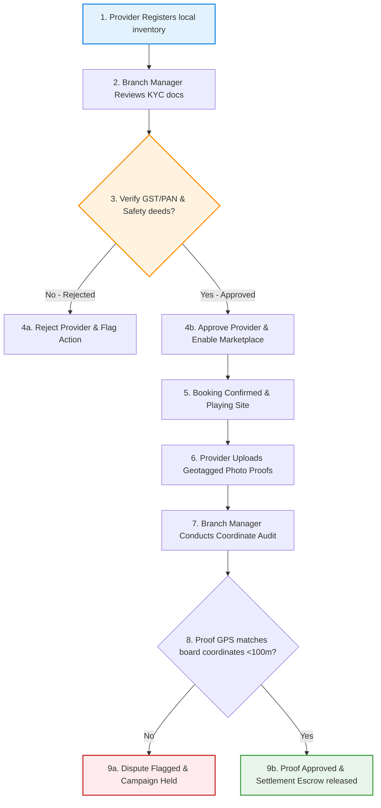

# SODARS Portals: Branch Portal (District-wise) Specifications
## Decoupled Regional Command Center (district.sodars.com)

---

# 1. OVERVIEW
The **Branch Portal (District-wise)** is the decentralized operational workspace for regional branch managers and local district staff within the SODARS (Streamline Outdoor Advertising Reach Solutions) platform. It provides localized monitoring and validation, ensuring that all third-party media owners, hoarding assets, campaign creative mountings, and proof uploads comply with quality and safety regulations inside their designated municipal territory.

---

# 2. PURPOSE
The Branch Portal allows district branch administrators to:
* Verify and validate local hoarding providers during onboarding.
* Conduct field inspections of physical billboard mounts.
* Audit and approve geotagged day/night campaign proof of plays.
* Track local revenue commission splits and district financial ledgers.

---

# 3. BUSINESS LOGIC
* **Strict Territorial Boundary Scoping**: Branch managers are blocked from viewing, modifying, or confirming inventories, bookings, or providers outside their designated branch city/area index parameters.
* **Double-Verification Escrow Logic**: Payments are held in secure escrow, releasing to provider payouts only after a district branch officer approves the on-site mounting proof files.
* **Local Commissions Splits**: Dynamic commission parameters calculate branch revenue shares upon booking complete events.

---

# 4. WORKFLOW
The regional branch operations verify KYC documentation and site mountings through the following workflow:



---

# 5. DATABASE TABLES
This portal scopes data queries across the following core schema tables:
* **`branches`**: Master organizational branch directory.
* **`providers`**: Traces regional provider owners and contact records.
* **`provider_documents`**: Ingests compliance files (PAN, GSTIN, structural safety certifications).
* **`booking_proofs`**: Audits uploaded mounting photos, illuminated night views, and drone captures.
* **`commissions`**: Calculates and updates district-level revenue splits.

---

# 6. APIs
Dynamic communications route through isolated, localized endpoints:

| HTTP Method | Route Endpoint | Role Restrictions | Function |
| :--- | :--- | :--- | :--- |
| `GET` | `/api/branch/dashboard` | Branch Manager, Staff | Fetches local revenue statistics, occupancy levels, and backlog counts. |
| `GET` | `/api/branch/verifications/providers` | Branch Manager, Staff | Lists pending regional provider applications. |
| `POST` | `/api/branch/verifications/providers/{id}/approve` | Branch Manager | Approves vendor, enabling marketplace participation. |
| `GET` | `/api/branch/verifications/proofs` | Branch Manager, Staff | Lists pending campaign mounting photos awaiting inspection. |
| `POST` | `/api/branch/verifications/proofs/{id}/approve` | Branch Manager | Approves proof file, triggering payout releases. |

---

# 7. FRONTEND STRUCTURE
* **Layout Modules**: Embedded inside the React SPA `modules/branch/` directory on the targeted repository.
* **Core Views**:
  * **Branch Overview Analytics**: Displaying local total inventory counts, regional occupancy rates, active campaign listings, and pending verifications backlogs.
  * **Provider Vetting Queue**: Side-by-side display of provider business registration forms and uploaded PDF compliance certificates.
  * **Geospatial Proof Inspector**: High-resolution camera proof displays integrated with coordinate boundaries, comparing the uploaded photo's metadata coordinates against the hoarding's baseline GPS coordinates.

---

# 8. BACKEND LOGIC
All Eloquent models mapping read and write actions in the central controllers automatically include a branch scoping scope, filtering queries by the branch identification key of the authenticated session:

```php
namespace App\Modules\Core\Traits;

trait ScopesBranchData
{
    public static function bootScopesBranchData()
    {
        static::addGlobalScope('branch_scope', function ($builder) {
            if (auth()->check() && auth()->user()->branch_id) {
                $builder->where('city_id', auth()->user()->branch->city_id);
            }
        });
    }
}
```

---

# 9. VALIDATION RULES
Verification audits require GPS coordinate validation. The uploaded proof of play image EXIF metadata coordinates are checked against the target hoarding record coordinates using the Haversine formula, enforcing a match threshold within **100 meters**.

---

# 10. STATUSES
Branch operations track these specific states:
* Provider Approvals: `Pending`, `Approved`, `Rejected`.
* Geotagged Proof Audits: `Awaiting Audit`, `Approved`, `Disputed`.
* Settlement Ledger Statuses: `Escrow Hold`, `Processing`, `Released`.

---

# 11. PERMISSIONS
Restricted gates mapped under the `district.sodars.com` auth guard via Spatie Laravel-Permission:
* `view-branch-dashboard`
* `approve-regional-providers`
* `verify-regional-proofs`
* `view-district-commissions`

---

# 12. UI/UX NOTES
* **Design Identity**: Clean B2B operational dashboard styling matching the **Dark Emerald Green** (`#014D40`) visual overlays.
* **Geospatial Heatmaps**: Local branch managers view maps showing occupied nodes in solid color blocks and vacant ones as outline selectors.
* **Framer Motion Drawer**: Detail screens slide out from the right pane on mobile viewports for seamless field operations.

---

# 13. FUTURE SCOPE
* **Scouting Drone Integrations**: Connecting branch verification logs directly with local commercial drone footage.
* **Dynamic Regional Traffic Scoring**: Gathering foot traffic and road congestion metrics to adjust local seasonal pricing modifiers automatically.
* **Decoupled Local Databases**: Transitioning district branch operational caches to edge servers for offline local catalog access.

---
*SODARS platform branch portal specification - Enterprise Operational Guidelines*
