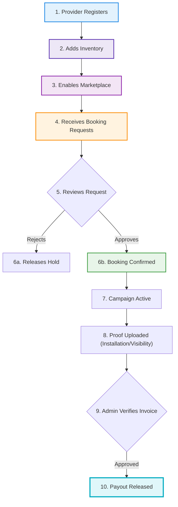
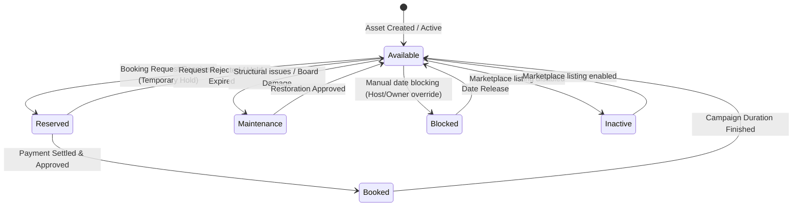

# SODARS Business Portal Architecture & Specification
## Outdoor Advertising Provider Operating System (business.sodars.com)

The **SODARS Business Portal** is the complete operational cockpit for hoarding owners, digital screen operators, media companies, and billboard providers. It digitizes physical advertising management, optimizes asset occupancy, tracks multi-tier earnings, and automates payouts.

---

## 🚀 Core Business Workflow Lifecycle

Providers onboard their media inventories, list them on the unified marketplace, verify incoming booking holds, monitor campaigns, submit structural/proof of play images, and withdraw earned payouts.



---

## 👥 Provider Organizational Roles & Permissions Matrix

To support enterprise media companies, the portal implements fine-grained user permissions for internal vendor staff.

| Role Name | Primary Responsibility | Scope of Action Gates |
| :--- | :--- | :--- |
| **Provider Owner** | Complete company management, bank settings and KYC control. | Full administrator rights. |
| **Provider Manager** | Oversees branch inventory, coordinates campaigns, and settles issues. | Full permissions except financial payouts/bank setup. |
| **Inventory Manager** | Media asset updates, maintenance scheduling, and pricing configs. | CRUD operations on inventory modules only. |
| **Operations Staff** | Handles physical mounting of artworks and uploading site proofs. | Read-only inventory, upload access on proof files. |
| **Finance Staff** | Generates ledger invoices, tracks payout milestones, and reviews tax bills. | Financial logs, payout requests, billing screens. |
| **Designer** | Reviews layout sizes, verifies creative ratios, and handles approvals. | Read-only on bookings, write permissions for artwork panels. |

---

## 📊 Inventory Status State Machine

The platform manages inventory availability dynamically through real-time state changes on the availability engine.



---

## 🎛️ Detailed Module Blueprint

The Business Portal is segmented into **18 functional modules**, ensuring complete control over the physical-to-digital advertising lifecycle.

---

### 1. Authentication Module
* **Scope**: Gateway verifying vendor identity and permissions.
* **Pages & Views**:
  * `Login` (MFA enabled secure entry)
  * `Forgot Password` / `Reset Password`
  * `Profile` (Personal profile settings)
  * `Change Password`
  * `Sessions` (Forced user agent termination panel)
* **Core Operations**: JWT token authentication via Laravel Sanctum, session auditing, dynamic profile updates, and active device tracking.

---

### 2. Dashboard Module
* **Scope**: High-level visual dashboard tracking performance.
* **Pages & Views**:
  * `Dashboard` (Main analytical panel)
  * `Marketplace Overview` (Public visibility stats)
  * `Notifications` (Unread task notifications feed)
  * `Activities` (Recent operational history logs)
* **KPI Matrix Dashboard**:
  * **Total Inventory**: Gross billboard assets registered.
  * **Available Inventory**: Assets currently vacuumed or unbooked.
  * **Booked Inventory**: Active playing assets.
  * **Occupancy Rate**: Percentage of occupied vs total asset metrics.
  * **Revenue**: Total earnings collected.
  * **Pending Bookings**: Intake queue awaiting response.

---

### 3. Inventory Management Module
> [!IMPORTANT]
> **Primary Asset Ledger**: This module aggregates physical specifications, geo-locations, custom pricing layers, and digital galleries for hoardings.

* **Pages & Views**:
  * `All Inventory` / `Inventory Details` (Tabular database grid)
  * `Add Inventory` / `Edit Inventory` (Wizard form layouts)
  * `Gallery` (Mockups, drone shots, video clips repository)
  * `Availability` (Dynamic calendar engine)
  * `Pricing` (Standard/Special seasonal rates panel)
  * `Maintenance` (Audit damage tracking log)
* **Data Fields Model**:
  * *Basic Info*: Title, unique item SKU code, format type (Hoarding, LED, Transit, Mall, Airport), description.
  * *Location*: Proximity address, Landmarks, Road name, Lat/Long coordinate pins, Google Maps API sync.
  * *Physical parameters*: Height, Width, Facing direction (North, South, East, West), Illumination (Front-lit, Back-lit, Non-lit), Traffic volume index.
  * *Price Model*: Daily, Weekly, Monthly baseline prices, Peak festival premiums, Dynamic discounts.
  * *Marketplace Control*: Enable/Disable toggle, visibility rankings, priority status.

---

### 4. Availability Module
* **Scope**: Real-time reservation calendar blocks.
* **Pages & Views**:
  * `Availability Calendar` (Full visual grid)
  * `Blocked Dates` (Manual owner holds list)
  * `Reservations` (Incoming pre-reserve locks)
  * `Maintenance Slots` (Structural audits blackout dates)
* **Core Operations**: Automated overlapping date checks, custom holiday blocking overrides, and structural downtime registers.

---

### 5. Booking Management Module
* **Scope**: Negotiating and confirming campaign contracts.
* **Pages & Views**:
  * `Booking Requests` / `Pending Approvals` (Intake grids)
  * `Confirmed Bookings` / `Completed Bookings` / `Cancelled Bookings`
  * `Active Campaigns` (Currently running inventory boards)
  * `Booking Calendar` (Timeline representation)
  * `Artwork Uploads` (Resolution and size checks container)
* **Inbound details panel**: Displays campaign parameters, buyer corporate details, agency routing, calendar timelines, and calculated provider net yield after platform commission splits.

---

### 6. Campaign Module
* **Scope**: Monitoring operational parameters of booked spaces.
* **Pages & Views**:
  * `Campaigns` (Master overview grid)
  * `Active Campaigns` / `Upcoming Campaigns` / `Completed Campaigns`
  * `Campaign Details` (Timeline, allocated inventory checklist, creative assets)
* **Core Operations**: Tracking campaign schedule status, creative asset links, and batch inventory progress meters.

---

### 7. Artwork Management Module
* **Scope**: Creative checkup, file downloads, and mounting verification logs.
* **Pages & Views**:
  * `Artwork Uploads` (Buyer submitted files list)
  * `Artwork Approvals` (Technical checks checklist panel)
  * `Proof Uploads` (Installation evidence records)
  * `Campaign Creatives` (Active file archives)
* **Proof Validation Types**:
  * 📸 *Photo Proof*: Daylight physical board confirmation shot.
  * 🌙 *Night Visibility*: Illuminated confirmation shot proving lighting uptime.
  * 🛠️ *Installation Proof*: Date/time geotagged image proving installation.
  * 🎥 *Video / Drone Proof*: Live play recording of LED displays or high-altitude aerial perspective.

---

### 8. Finance & Payouts Module
* **Scope**: Integrated invoicing pipeline, settlement registers, and GST logs.
* **Pages & Views**:
  * `Invoices` (Automated generation, vendor-to-marketplace files)
  * `Provider Earnings` (Gross balance, net margins ledger)
  * `Pending Payouts` / `Completed Payouts` (Disbursement requests)
  * `Transactions` (Historical deposits log)
  * `GST Reports` (Monthly regional tax report export)
* **Payout Release Path**:
  ```
  Booking Marked Completed 
    → Automated Provider Invoice Drafted 
      → System Auditing & Compliance Check 
        → Direct Bank Settlement / Payout Transferred
  ```

---

### 9. Notifications Module
* **Scope**: Dispatch system notifying personnel of events.
* **Pages & Views**:
  * `Notifications` (Internal platform alerts)
  * `Email Alerts` / `SMS Alerts` / `WhatsApp Alerts` (Subscription rules setup)
* **Automated Alert Rules**: Triggers dispatch upon: *New Booking Hold*, *Campaign Scheduled*, *Artwork File Uploaded*, *Payout Disbursed*, or *Maintenance Schedule Alert*.

---

### 10. Reports Module
* **Scope**: Business reports compile and analytics exports.
* **Pages & Views**:
  * `Revenue Reports` / `Inventory Reports` / `Occupancy Reports`
  * `Booking Reports` / `Campaign Reports`
* **Core Operations**: PDF dynamic compilation, automated CSV data dumping, occupancy rate trajectory graphing, and filter matrices.

---

### 11. Staff Management Module
* **Scope**: Granular settings for internal agency/vendor staff profiles.
* **Pages & Views**:
  * `Staff List` (Employee table)
  * `Add Staff` / `Roles` / `Permissions` (Permissions toggle matrix)
  * `Activity Logs` (Internal trace audit trails)
* **Core Operations**: Creating sub-accounts, assigning restricted permissions (e.g. Designers can only review/approve artwork, Operations can only upload proof sheets).

---

### 12. Profile & Company Module
* **Scope**: Onboarding compliance, legal declarations, and settlement setups.
* **Pages & Views**:
  * `Company Profile` (General parameters setup)
  * `KYC Documents` (PAN card, business registers)
  * `GST Details` (Tax classifications setup)
  * `Bank Accounts` (Verified payout target routing account)
  * `Branding` (Logo, custom layout profiles setup)
* **Core Operations**: Direct bank account verification, tax code structure validation, and secure upload of business verification documents.

---

### 13. Marketplace Participation Module
* **Scope**: Configuring storefront display rules.
* **Pages & Views**:
  * `Marketplace Status` (System enable toggle)
  * `Featured Listings` (Promotional bidding campaigns console)
  * `Marketplace Performance` (Search click-through rates panel)
  * `Marketplace Leads` (Inbound user interest listings)
* **Core Operations**: Bidding on priority rankings, analytics checking, and configuring public search visibility rules.

---

### 14. Geo Intelligence Module
* **Scope**: Geospatial overlay systems mapped on local geography.
* **Pages & Views**:
  * `Map View` (Inventory map overlay)
  * `Nearby Inventory` (Competitor and proximity scoring)
  * `Traffic Analytics` (Ingestion from road density indices)
  * `Location Analytics` (Spatial rating dashboard)
* **Core Operations**: Route intersection plotting, coordinates matching, and dynamic traffic yield metrics monitoring.

---

### 15. Business Analytics Module
* **Scope**: Strategic metrics calculating financial yield trajectories.
* **Pages & Views**:
  * `Revenue Analytics` / `Occupancy Analytics` / `Campaign Analytics`
  * `Provider Performance` / `Inventory Performance`
* **Strategic Insights Engine**: Highlights top-yielding hoarding sites, flags underperforming low-occupancy sites, tracks seasonal booking rates, and builds spatio-temporal revenue matrices.

---

### 16. Communication Center
* **Scope**: Internal messaging center connecting buyers and internal staff.
* **Core Operations**: Campaign discussion logs, creative requirements discussions, operational helpdesk, and system dispute logs.

---

### 17. Settings Module
* **Scope**: Custom preferences, layout parameters, and default structures.
* **Pages & Views**:
  * `General Settings` (Base configurations)
  * `Marketplace Settings` / `Notification Settings`
  * `Pricing Settings` (Base rates dynamic calculations setup)
  * `Profile Settings`

---

### 18. Mobile Ready Features
* **Scope**: Future framework layout hooks for field-operation app integrations.
* **Core Features**: Geotagged camera integrations for proof of play uploading, GPS track validations, instant push alerts, and direct smartphone approval triggers.

---

## 🗂️ Collapsible Sidebar Menu Structure

```txt
Dashboard                 # High-level analytical overview

Inventory                 # Master asset management
 ├── All Inventory        # Database grid of media inventory
 ├── Add Inventory        # Media upload & details wizard
 ├── Gallery              # High-res site mockup photos & videos
 ├── Availability         # Dedicated calendar overrides
 └── Pricing              # Base pricing & seasonal rates

Bookings                  # Contract negotiation & approvals
 ├── Booking Requests     # Inbound campaign requests holding queue
 ├── Pending Approvals    # Requests needing physical approval
 ├── Active Bookings      # Active campaigns on site
 ├── Calendar             # Interactive timelines layout
 └── Artwork Uploads      # Creative review and approval panel

Campaigns                 # Operational schedule controls
 ├── Active Campaigns     # Currently running campaigns tracker
 ├── Upcoming             # Future confirmed allocations
 └── Completed            # Archive of campaigns past

Finance                   # Cashflows & settlement panels
 ├── Earnings             # Ledger tracking margins
 ├── Payouts              # Disbursable funds panel
 ├── Invoices             # Output vendor invoices archive
 └── GST Reports          # Regional tax declaration documents

Marketplace               # Public storefront curation
 ├── Marketplace Status   # Enable storefront toggles
 ├── Featured Listings   # Priority list auctioning dashboard
 └── Leads                # User enquiries matching inventory

Reports                   # Performance analytics exports
 ├── Revenue              # Monthly yield reports
 ├── Occupancy            # Space occupancy trends reports
 ├── Inventory            # Asset-by-asset analysis reports
 └── Campaigns            # Campaign completion summaries

Staff                     # Employee access rules
 ├── Staff List           # Sub-account profiles list
 ├── Roles                # Staff permission groups CRUD
 └── Activity Logs        # Traceable logs audits

Settings                  # Portal modifiers
 ├── Profile              # Personal security parameters
 ├── Company              # Legal details, bank verify & KYC
 ├── Notifications        # Trigger parameters setup
 └── Pricing              # Baseline modifiers configurations
```

---

## 💻 Tech Stack Implementation Details

> [!TIP]
> **Vite-Speed SPA Layouts**: The portal uses **ReactJS + Vite** combined with Tailwind CSS to ensure fast load speeds even on slow mobile internet connections.

* **Frontend**: ReactJS, Vite, Redux Toolkit, Axios, `shadcn/ui` components for unified buttons and forms.
* **Backend Integration**: Structured Laravel 12 APIs, Laravel Sanctum secure stateful authentication, cloud storage integrations with AWS S3 / Cloudflare R2 for instant photo proofs fetching.
