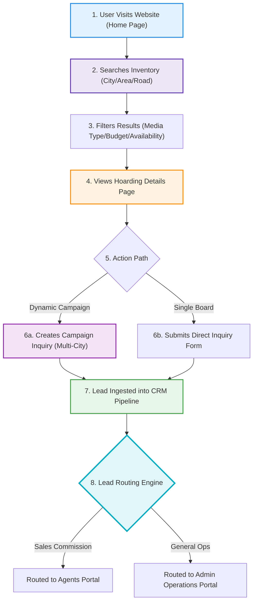

# SODARS Front Website Architecture & Specification
## Public Marketplace Platform (www.sodars.com)

The **SODARS Front Website** is a robust public marketplace platform engineered to bridge the gap between media buyers (advertisers, brands, agencies) and physical outdoor advertising vendors. It replaces traditional corporate catalog pages with a map-driven discovery engine, real-time availability checkups, and dynamic multi-city campaign inquiry pipelines.

---

## 🚀 Public Marketplace User Journey

The website structures visitor sessions to maximize conversions. Users transition from high-level geographic searches to granular filter states, culminating in individual hoarding inquiries or bulk campaign drafts.



---

## 📐 Wireframe Layout Maps

### 🏠 Home Page Wireframe Map
```
+-----------------------------------------------------------------------------------+
|  [Logo] SODARS Marketplace  |  Marketplace  Locations  Campaigns  Providers  [Login]|
+-----------------------------------------------------------------------------------+
|                                                                                   |
|                   ELEVATE YOUR REACH: FIND OUTDOOR MEDIA INSTANTLY                |
|           [ 📍 Enter City/Area ] [ 📂 All Media Types ]  🔍 [Search Inventory]    |
|                                                                                   |
+-----------------------------------------------------------------------------------+
|  📍 TOP METROPOLITAN HUBS                                                         |
|  [ Mumbai (1.2K sites) ] [ Bangalore (840 sites) ] [ Delhi-NCR (2.1K sites) ]    |
+-----------------------------------------------------------------------------------+
|  📈 LIVE MARKETPLACE HEALTH                                                       |
|  [ 📋 Total Hoardings: 12.4K+ ]             [ 🏙️ Cities Covered: 80+ ]            |
|  [ 👥 Active Providers: 400+ ]              [ 🚀 Campaigns Active: 3.1K+ ]        |
+-----------------------------------------------------------------------------------+
|  📦 TRENDING OUTDOOR INVENTORY                                                    |
|  +-----------------------+ +-----------------------+ +-----------------------+  |
|  | [Illuminated Hoarding]| | [Airport LED Screen]  | | [High Traffic Pillar] |  |
|  | Hyderabad - $1,200/mo | | Mumbai - $4,500/mo    | | Chennai - $800/mo     |  |
|  +-----------------------+ +-----------------------+ +-----------------------+  |
+-----------------------------------------------------------------------------------+
```

### 📦 Marketplace Listing Layout (Filter Sidebar + Grid Map)
```
+-----------------------------------------------------------------------------------+
| [Filter Sidebar]          | 🔍 Search: "Bangalore MG Road"       [🗺️ View on Map Toggle]  |
|                           +-------------------------------------------------------+
| 📍 Location Filter        |  Found 42 matching Hoardings                          |
|  ├─ State: Karnataka      |  +-------------------------------------------------+  |
|  ├─ City: Bangalore       |  | [Hoarding Photo Mockup]  📍 MG Road, Bangalore  |  |
|  └─ Area: Indiranagar     |  | Size: 40x20ft | Front-Lit | Daily Traffic: 250K  |  |
|                           |  | Rate: $1,400/month           [🔍 View Board Details]  |  |
| 💰 Monthly Budget         |  +-------------------------------------------------+  |
|  [ $500  ------- $5000+ ] |  +-------------------------------------------------+  |
|                           |  | [LED Display Mockup]     📍 Metro Junction      |  |
| 💡 Illumination           |  | Size: 20x10ft | Digital   | Daily Traffic: 500K  |  |
|  [x] Front-Lit [ ] Non-Lit|  | Rate: $2,800/month           [🔍 View Board Details]  |  |
|  [x] LED Digital Screen   |  +-------------------------------------------------+  |
+-----------------------------------------------------------------------------------+
```

---

## 🎛️ Detailed Module Blueprint

The Front Marketplace contains **17 modules** optimized to capture visitor interest, load fast, and ensure search indexing.

---

### 1. Home Page Module
* **Scope**: Strategic landing page establishing brand authority and initiating searches.
* **Core Page Sections**:
  * **Hero Section**: Introduces the platform, offering a prominent search bar to search by city, area, or road name.
  * **Featured Inventory Section**: Dynamically showcases premium hoardings, LED screens, and high-visibility locations.
  * **Marketplace Statistics Counter**: Shows live counts of total hoardings, cities covered, active providers, and completed campaigns.
  * **Top Cities Section**: Visual grid mapping core metropolitan hubs (Hyderabad, Mumbai, Bangalore, Chennai, Delhi).
  * **"How It Works" Section**: Educates buyers in 4 clear steps (Search -> Select Location -> Submit Inquiry -> Booking Process).
  * **Call To Action (CTA) Grid**: Action links for *Explore Inventory*, *Create Campaign*, *Become a Provider*, and *Contact Sales*.

---

### 2. Marketplace Module
> [!IMPORTANT]
> **Primary Discovery Console**: Built as an interactive grid with a search sidebar.
* **Pages & Views**:
  * `Marketplace` / `Inventory Listing` (Master grids)
  * `Inventory Details` (Comprehensive asset view)
  * `Featured Inventory` / `Nearby Inventory`
  * `Map View` (Split-screen geographic plot)
* **Geospatial Location Filters**: Country, State, District, City, Area, Road name, Landmark proximity.
* **Inventory Property Filters**: Media Format, Pricing/Budget bracket, Live calendar availability, Traffic score bracket, and Premium tags.

---

### 3. Inventory Details Page (Public View)
* **Scope**: In-depth individual asset overview designed to trigger direct sales enquiries.
* **Key Page Sections**:
  * **Asset Gallery**: Supports swipeable high-res photos, night illumination mockups, drone flybys, and sample campaign mockups.
  * **Technical Specs Grid**: Displaying Board dimensions, facing directions (e.g., North-facing), lighting class (Front-lit, Back-lit, Digital), and foot traffic index.
  * **Geographic Proximity Map**: Interactive Google Map displaying coordinates, landmarks, and route visibility metrics.
  * **Rate Card Ledger**: Clear rates displayed weekly, monthly, and seasonal premium modifiers.
  * **Live Availability Calendar**: Displays unbooked blocks, reserved holds, and maintenance blackout calendars.
  * **Intake Form**: Allows users to request booking quotes, check availability, or consult regional sales reps.

---

### 4. Campaign Inquiry Module
* **Scope**: Dynamic multi-city planner capturing enterprise budget inquiries.
* **Pages & Views**:
  * `Create Campaign Inquiry` (Step-by-step campaign constructor)
  * `Campaign Requirements` (Detail capture page)
  * `Bulk Inquiry` (Upload Excel listing requirements)
* **Campaign Ingestion Models**:
  * *Buyer Details*: Name, company name, phone, verified email, business sector.
  * *Campaign Scope*: Targeted cities list, budget threshold, duration, board volume required, campaign targets, and preferred landmarks.

---

### 5. Search & Discovery Module
* **Scope**: Smart predictive database search engine.
* **Core Capabilities**: Autocomplete suggestions, location keyword resolution (resolves "Metro" to nearby landmarks), and city/area proximity indexing.

---

### 6. Maps & Geo Module
* **Scope**: Mapping physical billboard coordinates.
* **Core Capabilities**: Integrated Google Maps SDK canvas, dynamic clustering pins representing vacancy (green pins represent available, orange/red represent booked/reserved), route overlap visualizations, and traffic density maps.

---

### 7. Featured Locations Module
* **Scope**: Localized landing pages driving SEO search queries.
* **Pages & Views**: `Top Cities`, `Premium Areas`, `High Traffic Roads`, `Featured Locations`.
* **Core Capabilities**: Promoting high-value local inventories, city discovery maps, and region-specific outdoor metrics.

---

### 8. Providers Module
* **Scope**: Credibility matrix listing partner media owners.
* **Pages & Views**: `Provider Listings`, `Provider Details`, `Top Providers`.
* **Details Displayed**: Verified business title, regions covered, total inventory volumes, marketplace rating metrics, and business experience indicators.

---

### 9. Lead Generation Module
* **Scope**: Capturing general outbound client interest.
* **Lead Sources**: Marketplace booking holds, bulk campaign constructors, contact forms, general callback bookings, and click-to-chat WhatsApp actions.

---

### 10. Blogs & SEO Module
* **Scope**: Dynamic educational engine boosting search ranks.
* **Pages & Views**: `Blogs`, `News`, `Advertising Guides`, `Location Insights`, `Marketing Articles`.
* **Core Capabilities**: City advertising guides (e.g. "Complete Guide to Billboard Ads in Mumbai"), outdoor metrics explainers, and search engine optimization indexing.

---

### 11. About Module
* **Scope**: Corporate information and credibility building.
* **Pages & Views**: `About Us`, `Vision`, `Mission`, `Careers`, `Partners`.

---

### 12. Contact Module
* **Scope**: Direct general inquiry routing.
* **Pages & Views**: `Contact Us`, `Support Hub`, `Sales Inquiry`, `Provider Onboarding Inquiries`.

---

### 13. User Authentication Module (Optional Future Feature)
* **Scope**: Customer login profile storage.
* **Pages & Views**: `Login`, `Register`, `Forgot Password`, `Profile Dashboard`.
* **Core Capabilities**: Saved inventory lists, target campaign drafts, favorite location lists, and historical inquiries tracker.

---

### 14. Notifications Module
* **Scope**: Confirmation messaging triggers.
* **Core Capabilities**: Sending emails verifying inquiries, dispatching SMS follow-ups, and notifying internal sales representatives on new incoming queries.

---

### 15. SEO & Marketing Module
> [!TIP]
> **SEO Traffic Farming**: Structured directories target local searches like *"Hoardings in Hyderabad"* or *"LED Screens in Bangalore"* automatically.
* **Core Capabilities**: Structured JSON-LD schema schemas for individual hoardings, meta tags configurations, automatic XML sitemap refreshes, and SEO-friendly slug generations.

---

### 16. Analytics Module
* **Scope**: Market research tracker mapping search behaviors.
* **Core Capabilities**: Search term log analysis, tracking conversion percentages, identifying top-searched roads/landmarks, and counting site visits.

---

### 17. Mobile Responsive Features
* **Scope**: Fluid viewport compatibility.
* **Core Capabilities**: Fully responsive layout breakpoints, map adjustments for mobile touches, touch swipe galleries, and fast-scrolling listing layouts.

---

## 🗂️ Unified Site Navigation Menu Structure

```txt
Home                      # Main marketplace search hub & conversion panels

Marketplace               # Inventory explorer index
 ├── Hoardings            # Static physical boards directory
 ├── LED Screens          # Real-time programmable media directory
 ├── Transit Media        # High-traffic mobile transit mediums
 ├── Featured Inventory   # High-conversion highlighted options
 └── Nearby Inventory     # Geo-proximal location listings

Locations                 # Geographic index
 ├── Cities               # Top metropolitan hubs listings
 ├── Areas                # Suburban area listings
 ├── Roads                # Major route billboard segments
 └── Landmarks            # High-value POI listings

Campaigns                 # Campaign builders
 ├── Create Campaign      # Multi-city campaign constructor wizard
 ├── Bulk Inquiry         # Multi-asset query loader console
 └── Campaign Support     # Customer consulting channels

Providers                 # Media owners directory
 ├── Top Providers        # Highly rated media vendors
 ├── Provider Listings    # Master vendor directory
 └── Become Provider      # Vendor onboarding registration gateway

Resources                 # Educational resources
 ├── Blogs                # SEO guides & articles
 ├── Advertising Guides   # How-to manuals on pricing
 ├── News                 # Platform announcements
 └── FAQs                 # General marketplace helpdesk

Company                   # Organizational details
 ├── About                # Vision, Mission, and parameters
 ├── Careers              # Recruitment panel
 ├── Contact              # Address and inquiry cards
 └── Support              # Operational dispute handling
```

---

## 💻 Tech Stack & Performance Tuning

To achieve high SEO rankings, the marketplace is developed with a server-rendered backend coupled with lightweight, fast-loading frontend libraries.

* **Backend Engine**: Laravel (Server-Side Rendered Blade Templates for instant SEO indexing).
* **CSS Framework**: Tailwind CSS (Minified compilation avoiding bulky layouts).
* **Frontend Logic**: Alpine.js (Lightweight interactive triggers for filters and dropdowns).
* **Map Engine**: Google Maps JavaScript API (Asynchronously loaded to avoid blocking page loads).
* **Image Delivery**: Auto-compressed asset pipelines targeting WebP formats hosted on global AWS S3 / Cloudflare R2 nodes.
