# SODARS Complete System Flow Chart & Operational Directory
## Streamline Outdoor Advertising Reach Solutions

This document establishes the official visual and functional workflow diagrams for all transactional, geographical, and programmatic pipelines within the SODARS platform.

---

## 1. 🌐 Complete Platform Flow
This end-to-end flowchart maps the operational lifecycle of a booking from search to commission payouts:

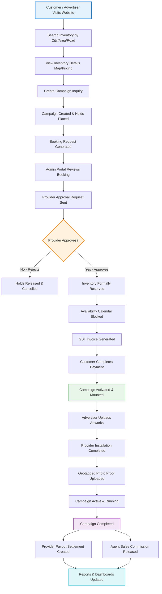

---

## 2. 🖥️ Decoupled Portal Flow
An architecture diagram illustrating how actions are partitioned across the four main user front-ends:

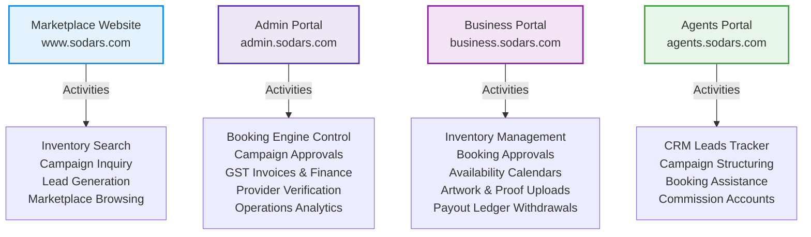

---

## 3. 📍 Geospatial Location Flow
The hierarchical taxonomy organizing all physical advertising media:

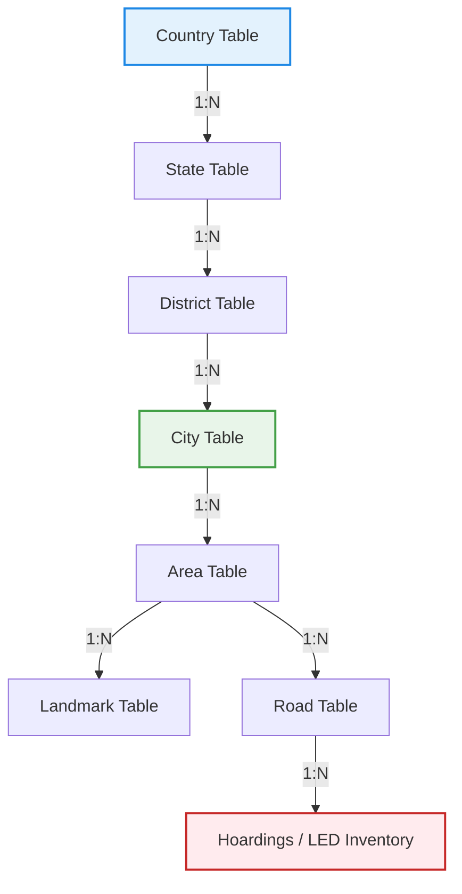

---

## 4. 👥 Provider Onboarding Flow
The operational lifecycle verifying third-party media vendors:

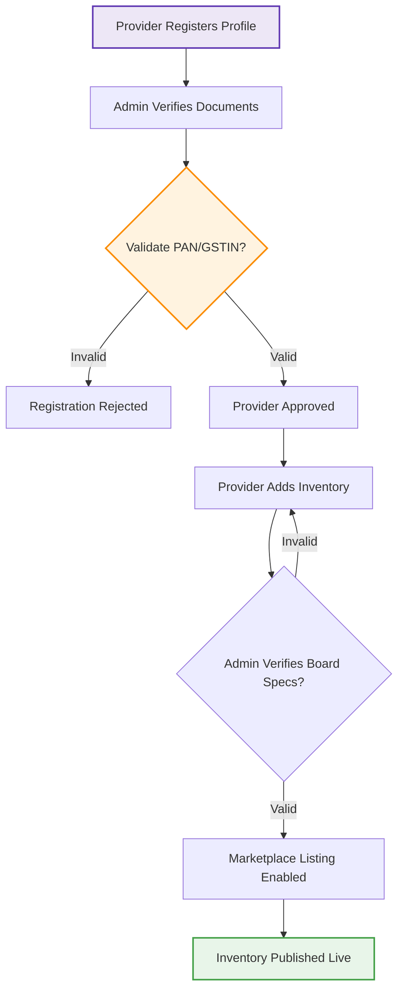

---

## 5. 📦 Inventory Ingestion Flow
The steps taken by a provider to publish a hoarding or LED display listing:

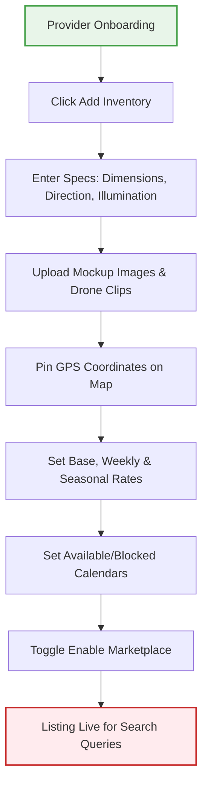

---

## 6. 🚀 Campaign Structuring Flow
How media buyers aggregate multiple billboard holdings into a single execution campaign:

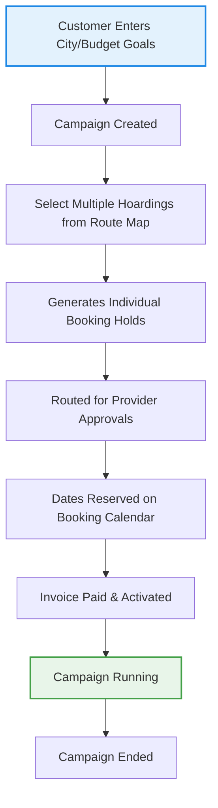

---

## 7. ⏱️ Core Booking Engine Flow
> [!IMPORTANT]
> **Primary Platform Transaction Engine**: Resolves date reservations, runs availability calculations, processes billing, and completes settlements.

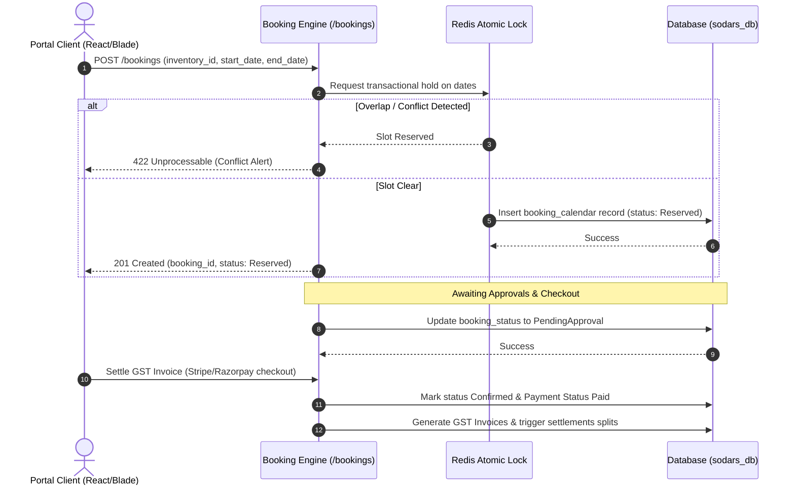

---

## 8. 🛡️ Availability Engine Flow
The conflict checking rules verifying dates before booking creations:

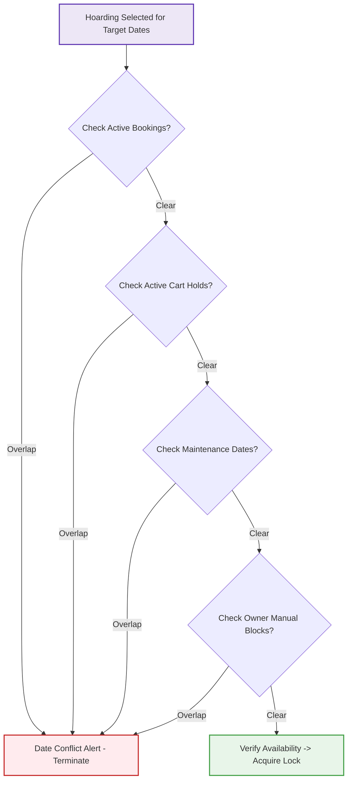

---

## 9. 💵 Finance & Settlement Flow
The accounting pipeline mapping billing balances to payouts and commissions:

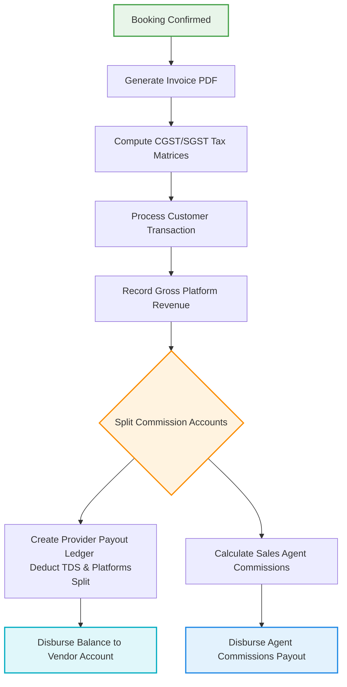

---

## 10. 👥 CRM Sales Agent Flow
The sales pipeline tracking prospects from lead capture to payouts:

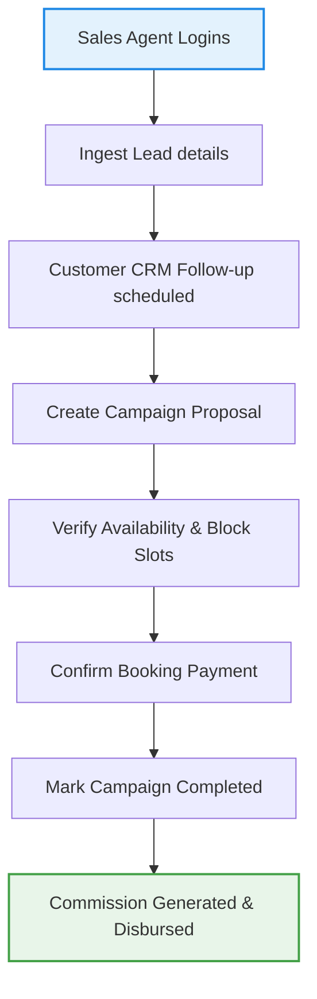

---

## 11. 🌐 Central API Architecture Flow
The routing and execution layers of the centralized API engine:

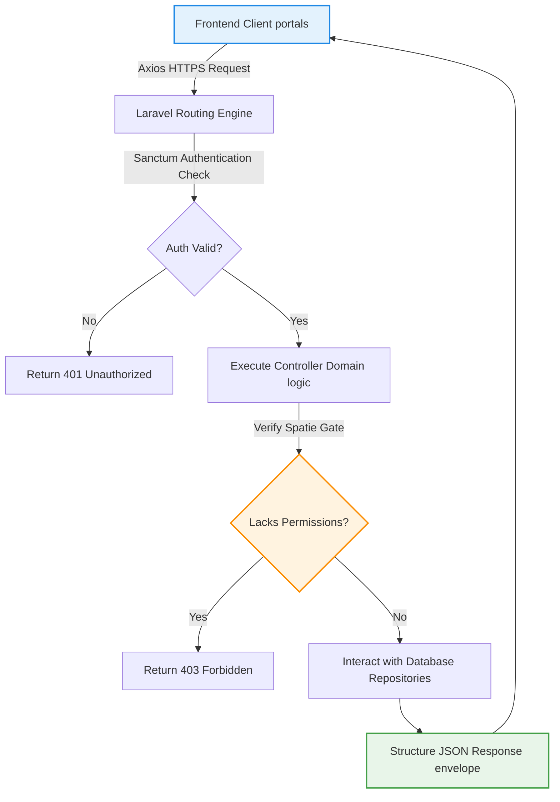

---

## 12. ☁️ Cloud File Ingestion Flow
The pipeline optimizing media uploads and storing paths in the database:

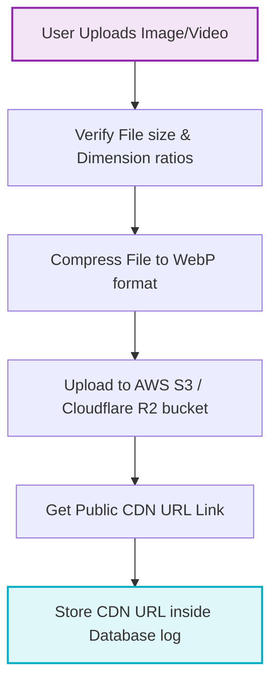

---

## 13. 🔔 Event-Driven Notification Queue Flow
How async system alerts are managed without blocking browser sessions:

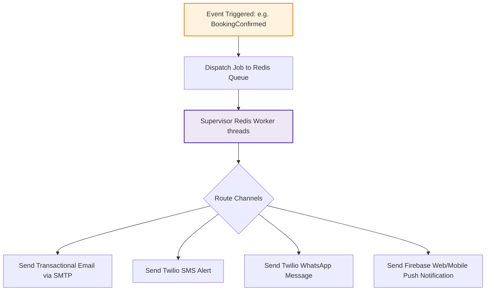

---

## 14. 🔄 Complete Business Lifecycle Loop
The complete operational loop linking all modules:

```mermaid
graph LR
    Add[1. Provider Adds Inventory] --> Live[2. Active on Marketplace]
    Live --> Search[3. Customer Searches Inventory]
    Search --> Inq[4. Submits Inquiry]
    Inq --> Book[5. Booking Request Created]
    Book --> Approve[6. Provider Approves Hold]
    Approve --> Pay[7. Payment Settled]
    Pay --> Active[8. Campaign Activated]
    Active --> Proof[9. Mounting Proof Uploaded]
    Proof --> Complete[10. Campaign Ended]
    Complete --> Settle[11. Payout Settlement Released]
    Settle --> Analytics[12. System Analytics Updated]
    Analytics --> Add
```

---

## 15. 🏆 Final Enterprise Platform Blueprint
How all specialized systems compile into the single **SODARS ERP Marketplace**:

```
+-------------------------------------------------------------------------+
|                        SODARS Enterprise ERP                            |
+-------------------------------------------------------------------------+
|  [Marketplace Website]    [Geo-Intelligence]    [Booking Engine]        |
|  - Discovery Frontend     - Google Maps Pins    - Atomic Holds locks    |
|  - SEO Traffic Generation - Proximity scoring   - Conflict checking     |
+-------------------------------------------------------------------------+
|  [Availability Engine]    [Provider Portal]     [Finance System]        |
|  - Date availability scan - Inventory CRUD      - GST tax calculators   |
|  - Maintenance logs       - Verification checks - Payout ledgers        |
+-------------------------------------------------------------------------+
|  [CRM Sales Module]       [System Analytics]    [Notification Queue]    |
|  - Leads kanban pipeline  - Cashflow MRR graphs - Twilio SMS/WhatsApp   |
|  - Follow-up reminders    - Occupancy reports   - SMTP Email templates  |
+-------------------------------------------------------------------------+
```
