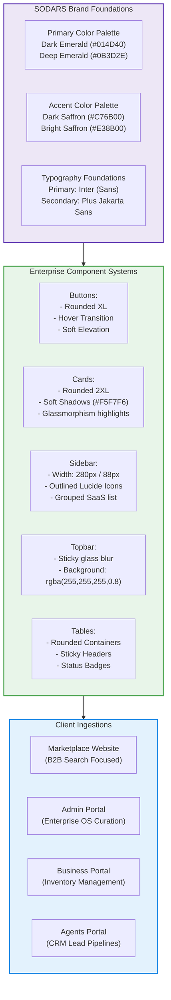

# SODARS Enterprise UI/UX & Brand Design System
## System Design Guidelines (www.sodars.com / admin.sodars.com / business.sodars.com / agents.sodars.com)

This document establishes the official **Brand Identity**, **Visual Specifications**, **Component Styles**, and **UI/UX Design Language** for all current and future portals within the SODARS (Streamline Outdoor Advertising Reach Solutions) ecosystem.

---

## 🎨 System Design Architecture

The SODARS design language bridges high-end corporate analytics with functional marketplace features, ensuring consistent branding across all decoupled client front-ends.



---

## 🧭 Visual Strategy Guidelines

To establish trust and credibility with enterprise advertisers and media owners, all interfaces must strictly align with the following design guidelines:

* **DO Use Corporate SaaS Spacing**: Use ample whitespace, clean border-lines (`border-slate-100`), soft shadows, and clean margins.
* **DO Maintain Color Discipline**: Use the curated **Emerald & Saffron** palette to guide user attention toward active triggers and status metrics.
* **DO Emphasize Geotag Data & Maps**: Emphasize map overlays, coordinate displays, and physical site previews.
* **AVOID Gaming or Consumer Over-Styling**: Do not use neon colors, overly rounded buttons, or distracting animations.
* **AVOID Generic Admin Frameworks**: Avoid standard out-of-the-box Bootstrap layouts or flat admin dashboard templates.

---

## 🎨 Enterprise Color Palette

```
🎨 Color Palette Visualizer
+-------------------------------------+-------------------------------------+
|  Dark Emerald Green (Primary)       |  Dark Saffron (Accent)              |
|  [ #014D40 ]                        |  [ #C76B00 ]                        |
+-------------------------------------+-------------------------------------+
|  Deep Emerald Variant               |  Bright Saffron Hover                |
|  [ #0B3D2E ]                        |  [ #E38B00 ]                        |
+-------------------------------------+-------------------------------------+
|  Main Background                    |  Sidebar Base                       |
|  [ #F5F7F6 ]                        |  [ #062F28 ]                        |
+-------------------------------------+-------------------------------------+
```

### 1. Primary Colors (Emerald Core)
* **Dark Emerald Green (`#014D40`)**: The core brand color. Used for the navigation sidebar, primary action buttons, active menus, structural headers, and brand marks.
* **Deep Emerald Variant (`#0B3D2E`)**: Darker gradient color. Used for sidebar gradients, dark layouts, and high-visibility analytics headers.

### 2. Accent Colors (Saffron Core)
* **Dark Saffron (`#C76B00`)**: The primary call-to-action color. Used for CTA buttons, search buttons, alerts, status indicators, and warning states.
* **Bright Saffron Accent (`#E38B00`)**: Highlight color. Used for hover states, chart accents, and premium featured inventory badges.

### 3. Background Colors
* **Main Background (`#F5F7F6`)**: Low-contrast off-white backing for portal canvases.
* **Card Background (`#FFFFFF`)**: Pure white card components.
* **Sidebar Background (`#062F28`)**: Dark emerald slate background.
* **Dark Layout Background (`#041F1A`)**: Deep canvas backing.

### 4. Semantic Status Flags
* **Success (`#16A34A`)**: Used for *Available* status flags, completed payments, and approved files.
* **Danger (`#DC2626`)**: Used for *Cancelled* status flags, payment failures, and validation blocks.
* **Warning (`#D97706`)**: Used for *Reserved* holds, pending approvals, and maintenance blackouts.
* **Info (`#0284C7`)**: Used for active updates, system guidelines, and general logs.

---

## 🖋️ Typography System

SODARS utilizes two premium fonts asynchronously loaded from Google Fonts:

* **Primary Font**: **Inter** (Outlines, form inputs, numerical details tables, and body paragraphs).
* **Secondary Font**: **Plus Jakarta Sans** (Dashboard headings, page titles, and hero metrics).

### Hierarchy Specifications:
* **Dashboard Hero Headings**: `32px` / Bold (`font-weight: 700`) / Line-height: `1.2`
* **Section / Title Headings**: `24px` / Semi-Bold (`font-weight: 600`)
* **Card Titles**: `18px` / Semi-Bold (`font-weight: 600`)
* **Body / Form Labels**: `14px` - `16px` / Regular (`font-weight: 400`)

---

## 🎛️ Portal Specifications

---

### 1. Public Marketplace Website (www.sodars.com)
* **Brand Aesthetic**: **Modern Marketplace + Spatial Geo Intelligence**.
* **Visual Drivers**: Search-focused hero sections, high-res site previews, interactive map listings, and multi-city campaign construction forms.
* **Color Usage**:
  * Dark Emerald backgrounds in Hero banners.
  * Dark Saffron accent overrides for *Explore*, *Create*, and *Search* CTA controls.
  * Clean white card items displaying size specs, traffic metrics, and visibility indicators.

---

### 2. Admin Portal (admin.sodars.com)
* **Brand Aesthetic**: **Enterprise Marketplace Operating System**.
* **Visual Drivers**: Dark premium sidebar, sticky glassmorphic topbar, unified KPI metrics cards, and detailed transaction tables.
* **Color Usage**:
  * Sidebar: `#062F28` base with `#014D40` headers.
  * Active Navigation Highlights: Saffron text markers and clean left-border indicators (`border-l-4 border-l-[#C76B00]`).
  * Analytics: Dynamic line and bar graphs featuring emerald gradients.

---

### 3. Business Portal (business.sodars.com)
* **Brand Aesthetic**: **Provider Operations Console**.
* **Visual Drivers**: Focus on physical hoarding parameters, clean interactive calendar timetables, quick approvals queues, and clear payout ledger tables.
* **Color Usage**:
  * Available Status: Success Green (`#16A34A`) badge.
  * Booked Status: Deep Emerald (`#014D40`) badge.
  * Pending Status: Warning Saffron (`#D97706`) badge.

---

### 4. Agents Portal (agents.sodars.com)
* **Brand Aesthetic**: **Sales & Lead Intelligence Platform**.
* **Visual Drivers**: CRM pipelines matching a kanban style layout, direct telephone callbacks loggers, dynamic commission tracking graphs, and customer directories.
* **Color Usage**:
  * Pipeline Lead Cards: Soft slate borders with status-specific left borders.
  * Commission Charts: Bright Saffron line graphs highlighting monthly earnings.

---

## 🧱 Component Design Standards

---

### 1. Button Design System
All buttons implement smooth CSS hover transitions (`duration-200 ease-in-out`), subtle shadow structures, and rounded boundaries.

```html
<!-- Primary Button (Dark Emerald) -->
<button class="bg-[#014D40] hover:bg-[#0B3D2E] text-white font-semibold px-6 py-3 rounded-xl shadow-sm transition-all duration-200">
  Confirm Selection
</button>

<!-- Accent Button (Dark Saffron) -->
<button class="bg-[#C76B00] hover:bg-[#E38B00] text-white font-semibold px-6 py-3 rounded-xl shadow-sm transition-all duration-200">
  Request Booking Hold
</button>
```

---

### 2. Card Design System
Card structures use a soft, modern shadow structure and rounded corner boundaries.

```css
.sodars-card {
  background-color: #FFFFFF;
  border-radius: 16px; /* rounded-2xl */
  border: 1px solid #EEF2F0;
  box-shadow: 0 4px 6px -1px rgba(0, 0, 0, 0.05), 0 2px 4px -1px rgba(0, 0, 0, 0.03);
}
```

* **KPI Cards**: Feature clean Lucide React icon containers on the left side, bold primary values, and trend markers showing status changes.
* **Activity Logs Cards**: Use soft border split grids and chronologically ordered elements.
* **Analytics Cards**: House Recharts container wrappers with clean tooltips and soft gradient fills.

---

### 3. Sidebar Navigation System
* **Desktop Width**: `280px` (provides breathing room for names and section titles).
* **Mobile / Collapsed Width**: `88px` (hides text labels and shifts to icon-only representation).
* **Menu Architecture**: Outlined **Lucide React Icons** grouped cleanly under logical sub-system headers (e.g. Operations, Inventory, Finance).

---

### 4. Topbar Navigation System
* **Type**: Fixed sticky header.
* **Aesthetic**: Glassmorphic blur background overlay.
* **Styling Parameters**:
  ```css
  .sodars-topbar {
    position: sticky;
    top: 0;
    z-index: 40;
    background-color: rgba(255, 255, 255, 0.8);
    backdrop-filter: blur(12px);
    border-bottom: 1px solid #EEF2F0;
  }
  ```

---

### 5. Table Design System
* **Style**: Clean, responsive layout blocks containing detailed customer information.
* **Styling Parameters**:
  * Rounded container boundaries with hidden overflows.
  * Sticky table headers for infinite scrolling.
  * Status badges utilizing muted background variants with high-contrast text tags (e.g., Success text `#16A34A` over background opacity `#DCFCE7`).

---

### 6. Form Input Design System
```html
<div class="relative mb-6">
  <input type="text" id="custName" class="w-full px-4 py-3 rounded-xl border border-slate-200 focus:border-[#014D40] focus:ring-1 focus:ring-[#014D40] outline-none transition-all duration-200" placeholder=" " />
  <label for="custName" class="absolute left-4 top-3 text-slate-400 pointer-events-none transition-all duration-200">Customer Name</label>
</div>
```

---

### 7. Icon System
* **Library**: **Lucide React** outlines.
* **Standard Size**: `20px` x `20px` (`w-5 h-5`).
* **Icon Containers**: Injected inside circular or rounded-lg envelopes using Dark Emerald (`#014D40`) at low opacities (`bg-[#014D40]/5`).

---

### 8. Analytics & Charts
* **Library**: **Recharts** wrappers.
* **Aesthetic Rules**:
  * Use Area charts with soft gradients mapping from Brand Primary to transparency (`stopColor="#014D40" stopOpacity={0.2}`).
  * Keep grid lines thin (`strokeDasharray="3 3"` / color `#F1F5F9`).
  * Custom hover tooltips styled as rounded card envelopes.

---

### 9. Motion & Animation System
* **Library**: **Framer Motion**.
* **Transition Settings**:
  * Layout Shifts: Muted fade-ins (`opacity: [0, 1]` / `y: [12, 0]` / duration `0.3s`).
  * Hover Scaling: Minimal button shifts (`whileHover={{ scale: 1.02 }}` / `whileTap={{ scale: 0.98 }}`).
  * Avoid fast, jittery page transitions. Keep motion professional.
